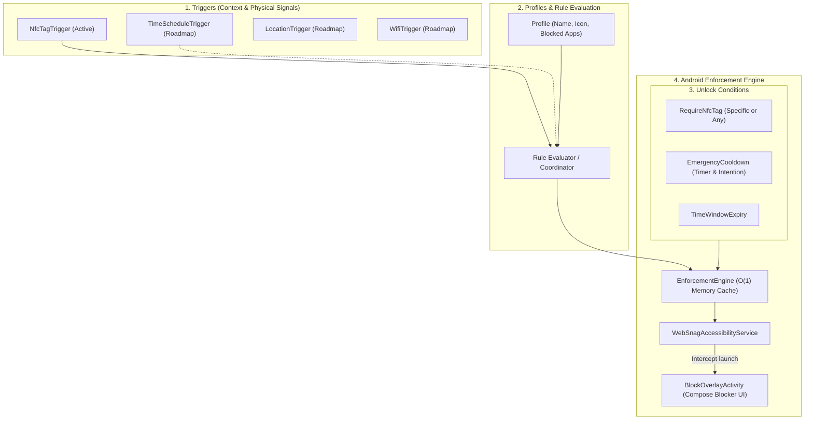

# WebSnag

[](LICENSE)
[](https://android.com)
[](https://kotlinlang.org)
[](https://developer.android.com/jetpack/compose)

> **"WebSnag makes the user's intentions stronger than their impulses."**

WebSnag is an open-source, local-first Android application for intentional digital distraction blocking and context-aware self-control.

Inspired by physical-first focus tools like Brick, WebSnag extends beyond simple NFC tapping to provide **programmable environmental self-control**. Users decide how they want their future behavior to be while thinking clearly, and WebSnag enforces those boundaries when temptation appears.

---

## Architecture Overview

WebSnag is designed around a clean pipeline:

```
Triggers → Rules & Profiles → Enforcement / Unlock Conditions
```



### Architectural Principles

1. **Local-First & Private**: Operates completely offline with zero telemetry, tracking, or external server dependencies.
2. **Intentional Friction**: Designed for standard consumer Android (non-Device Owner / non-MDM). Focuses on destroying impulsive gratification through deliberate friction rather than making the device permanently inaccessible.
3. **Reactive & Battery-Efficient**: Uses event-driven Android Accessibility events (`TYPE_WINDOW_STATE_CHANGED`) rather than background polling loops.
4. **Universal NFC Support**: Reads standard tag hardware UIDs (`NfcAdapter.enableReaderMode`) with support for any tag (NTAG213/215/216, transit cards, key fobs) and optional WebSnag NDEF payload writing.

---

## Core Features (Milestone 1)

* 🏷️ **NFC Tag Hub & Scanner**: Enroll physical NFC tags with real-time radar pulse scanning, custom naming, and usage tracking.
* 🛡️ **Distraction Profiles**: Create and customize blocking profiles with colors, descriptions, and tag bindings.
* 📱 **Installed App Selector**: Search and filter launchable applications by category (Social, Entertainment, Games, Shopping, News, Productivity).
* ⚡ **Zero-Latency App Interception**: Intercepts blocked foreground applications instantly via `WebSnagAccessibilityService` and returns to home.
* 🧘 **Calm Blocker Screen**: Fullscreen Jetpack Compose overlay showing the active intention, profile details, and immediate NFC tap reader.
* ⏳ **Emergency Unlock Friction**: Deliberate cooldown timer (5-minute delay + typed intention phrase) to prevent impulsive bypasses without risking permanent lockouts.

---

## Project Structure

```
app/src/main/
├── AndroidManifest.xml
├── res/
│   ├── values/ (strings.xml, colors.xml, themes.xml)
│   └── xml/ (accessibility_service_config.xml)
└── java/org/websnag/
    ├── WebSnagApp.kt                  # Application container & dependency wiring
    ├── MainActivity.kt                # Jetpack Compose Navigation & NFC host
    ├── core/
    │   ├── model/
    │   │   ├── Trigger.kt             # Sealed trigger hierarchy
    │   │   ├── UnlockCondition.kt     # Unlock requirements & friction policies
    │   │   ├── Profile.kt             # Blocking profile domain model
    │   │   ├── NfcTagRecord.kt        # Enrolled NFC tag representation
    │   │   ├── AppInfo.kt             # Installed app metadata & categories
    │   │   └── EnforcementState.kt    # System-wide blocking state
    │   ├── data/
    │   │   ├── LocalDataStore.kt      # DataStore + Kotlinx Serialization persistence
    │   │   ├── ProfileRepository.kt   # Profile CRUD & presets
    │   │   ├── NfcTagRepository.kt    # Tag enrollment repository
    │   │   └── InstalledAppsRepository.kt # PackageManager app scanner
    │   ├── nfc/
    │   │   ├── NfcManager.kt          # Modern ReaderMode coordinator
    │   │   ├── NfcActionResolver.kt   # Tag tap action dispatcher
    │   │   └── NfcPayloadHelper.kt    # UID conversion & NDEF helpers
    │   └── enforcement/
    │       └── EnforcementEngine.kt   # Central reactive blocking coordinator
    ├── service/
    │   └── WebSnagAccessibilityService.kt # Low-latency window state interceptor
    └── ui/
        ├── theme/ (Color.kt, Theme.kt, Type.kt)
        ├── navigation/ (Screen.kt)
        ├── dashboard/ (DashboardScreen.kt, DashboardViewModel.kt)
        ├── profiles/ (ProfilesScreen.kt, ProfileEditorScreen.kt, ProfilesViewModel.kt)
        ├── tags/ (TagsScreen.kt, EnrollTagScreen.kt, TagsViewModel.kt)
        ├── overlay/ (BlockOverlayActivity.kt, BlockOverlayScreen.kt)
        └── setup/ (PermissionsScreen.kt)
```

---

## Tech Stack

* **Language**: [Kotlin](https://kotlinlang.org) 2.3.20
* **UI Toolkit**: [Jetpack Compose](https://developer.android.com/jetpack/compose) with Material 3
* **Concurrency**: Kotlin Coroutines & Reactive `StateFlow` / `SharedFlow`
* **Persistence**: Jetpack DataStore Preferences + Kotlinx Serialization
* **Android APIs**: Android NFC ReaderMode, AccessibilityService, PackageManager
* **Build System**: Gradle 9.1.0 with Kotlin DSL & Version Catalogs (`libs.versions.toml`)

---

## Building and Running

### Prerequisites

* JDK 17 or higher (`export JAVA_HOME=...`)
* Android SDK (API 35/36 installed)
* Device or emulator running Android 8.0+ (API 26+) with NFC support

### Gradle Commands

```bash
# Run unit tests
./gradlew test

# Build debug APK
./gradlew assembleDebug

# Output APK location:
# app/build/outputs/apk/debug/app-debug.apk
```

---

## Setup on Device

1. Install and launch WebSnag.
2. Navigate to **Setup** and enable **WebSnag** in **Android Accessibility Settings**.
3. Go to **NFC Hub** -> Tap **Enroll Tag** -> Tap your physical NFC tag against the back of your phone.
4. Select or edit a **Profile** -> Choose your distracting apps -> Link your enrolled NFC tag.
5. Tap your NFC tag to activate the profile. Tapping any blocked app will now be intercepted until the tag is tapped again.

---

## Roadmap

- [ ] **Time Schedule Triggers**: Automatic profile activation during defined hours and days.
- [ ] **Location & Geofencing**: Bedroom vs. office context-aware rules with transition hysteresis.
- [ ] **Wi-Fi SSID Triggers**: Automatically activate restrictions when connected to specific networks.
- [ ] **Strict Mode**: Friction-based protections against casual uninstallation while a profile is active.
- [ ] **Optional Integrations**: Companion integrations with projects like Thwiply while maintaining 100% standalone independence.

---

## License

This project is licensed under the terms of the [MIT License](LICENSE).
