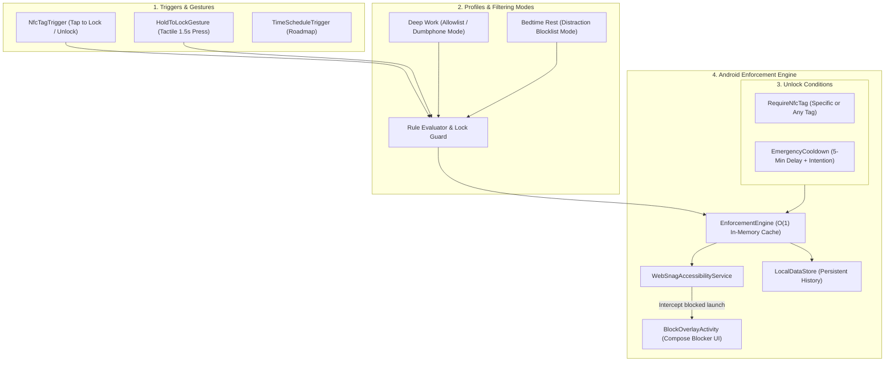
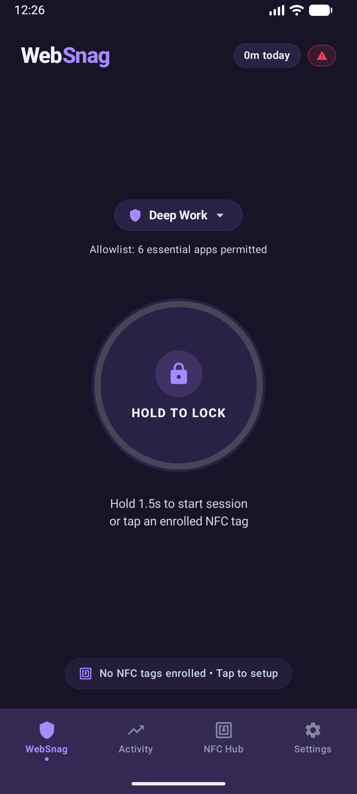
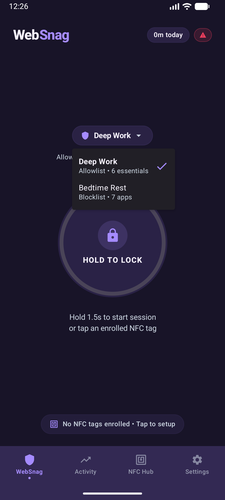
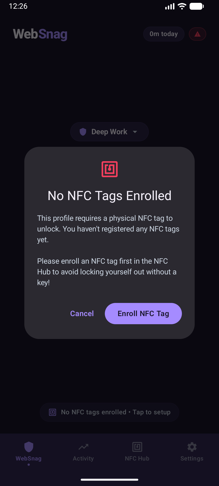
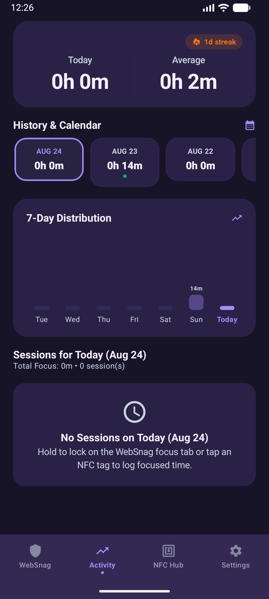
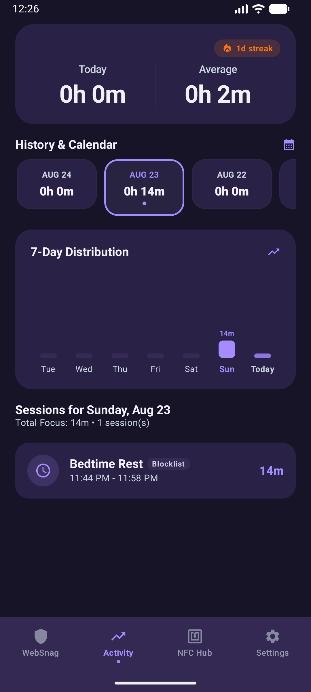
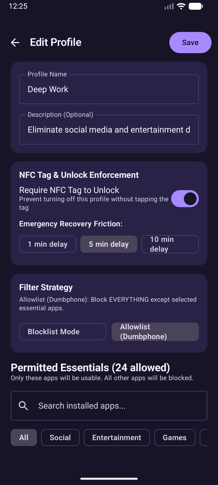
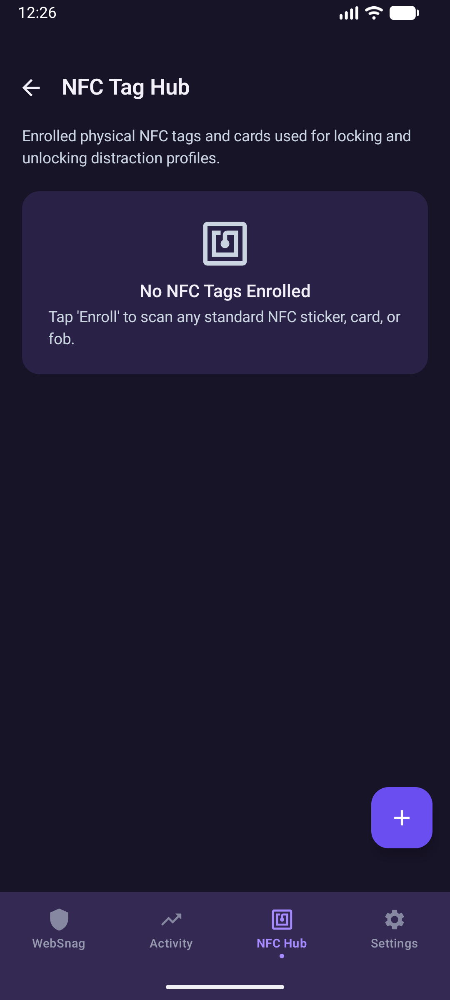
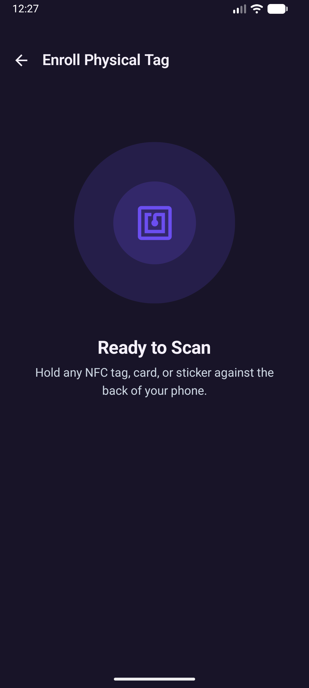
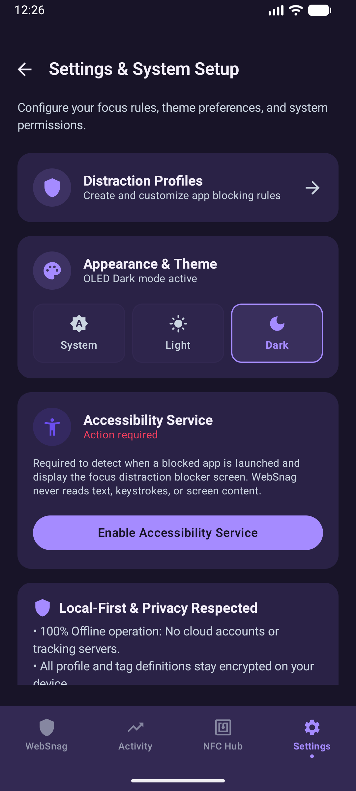

<p align="center">
  
</p>

<h1 align="center">WebSnag</h1>

<p align="center">
  <em>Environmental & Context-Aware Tangible Self-Control System for Android</em>
</p>

<p align="center">
  <a href="LICENSE"></a>
  <a href="https://android.com"></a>
  <a href="https://kotlinlang.org"></a>
  <a href="https://developer.android.com/jetpack/compose"></a>
</p>

> **"WebSnag makes the user's intentions stronger than their impulses."**

WebSnag is an open-source, local-first Android application for intentional digital distraction blocking, tangible NFC physical locking, and context-aware self-control.

Inspired by physical-first focus devices like Brick, WebSnag turns your smartphone into an intentional tool. Users decide how they want their future behavior to be while thinking clearly, and WebSnag enforces those boundaries with physical NFC keys and zero-bypass friction.

---

## Architecture Overview

WebSnag is designed around a clean, reactive pipeline:

```
Physical NFC Triggers → Profiles & Rules → Enforcement Engine → Accessibility Interception
```



### Architectural Principles

1. **Local-First & Private**: Operates 100% offline with zero cloud accounts, telemetry, or tracking servers.
2. **Intentional Friction**: Designed for standard consumer Android (non-MDM). Destroys dopamine-driven impulsive gratification through deliberate physical friction.
3. **Reactive & Battery-Efficient**: Event-driven Android Accessibility events (`TYPE_WINDOW_STATE_CHANGED`) rather than battery-draining background polling loops.
4. **Universal NFC Compatibility**: Reads standard hardware UIDs (`NfcAdapter.enableReaderMode`) with support for any tag (NTAG213/215/216, transit cards, key fobs, hotel cards, stickers).

---

## Core Features

* 🏷️ **NFC Tag Hub & Scanner**: Enroll physical NFC tags with radar pulse scanning, custom naming, and usage tracking.
* 🔒 **Tactile "Hold to Lock" Remote Action**: 1.5-second press-and-hold button with progressive haptic feedback to lock profiles on the go.
* 🛡️ **NFC Lockout Guard**: Validates that physical tags are enrolled before locking NFC-enforced profiles, preventing accidental lockout risks.
* 📵 **Allowlist (Dumbphone Mode)**: Choose between standard **Blocklist Mode** (*"Block selected apps"*) or strict **Allowlist Mode** (*"Block EVERYTHING except essential tools like Phone, Maps & Notes"*).
* 📊 **Brick-Style Activity & Calendar**:
  * **Split Today / Average Metric Header** with active streak counter (`🔥 1d streak`).
  * **Interactive Calendar Day Tiles** (`AUG 24`, `AUG 23`...) with session dots.
  * **7-Day Hour:Minute Distribution Chart**.
  * **Day Session Drilldown Feed** inspecting exact start/end times and prevented distraction attempts.
* 🌓 **Dynamic Theme Engine**: Full support for Dark Theme, Light Theme, and System Default.
* 🧘 **Calm Blocker Screen**: Fullscreen Jetpack Compose overlay with breathing animation, active focus duration timer, and instant NFC unlock listener.
* ⏳ **Emergency Unlock Friction**: Deliberate cooldown timer (5-minute delay + typed intention phrase) to prevent impulsive bypasses without risking permanent lockouts.

---

## App Screenshots

| Dashboard (Hold to Lock) | Profile Quick-Switcher | NFC Lockout Guard |
| :---: | :---: | :---: |
|  |  |  |

| Activity (Split Header & Chart) | Activity (Day Drilldown) | Profile Editor (Allowlist Mode) |
| :---: | :---: | :---: |
|  |  |  |

| NFC Hub | Physical Tag Enrollment | Settings & System Setup |
| :---: | :---: | :---: |
|  |  |  |

---

## Project Structure

```
app/src/main/
├── AndroidManifest.xml
├── res/
│   ├── drawable/ (websnag_logo_circle.png, websnag_wordmark_dark.png, ic_launcher_*)
│   ├── mipmap-*/ (adaptive & legacy launcher icons)
│   ├── values/ (colors.xml, strings.xml, themes.xml, websnag_colors.xml)
│   └── xml/ (accessibility_service_config.xml)
└── java/org/websnag/
    ├── WebSnagApp.kt                  # Application container & dependency wiring
    ├── MainActivity.kt                # Jetpack Compose Navigation & NFC host
    ├── core/
    │   ├── model/
    │   │   ├── Trigger.kt             # Sealed trigger hierarchy
    │   │   ├── UnlockCondition.kt     # Unlock requirements & friction policies
    │   │   ├── Profile.kt             # Blocking profile domain model
    │   │   ├── NfcTagRecord.kt        # Enrolled NFC tag representation
    │   │   ├── FocusSessionRecord.kt  # Focus history and session metrics
    │   │   ├── AppThemeMode.kt        # Dark / Light / System theme enum
    │   │   ├── AppInfo.kt             # Installed app metadata & categories
    │   │   └── EnforcementState.kt    # System-wide blocking state
    │   ├── data/
    │   │   ├── LocalDataStore.kt      # DataStore + Kotlinx Serialization persistence
    │   │   ├── ProfileRepository.kt   # Profile CRUD & presets
    │   │   ├── NfcTagRepository.kt    # Tag enrollment repository
    │   │   └── InstalledAppsRepository.kt # PackageManager app scanner
    │   ├── nfc/
    │   │   ├── NfcManager.kt          # Modern ReaderMode coordinator
    │   │   ├── NfcActionResolver.kt   # Tag tap action dispatcher
    │   │   └── NfcPayloadHelper.kt    # UID conversion & NDEF helpers
    │   └── enforcement/
    │       └── EnforcementEngine.kt   # Central reactive blocking coordinator
    ├── service/
    │   └── WebSnagAccessibilityService.kt # Low-latency window state interceptor
    └── ui/
        ├── theme/ (Color.kt, Theme.kt, Type.kt)
        ├── navigation/ (Screen.kt)
        ├── dashboard/ (DashboardScreen.kt, DashboardViewModel.kt)
        ├── activity/ (ActivityScreen.kt, ActivityViewModel.kt)
        ├── profiles/ (ProfilesScreen.kt, ProfileEditorScreen.kt, ProfilesViewModel.kt)
        ├── tags/ (TagsScreen.kt, EnrollTagScreen.kt, TagsViewModel.kt)
        ├── overlay/ (BlockOverlayActivity.kt, BlockOverlayScreen.kt)
        └── setup/ (PermissionsScreen.kt)
```

---

## Building & Sideloading

### Prerequisites
* Android Studio Ladybug / Iguana or later
* JDK 17+
* Android SDK 35 (Android 15)

### Build Debug APK
```bash
./gradlew assembleDebug
```
Output APK is located at: `app/build/outputs/apk/debug/app-debug.apk`

### Install to Connected Device via ADB
```bash
adb install -r app/build/outputs/apk/debug/app-debug.apk
```

---

## License

WebSnag is licensed under the [MIT License](LICENSE).
