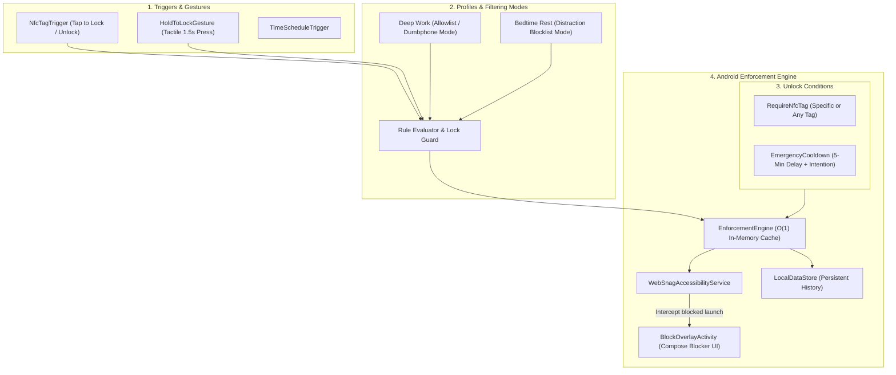

<p align="center">
  
</p>

<h1 align="center">WebSnag</h1>

<p align="center">
  <em>Environmental & Context-Aware Tangible Self-Control System for Android</em>
</p>

<p align="center">
  <a href="LICENSE"></a>
  <a href="https://android.com"></a>
  <a href="https://kotlinlang.org"></a>
  <a href="https://developer.android.com/jetpack/compose"></a>
</p>

> **"WebSnag makes the user's intentions stronger than their impulses."**

WebSnag is an open-source, local-first Android application for intentional digital distraction blocking, tangible NFC physical locking, and context-aware self-control.

Inspired by physical-first focus devices like Brick, WebSnag turns your smartphone into an intentional tool. Users decide how they want their future behavior to be while thinking clearly, and WebSnag applies local profiles, physical NFC tags, and an emergency-recovery path as intentional friction.

---

## Architecture Overview

WebSnag is designed around a clean, reactive pipeline:

```
Physical NFC Triggers → Profiles & Rules → Enforcement Engine → Accessibility Interception
```



### Architectural Principles

1. **Local-First & Private**: Operates 100% offline with zero cloud accounts, telemetry, or tracking servers.
2. **Intentional Friction**: Designed for standard consumer Android (non-MDM). It adds deliberate physical friction but does not claim zero-bypass enforcement.
3. **Reactive & Battery-Efficient**: Event-driven Android Accessibility events (`TYPE_WINDOW_STATE_CHANGED`) rather than battery-draining background polling loops.
4. **NFC Trust Boundary**: Enrolled tag identifiers are stored only as Android-Keystore-keyed HMAC fingerprints. At least one enrolled tag is required before any profile can activate. An NFC-gated profile requires its specific enrolled tag by default; any-enrolled behavior is an explicit policy. NFC UIDs are not clone-resistant credentials.

---

## Core Features

* 🏷️ **NFC Tag Hub & Scanner**: Enroll physical NFC tags with radar pulse scanning, custom naming, and usage tracking.
* 🔒 **Tactile "Hold to Lock" Remote Action**: 1.5-second press-and-hold button with progressive haptic feedback to lock profiles on the go.
* 📅 **Brick-Style Automated Schedules & Routines**: Set recurring focus windows (e.g., Workday Mon-Fri 9:00 AM - 5:00 PM, Nightly Bedtime 10:30 PM - 7:00 AM) that automatically activate profiles and enforce boundaries.
* 🛡️ **NFC Lockout Guard**: Rejects every manual, scheduled, or NFC-triggered lock activation until at least one tag is enrolled. Unknown and deleted tags remain rejected, and NFC-required profiles must have a specific enrolled tag before they can be saved.
* 📵 **Allowlist (Dumbphone Mode)**: Choose between standard **Blocklist Mode** (*"Block selected apps"*) or strict **Allowlist Mode** (*"Block EVERYTHING except essential tools like Phone, Maps & Notes"*).
* 📊 **Brick-Style Activity & Calendar**:
  * **Split Today / Average Metric Header** with active streak counter (`🔥 1d streak`).
  * **Interactive Calendar Day Tiles** (`AUG 24`, `AUG 23`...) with session dots.
  * **7-Day Hour:Minute Distribution Chart**.
  * **Day Session Drilldown Feed** inspecting exact start/end times and prevented distraction attempts.
* 🌓 **Dynamic Theme Engine**: Full support for Dark Theme, Light Theme, and System Default.
* 🧘 **Calm Blocker Screen**: Fullscreen Jetpack Compose overlay with breathing animation, active focus duration timer, and instant NFC unlock listener.
* 🔐 **Portable Private Backups**: Passphrase-encrypted local export/import with atomic restore and active-lock conflict protection.
* 🧾 **Locally Verifiable Activity Exports**: Device-key-signed focus history exports, with explicit installation-bound trust limits.
* ⏳ **Emergency Unlock Friction**: A configured local cooldown and typed intention phrase provide recovery without creating an unrecoverable lock. Emergency calling and the device dialer are always exempt from blocking.
* 📅 **Durable schedules**: Schedule occurrences, dismissals, and end reasons persist locally. Android alarms reconcile windows after reboot, timezone or clock changes; timing is explicitly best-effort if exact alarms are unavailable.
* 🩺 **Privacy-preserving local diagnostics**: An on-device "Local diagnostics" screen answers "why did WebSnag not block?" from typed state only, fully local/offline with no telemetry. Export is explicit user opt-in through the Storage Access Framework, producing schema-v1 JSON bounded to 16,384 bytes. It never includes user behavior, raw identifiers, profile/tag names, package lists, Wi-Fi SSIDs, passphrases, activity history, event content, or filesystem paths containing usernames.

---

## App Screenshots

| Dashboard (Hold to Lock) | Profile Quick-Switcher | Schedules (Automated Routines) |
| :---: | :---: | :---: |
|  |  |  |

| Schedule Editor | Activity (Split Header & Chart) | Activity (Day Drilldown) |
| :---: | :---: | :---: |
|  |  |  |

| NFC Hub | Physical Tag Enrollment | Settings & System Setup |
| :---: | :---: | :---: |
|  |  |  |

---

## Project Structure

```
app/src/main/
├── AndroidManifest.xml
├── res/
│   ├── drawable/ (websnag_logo_circle.png, websnag_wordmark_dark.png, ic_launcher_*)
│   ├── mipmap-*/ (adaptive & legacy launcher icons)
│   ├── values/ (colors.xml, strings.xml, themes.xml, websnag_colors.xml)
│   └── xml/ (accessibility_service_config.xml)
└── java/websnag/elopenmike/com/
    ├── WebSnagApp.kt                  # Application container & dependency wiring
    ├── MainActivity.kt                # Jetpack Compose Navigation & NFC host
    ├── core/
    │   ├── activity/                   # Installation-bound signed activity exports
    │   ├── backup/                     # Encrypted backup, restore, and conflict policy
    │   ├── data/
    │   │   ├── LocalDataStore.kt       # DataStore + Kotlinx Serialization persistence
    │   │   ├── ProfileRepository.kt    # Profile CRUD & presets
    │   │   ├── NfcTagRepository.kt     # Tag enrollment repository
    │   │   ├── TagIdentityProtector.kt # Keystore-keyed NFC identity protection
    │   │   └── InstalledAppsRepository.kt # PackageManager app scanner
    │   ├── diagnostics/                # Typed, redacted, bounded local diagnostics
    │   ├── enforcement/                # Central blocking and unlock policy
    │   ├── model/                      # Profiles, schedules, tags, history, and state
    │   ├── network/                    # Local connectivity state only
    │   ├── nfc/                        # Reader mode, action resolution, and tag verification
    │   ├── privacy/                    # Local privacy status
    │   └── schedule/                   # Calculation, alarms, receivers, and reconciliation
    ├── service/
    │   └── WebSnagAccessibilityService.kt # Low-latency window state interceptor
    └── ui/
        ├── theme/ (Color.kt, Theme.kt, Type.kt)
        ├── navigation/ (Screen.kt)
        ├── dashboard/ (DashboardScreen.kt, DashboardViewModel.kt)
        ├── schedule/ (ScheduleScreen.kt, ScheduleEditorScreen.kt, ScheduleViewModel.kt)
        ├── activity/ (ActivityScreen.kt, ActivityViewModel.kt)
        ├── profiles/ (ProfilesScreen.kt, ProfileEditorScreen.kt, ProfilesViewModel.kt)
        ├── tags/ (TagsScreen.kt, EnrollTagScreen.kt, TagsViewModel.kt)
        ├── overlay/ (BlockOverlayActivity.kt, BlockOverlayScreen.kt)
        ├── diagnostics/ (DiagnosticsScreen.kt) # Local diagnostics screen, SAF export via caller
        ├── privacy/ (PrivacyScreen.kt) # Backup, attestation, diagnostics, and deletion controls
        └── setup/ (PermissionsScreen.kt)
```

---

## Building & Sideloading

### Prerequisites
* Android Studio Ladybug / Iguana or later
* JDK 17+
* Android SDK 35 (Android 15)

### Build Debug APK
```bash
./gradlew assembleDebug
```
Output APK is located at: `app/build/outputs/apk/debug/app-debug.apk`

### Install to Connected Device via ADB
```bash
adb install -r app/build/outputs/apk/debug/app-debug.apk
```

---

## Continuous Integration and Repository Security

Pull requests targeting `main` and pushes to `main` are validated by GitHub Actions. A push to `main` is the post-merge validation path; dependency review itself is pull-request-only because it compares the proposed dependency graph with the base branch.

| Automation | When it runs | Why it exists |
| --- | --- | --- |
| [CI](.github/workflows/ci.yml) | Pull requests, pushes to `main`, and manual dispatches | Tests release-version build logic, verifies build-tool dependency floors, runs app unit tests and Android lint, then builds the debug APK. Failure reports are retained for diagnosis. |
| [Debug Release](.github/workflows/release.yml) | Pushed tags matching `v*` | Derives Android version metadata from the exact tag, verifies the APK manifest, repeats primary validation, and publishes the debug APK as a GitHub prerelease. |
| [CodeQL](.github/workflows/codeql.yml) | Pull requests, pushes to `main`, weekly, and manual dispatches | Scans Java/Kotlin and GitHub Actions for security issues. The Android build is captured with JDK 17 and SDK 35 so analysis covers the compiled app. |
| [Dependency Graph](.github/workflows/dependency-graph.yml) | Pull requests and pushes to `main` | Validates the Gradle wrapper and build-tool dependency floors before generating snapshots. Main-branch snapshots are submitted directly; pull-request snapshots are uploaded without granting untrusted PR code a write token. |
| [Submit Pull Request Dependency Graph](.github/workflows/dependency-graph-submit.yml) | After a successful pull-request dependency-graph run | Downloads one expected artifact in a trusted workflow, validates its structure, workflow identity, PR ref, commit SHA, and metadata, then submits only the validated snapshot fields. This supports fork PRs without executing their code in a privileged job. |
| [Dependency Review](.github/workflows/dependency-review.yml) | Pull requests | Waits for the submitted snapshot, rejects newly introduced dependencies with known vulnerabilities rated moderate or higher, and fails closed if snapshot warnings remain after the retry window. |
| [Dependabot](.github/dependabot.yml) | Weekly | Opens bounded update PRs for Gradle and GitHub Actions dependencies after a seven-day release cooldown, so upgrades have stabilization time and go through the same review and validation gates. Security updates are not delayed by the cooldown. |

Third-party actions are pinned to full commit SHAs to prevent mutable tags from changing executed CI code unexpectedly. Dependabot keeps those pinned references current. The workflows grant read-only permissions by default and add write permissions only to CodeQL result upload, dependency-snapshot submission, or tagged GitHub release publication jobs.

The Kotlin toolchain uses **2.4.20-RC2**, a patched release candidate for the build-cache
deserialization vulnerability in Dependabot alert #50. The Gradle, Compose, and
serialization plugins share this version. See the [dependency triage notes](docs/security/dependency-triage.md#alert-50-kotlin-build-cache-metadata-deserialization)
for the security check, validation steps, and stable-release follow-up.

Debug releases are intentional rather than merge-driven. Create and push an annotated
stable tag (`vMAJOR.MINOR.PATCH`) or an `alpha`, `beta`, or `rc` tag such as
`v1.0.0-alpha.5`. Gradle derives deterministic Android `versionName` and `versionCode`
values from that exact tag, and the workflow verifies the APK manifest before publishing
`websnag-v1.0.0-alpha.5-debug.apk`. Untagged local builds use
`versionName=0.0.0-dev` and `versionCode=1`.

These APKs still use runner-generated debug signing keys, so uninstall the previous
CI-distributed build before installing a newer one; uninstalling removes that build's
local app data. Production signing, Android App Bundles, and Google Play publishing are
outside this workflow.

[`CODEOWNERS`](.github/CODEOWNERS) assigns the workflow definitions, Gradle build logic
and configuration, version catalog, wrapper, and launchers to the repository owner. To
enforce these safeguards, configure the `main` branch rules after the workflows have run
once:

1. Require a pull request before merging and require code-owner approval.
2. Require the CI validation, both CodeQL analyses, dependency-graph generation, and dependency-review checks to pass.
3. Require branches to be up to date before merging and block force pushes and deletions.

The pull request that first installs these workflows runs Dependency Review in bootstrap mode because GitHub only triggers a `workflow_run` workflow after that workflow exists on the default branch. Bootstrap mode is limited to the known pre-Actions base commit; a missing trusted workflow on any later base is an error. After this change is merged, every later pull request runs the full dependency review and fails if its Gradle snapshot is missing or incomplete.

Run the same primary validation locally with:

```bash
./gradlew testDebugUnitTest lintDebug assembleDebug --continue --no-daemon
```

### Migration fixtures

The synthetic migration suite covers historical/current preferences, atomic storage and reload,
NFC authorization, recovery/dismissal state, retention, and encrypted backups. **MIG-001A remains
incomplete:** an enabled Android acceptance test demonstrates that migration failure preserves
stored bytes while runtime enforcement becomes inactive. The [migration testing guide](docs/testing/migrations.md)
explains the blocker, fixture provenance, full matrix, failure/retry limits, and safe setup.

Use JDK 17 and Android SDK 35. Device tests require a dedicated emulator (API 26+) and an explicitly
selected serial; never use a personal installation. Discover local JDK/SDK paths without committing them.

```bash
./gradlew testDebugUnitTest --tests 'websnag.elopenmike.com.core.data.*' --rerun-tasks --no-build-cache --no-daemon
adb devices -l
ANDROID_SERIAL=emulator-5556 ./gradlew connectedDebugAndroidTest -Pandroid.testInstrumentationRunnerArguments.package=websnag.elopenmike.com.core.data --rerun-tasks --no-build-cache --no-daemon
```

Replace the example serial with your dedicated emulator. The Android command currently fails the
runtime acceptance gate; do not skip it to claim completion. These fixtures do not prove signed
in-place package upgrades or portable NFC authentication credentials.

### Release signing

Release tasks require `KEYSTORE_PATH`, `KEYSTORE_PASSWORD`, `KEY_ALIAS`, and `KEY_PASSWORD`. No password or alias fallback is built into the project; debug builds remain independently signed by the Android debug configuration.

---

## Roadmap

[`docs/ROADMAP.md`](docs/ROADMAP.md) is the source of truth for post-alpha work. It
contains task status, dependencies, execution order, security/privacy invariants, and
PR-sized task cards for future contributors and agents.

---

## License

WebSnag is licensed under the [MIT License](LICENSE).
