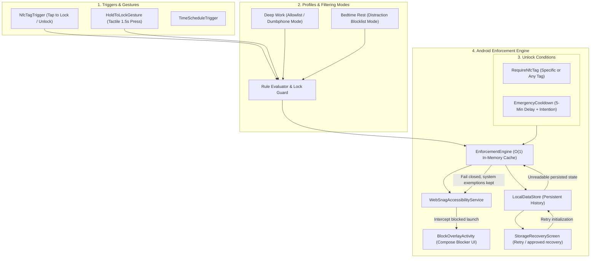
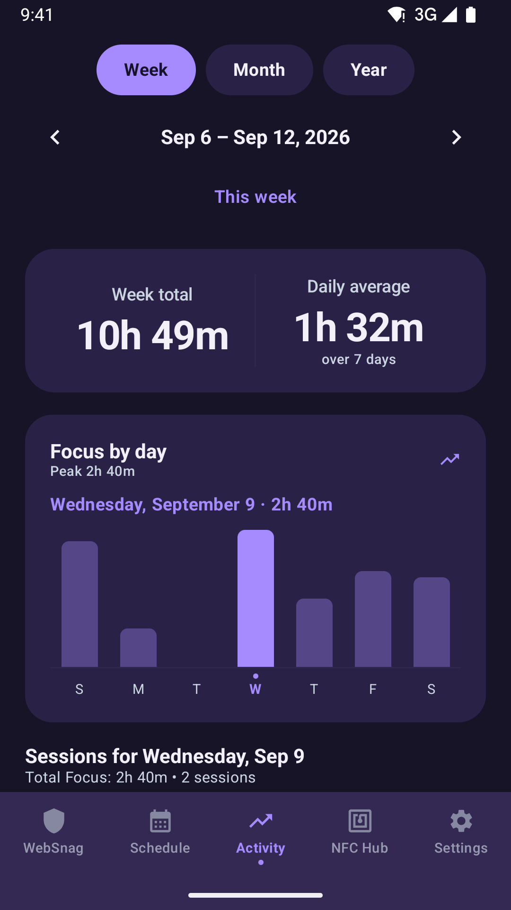
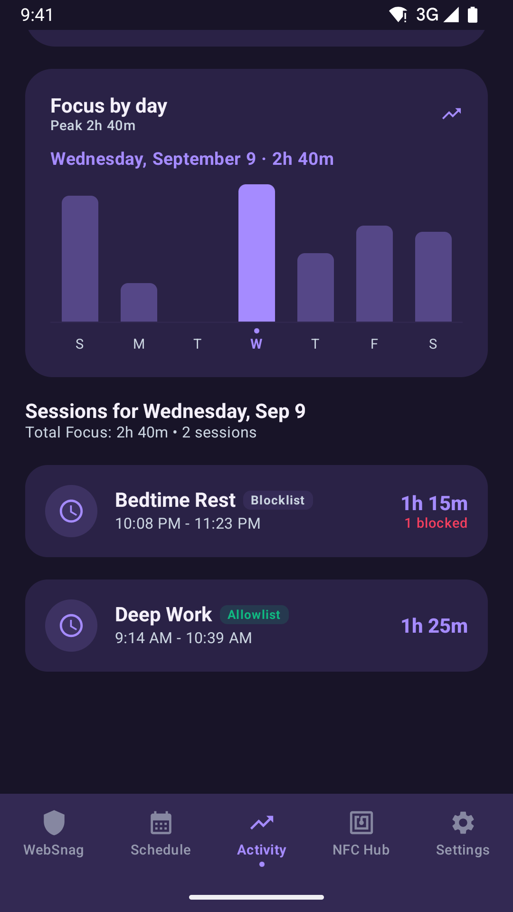
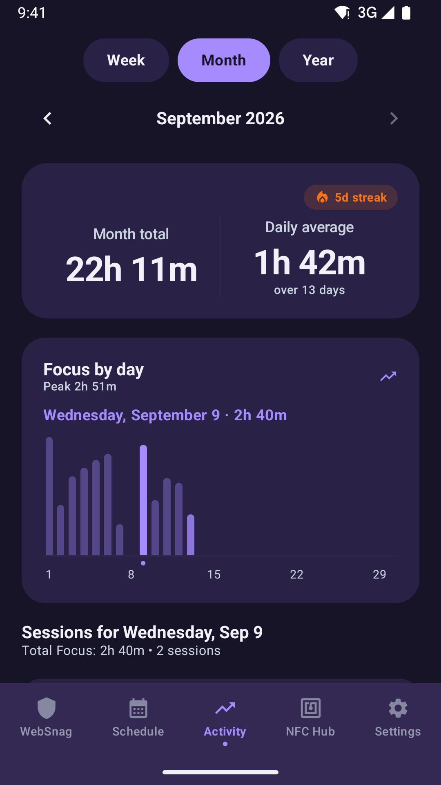
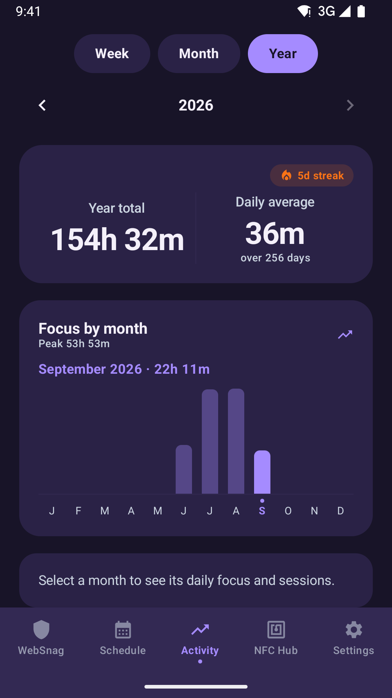

<p align="center">
  
</p>

<h1 align="center">WebSnag</h1>

<p align="center">
  <em>Environmental & Context-Aware Tangible Self-Control System for Android</em>
</p>

<p align="center">
  <a href="LICENSE"></a>
  <a href="https://android.com"></a>
  <a href="https://kotlinlang.org"></a>
  <a href="https://developer.android.com/jetpack/compose"></a>
</p>

> **"WebSnag makes the user's intentions stronger than their impulses."**

WebSnag is an open-source, local-first Android application for intentional digital distraction blocking, tangible NFC physical locking, and context-aware self-control.

Inspired by physical-first focus devices like Brick, WebSnag turns your smartphone into an intentional tool. Users decide how they want their future behavior to be while thinking clearly, and WebSnag applies local profiles, physical NFC tags, and an emergency-recovery path as intentional friction.

---

## Architecture Overview

WebSnag is designed around a clean, reactive pipeline:

```
Physical NFC Triggers → Profiles & Rules → Enforcement Engine → Accessibility Interception
```



### Architectural Principles

1. **Local-First & Private**: Operates 100% offline with zero cloud accounts, telemetry, or tracking servers.
2. **Intentional Friction**: Designed for standard consumer Android (non-MDM). It adds deliberate physical friction but does not claim zero-bypass enforcement.
3. **Reactive & Battery-Efficient**: Event-driven Android Accessibility events (`TYPE_WINDOW_STATE_CHANGED`) rather than battery-draining background polling loops.
4. **NFC Trust Boundary**: Enrolled tag identifiers are stored only as Android-Keystore-keyed HMAC fingerprints. At least one enrolled tag is required before any profile can activate. An NFC-gated profile requires its specific enrolled tag by default; any-enrolled behavior is an explicit policy. NFC UIDs are not clone-resistant credentials.

---

## Core Features

* 🏷️ **NFC Tag Hub & Scanner**: Enroll physical NFC tags with radar pulse scanning, custom naming, and usage tracking.
* 🔒 **Tactile "Hold to Lock" Remote Action**: 1.5-second press-and-hold button with progressive haptic feedback to lock profiles on the go.
* 📅 **Brick-Style Automated Schedules & Routines**: Set recurring focus windows (e.g., Workday Mon-Fri 9:00 AM - 5:00 PM, Nightly Bedtime 10:30 PM - 7:00 AM) that automatically activate profiles and enforce boundaries.
* 🛡️ **NFC Lockout Guard**: Rejects every manual, scheduled, or NFC-triggered lock activation until at least one tag is enrolled. Unknown and deleted tags remain rejected, and NFC-required profiles must have a specific enrolled tag before they can be saved.
* 📵 **Allowlist (Dumbphone Mode)**: Choose between standard **Blocklist Mode** (*"Block selected apps"*) or strict **Allowlist Mode** (*"Block EVERYTHING except essential tools like Phone, Maps & Notes"*).
* 📊 **Brick-Style Activity Charts**:
  * **Week · Month · Year bar charts** of recorded focus time: 7 daily bars (starting on your locale's first day of the week), one bar per calendar day of the month, or 12 monthly bars.
  * **Calendar navigation** with previous/next period controls and a one-tap return to the current week, month, or year; the view never moves past the current period.
  * **Period Total / Daily Average Header** matching the displayed period, with the current streak counter (`🔥 1d streak`) while viewing the current period.
  * **Day Session Drilldown Feed**: select a day's bar for its focus total, exact start/end times, and prevented distraction attempts; select a month's bar in the year view to open that month.
  * Charts read only locally retained history (90 days by default, at most 500 sessions); days without retained records show as zero. Sessions crossing midnight or a month boundary count toward each side.
* 🌓 **Dynamic Theme Engine**: Full support for Dark Theme, Light Theme, and System Default.
* 🧘 **Calm Blocker Screen**: Fullscreen Jetpack Compose overlay with breathing animation, active focus duration timer, and instant NFC unlock listener.
* 🔐 **Portable Private Backups**: Passphrase-encrypted local export/import with atomic restore and active-lock conflict protection.
* 🧾 **Locally Verifiable Activity Exports**: Device-key-signed focus history exports, with explicit installation-bound trust limits.
* ⏳ **Emergency Unlock Friction**: A configured local cooldown and typed intention phrase provide recovery without creating an unrecoverable lock. Emergency calling and the device dialer are always exempt from blocking.
* 🛟 **Fail-closed storage recovery**: If saved data cannot be loaded -- for example when a startup migration refuses an unconvertible legacy value -- WebSnag keeps the original data untouched, keeps blocking active instead of silently unlocking, and shows an explicit retry/recovery screen. Emergency calling, the device dialer, the home screen, and WebSnag itself stay reachable throughout, and a typed intention phrase withdraws that extra blocking when no retry can repair it -- never a focus session you had already started, which keeps its own unlock rules -- so a load failure never leaves an unrecoverable lock.
* 📅 **Durable schedules**: Schedule occurrences, dismissals, and end reasons persist locally. Android alarms reconcile windows after reboot, timezone or clock changes; timing is explicitly best-effort if exact alarms are unavailable.
* 🩺 **Privacy-preserving local diagnostics**: An on-device "Local diagnostics" screen answers "why did WebSnag not block?" from typed state only, fully local/offline with no telemetry. Export is explicit user opt-in through the Storage Access Framework, producing schema-v1 JSON bounded to 16,384 bytes. It never includes user behavior, raw identifiers, profile/tag names, package lists, Wi-Fi SSIDs, passphrases, activity history, event content, or filesystem paths containing usernames.

---

## App Screenshots

| Dashboard (Hold to Lock) | Profile Quick-Switcher | Schedules (Automated Routines) |
| :---: | :---: | :---: |
|  |  |  |

| Schedule Editor | Activity (Week) | Activity (Day Drilldown) |
| :---: | :---: | :---: |
|  |  |  |

| Activity (Month) | Activity (Year) | |
| :---: | :---: | :---: |
|  |  | |

Activity screenshots use synthetic focus sessions. Months before the retained history window show zero activity.

| NFC Hub | Physical Tag Enrollment | Settings & System Setup |
| :---: | :---: | :---: |
|  |  |  |

---

## Project Structure

```
app/src/main/
├── AndroidManifest.xml
├── res/
│   ├── drawable/ (websnag_logo_circle.png, websnag_wordmark_dark.png, ic_launcher_*)
│   ├── mipmap-*/ (adaptive & legacy launcher icons)
│   ├── values/ (colors.xml, strings.xml, themes.xml, websnag_colors.xml)
│   └── xml/ (accessibility_service_config.xml)
└── java/websnag/elopenmike/com/
    ├── WebSnagApp.kt                  # Application container & dependency wiring
    ├── MainActivity.kt                # Jetpack Compose Navigation & NFC host
    ├── core/
    │   ├── activity/                   # Focus period aggregation and installation-bound signed activity exports
    │   ├── backup/                     # Encrypted backup, restore, and conflict policy
    │   ├── data/
    │   │   ├── LocalDataStore.kt       # DataStore + Kotlinx Serialization persistence
    │   │   ├── LegacyTagIdentifierMigration.kt # Startup identity conversion & failure policy
    │   │   ├── MigrationRecoveryConsent.kt # One-shot, process-scoped approval for the unconvertible legacy lock
    │   │   ├── ProfileRepository.kt    # Profile CRUD & presets
    │   │   ├── NfcTagRepository.kt     # Tag enrollment repository
    │   │   ├── TagIdentityProtector.kt # Keystore-keyed NFC identity protection
    │   │   └── InstalledAppsRepository.kt # PackageManager app scanner
    │   ├── diagnostics/                # Typed, redacted, bounded local diagnostics
    │   ├── enforcement/                # Central blocking and unlock policy
    │   ├── model/                      # Profiles, schedules, tags, history, and state
    │   ├── network/                    # Local connectivity state only
    │   ├── nfc/                        # Reader mode, action resolution, and tag verification
    │   ├── privacy/                    # Local privacy status
    │   └── schedule/                   # Calculation, alarms, receivers, and reconciliation
    ├── service/
    │   └── WebSnagAccessibilityService.kt # Low-latency window state interceptor
    └── ui/
        ├── theme/ (Color.kt, Theme.kt, Type.kt)
        ├── navigation/ (Screen.kt)
        ├── dashboard/ (DashboardScreen.kt, DashboardViewModel.kt)
        ├── schedule/ (ScheduleScreen.kt, ScheduleEditorScreen.kt, ScheduleViewModel.kt)
        ├── activity/ (ActivityScreen.kt, ActivityViewModel.kt)
        ├── profiles/ (ProfilesScreen.kt, ProfileEditorScreen.kt, ProfilesViewModel.kt)
        ├── tags/ (TagsScreen.kt, EnrollTagScreen.kt, TagsViewModel.kt)
        ├── overlay/ (BlockOverlayActivity.kt, BlockOverlayScreen.kt)
        ├── diagnostics/ (DiagnosticsScreen.kt) # Local diagnostics screen, SAF export via caller
        ├── privacy/ (PrivacyScreen.kt) # Backup, attestation, diagnostics, and deletion controls
        ├── recovery/ (StorageRecoveryScreen.kt) # Retry/recovery route when persisted state is unreadable
        └── setup/ (PermissionsScreen.kt)
```

---

## Building & Sideloading

### Prerequisites
* Android Studio compatible with AGP 9.3.2, or the Android command-line tools
* JDK 17 (the project toolchain and CI runtime)
* Android SDK 35 (Android 15), build-tools 35.0.0, and platform-tools
* For release-control scripts: Python 3.9+ with POSIX `waitid`/`WNOWAIT`, Git, and `ps`;
  set `JAVA_HOME`, `ANDROID_HOME`, and the SDK tools on PATH as described in the
  [release guide](docs/releasing.md#local-disposable-validation)

### Build Debug APK
```bash
./gradlew assembleDebug
```
Output APK is located at: `app/build/outputs/apk/debug/app-debug.apk`

### Install to Connected Device via ADB
```bash
adb install -r app/build/outputs/apk/debug/app-debug.apk
```

---

## Continuous Integration and Repository Security

Pull requests targeting `main` and pushes to `main` are validated by GitHub Actions. A push to `main` is the post-merge validation path; dependency review itself is pull-request-only because it compares the proposed dependency graph with the base branch.

| Automation | When it runs | Why it exists |
| --- | --- | --- |
| [CI](.github/workflows/ci.yml) | Pull requests, pushes to `main`, and manual dispatches | Tests build logic, release controls and device-harness guards without durable credentials, verifies dependency floors, runs app unit tests/lint/debug assembly, and independently runs the bounded 50-test Android safety gate, including runtime and UI recovery. Manual dispatch can select full coverage before the dedicated workflow is merged. |
| [Android device tests](.github/workflows/device-tests.yml) | Called by CI for smoke; weekly Monday 06:23 UTC and manual dispatch for full coverage | Uses a disposable API 36 emulator. Full coverage adds Compose Activity chart and diagnostics tests to smoke. Fails on missing/empty/skipped/failing results and retains only bounded synthetic status metadata for seven days. See the [device-test guide](docs/testing/device-tests.md). |
| [Debug Release](.github/workflows/release.yml) | Pushed tags matching `v*` | Derives Android version metadata from the exact tag, verifies the APK manifest, repeats primary validation, and publishes the debug APK as a GitHub prerelease. |
| [Signed candidate build](.github/workflows/release-build.yml) | Manual dispatch on protected `main`, after owner setup | Rechecks the exact main commit, gates credentials through `prerelease-signing`, builds and checks release APK/AAB, then removes private state. No upload or publication. |
| [CodeQL](.github/workflows/codeql.yml) | Pull requests, pushes to `main`, weekly, and manual dispatches | Scans Java/Kotlin, GitHub Actions, and Python release controls using the configured no-build analyses. |
| [Dependency Graph](.github/workflows/dependency-graph.yml) | Pull requests and pushes to `main` | Validates the Gradle wrapper and build-tool dependency floors before generating snapshots. Main-branch snapshots are submitted directly; pull-request snapshots are uploaded without granting untrusted PR code a write token. |
| [Submit Pull Request Dependency Graph](.github/workflows/dependency-graph-submit.yml) | After a successful pull-request dependency-graph run | Downloads one expected artifact in a trusted workflow, validates its structure, workflow identity, PR ref, commit SHA, and metadata, then submits only the validated snapshot fields. This supports fork PRs without executing their code in a privileged job. |
| [Dependency Review](.github/workflows/dependency-review.yml) | Pull requests | Waits for the submitted snapshot, rejects newly introduced dependencies with known vulnerabilities rated moderate or higher, and fails closed if snapshot warnings remain after the retry window. |
| [Dependabot](.github/dependabot.yml) | Weekly | Opens bounded update PRs for Gradle and GitHub Actions dependencies after a seven-day release cooldown, so upgrades have stabilization time and go through the same review and validation gates. Security updates are not delayed by the cooldown. |

Third-party actions are pinned to full commit SHAs to prevent mutable tags from changing executed CI code unexpectedly. Dependabot keeps those pinned references current. The workflows grant read-only permissions by default and add write permissions only to CodeQL result upload, dependency-snapshot submission, or tagged GitHub release publication jobs.

The Kotlin toolchain uses **2.4.20-RC2**, a patched release candidate for the build-cache
deserialization vulnerability in Dependabot alert #50. The Gradle, Compose, and
serialization plugins share this version. See the [dependency triage notes](docs/security/dependency-triage.md#alert-50-kotlin-build-cache-metadata-deserialization)
for the security check, validation steps, and stable-release follow-up.

Debug releases are intentional rather than merge-driven. Create and push an annotated
stable tag (`vMAJOR.MINOR.PATCH`) or an `alpha`, `beta`, or `rc` tag such as
`v1.0.0-alpha.5`. Gradle derives deterministic Android `versionName` and `versionCode`
values from that exact tag, and the workflow verifies the APK manifest before publishing
`websnag-v1.0.0-alpha.5-debug.apk`. Untagged local builds use
`versionName=0.0.0-dev` and `versionCode=1`.

These APKs still use runner-generated debug signing keys, so uninstall the previous
CI-distributed build before installing a newer one; uninstalling removes that build's
local app data. Production signing, Android App Bundles, and Google Play publishing are
outside this workflow.

[`CODEOWNERS`](.github/CODEOWNERS) assigns the workflow definitions, Gradle build logic
and configuration, version catalog, wrapper, launchers, key exclusions, release scripts
and signing configuration to the repository owner. It records ownership, not independent
approval. Under the approved solo-maintainer policy, `main` requires PRs, **zero required
approving reviews**, resolved conversations and strict up-to-date checks; mandatory
code-owner and last-push approval are off. The owner inspects the final diff and checks
and separately authorizes the exact PR/head for normal merging, without `--admin` or an
emergency bypass.

These controls were configured and read back on **2026-09-13 at 04:59 UTC**:
[main-only ruleset 23134410](https://github.com/mcasillas17/WebSnag/rules/23134410)
requires exactly `Validate`, `Device safety / Device (smoke, API 36)`,
`Analyze (java-kotlin)`, `Analyze (actions)`, `Analyze (python)`,
`Generate pull request snapshot` and `Review dependency changes`, all from GitHub Actions
app `15368`. The device gate stays required when diagnosing migration/recovery regressions.
[Ruleset 21267137](https://github.com/mcasillas17/WebSnag/rules/21267137) remains unchanged,
banning default-branch force pushes and deletion. Both rulesets have no bypass actors.

`Submit pull request snapshot` is not a required PR-head context: its observed
`workflow_run` check attaches to main. Inspect the actual trusted submission for the
merged PR, and `Submit main snapshot` for main-push evidence. Dependency workflows can
green-skip disabled/unsupported services; signing approval requires applicable submission
and review to have actually executed successfully, not merely a green badge.
See the [release guide's public control record and approval policy](docs/releasing.md#1-confirm-configured-repository-and-environment-controls).

Dependency Review's bootstrap exception remains limited to the known pre-Actions base
commit; a missing trusted submission workflow on a later base is an error. Outside that
exception, enabled services use the full dependency-review path; disabled/unsupported
service skips do not satisfy signing acceptance.

Run the same primary validation locally with:

```bash
./gradlew testDebugUnitTest lintDebug assembleDebug --continue --no-daemon
```

The [device-test guide](docs/testing/device-tests.md) covers prerequisites, the exact smoke/full
split, isolated emulator setup, report diagnosis, and consecutive-run evidence. With its dedicated
API 36 emulator running, use `ANDROID_SERIAL=emulator-5556 python3 -B scripts/ci/device_tests.py smoke`.
Both migration runtime acceptance methods and the recovery-screen tests are required in smoke;
the harness does not skip or reinterpret them. Full coverage adds twelve Activity chart UI tests
(including activity-recreation and launch-intent checks) and five diagnostics UI tests.

### Migration fixtures

The synthetic migration suite covers historical/current preferences, atomic storage and reload,
NFC authorization, recovery/dismissal state, retention, and encrypted backups. An enabled Android
acceptance test proves that a failed migration preserves the stored bytes *and* keeps runtime
enforcement failing closed behind an explicit recovery screen. The
[migration testing guide](docs/testing/migrations.md) explains that failure/recovery behavior, the
narrow legacy-duration compatibility decision, fixture provenance, the full matrix, retry limits,
and safe setup.

Use JDK 17 and Android SDK 35. Device tests require a dedicated emulator (API 26+) and an explicitly
selected serial; never use a personal installation. Discover local JDK/SDK paths without committing them.

```bash
./gradlew testDebugUnitTest --tests 'websnag.elopenmike.com.core.data.*' --rerun-tasks --no-build-cache --no-daemon
adb devices -l
ANDROID_SERIAL=emulator-5556 ./gradlew connectedDebugAndroidTest -Pandroid.testInstrumentationRunnerArguments.package=websnag.elopenmike.com.core.data --rerun-tasks --no-build-cache --no-daemon
```

Replace the example serial with your dedicated emulator. These fixtures do not prove signed
in-place package upgrades or portable NFC authentication credentials.

### Release signing

The release-build foundation is merged in #35 and the solo-maintainer protections are
configured, but **REL-002A remains blocked on approved identity/custody, tested restore,
separately approved provisioning and two approved-key executions**. As of the
2026-09-13 04:59 UTC control record, identity/custody is unknown, not absent; the public
fingerprint is empty, `prerelease-signing` has zero secrets, no protected
`release-build.yml` runs have been dispatched and no acceptance evidence exists.
This documentation/setup change was pending merge at the **2026-09-13 04:59 UTC
pre-merge checkpoint**; merging it does not complete signing setup.

`prerelease-signing` permits only the selected `main` branch, with manual approval by
`@mcasillas17`, self-review allowed and administrator bypass disabled. Self-approval is
owner authorization, not independent human review; no second maintainer is required.
The [release guide](docs/releasing.md) covers the concentrated account risk and custody
requirements. Reuse an existing approved identity if one exists; do not create a fallback.
Only after controls/custody/restore and separate provisioning approval, register
`KEYSTORE_BASE64`, `KEYSTORE_PASSWORD`, `KEY_ALIAS` and `KEY_PASSWORD` at environment
scope only, using secure local/vault input or Settings, never chat.

Merge the approved public DER certificate digest and policy/configuration changes to
`main` first through normal checks and separate owner merge authorization. Then inspect
actual current-main checks and merged-PR dependency work, separately authorize two
consecutive valid version inputs/dispatches, and have the owner **manually approve each
deployment** after SHA/input/check review. Never automate owner approval. A main change
requires re-review and redispatch, not relaxed SHA checks. Inputs create no tags.
Record both runs' identity, versions, verification, job durations and full build/final
cleanup results before claiming acceptance; the identity log line alone is not cleanup
proof. REL-002B/C remain blocked until full acceptance is recorded and changes merged;
MIG-001B's prerequisites and the debug-build uninstall/data-loss warning remain unchanged.

For safe local proof with a temporary identity, after configuring the prerequisites:

```bash
python3 -B scripts/release/validate_local.py --failure-cases
```

It builds consecutive version inputs with one disposable key, checks APK/AAB identity,
and removes that key and private caches. Do not distribute those outputs.
Release outputs are `app/build/outputs/apk/release/app-release.apk` and
`app/build/outputs/bundle/release/app-release.aab`; the protected workflow retains no
downloadable artifact until REL-002B.

Direct release tasks require `KEYSTORE_PATH`, `KEYSTORE_PASSWORD`, `KEY_ALIAS`,
`KEY_PASSWORD`, and `WEBSNAG_SIGNING_CERT_SHA256`, plus
`-PwebsnagReleaseSigning=true`, a valid `-PwebsnagReleaseTag`, disabled configuration/build
caches, and an external temporary `--project-cache-dir`. No password, alias or key
fallback exists. For the protected workflow, `KEYSTORE_PATH` and
`WEBSNAG_SIGNING_CERT_SHA256` are derived runtime values, not additional GitHub secrets.
Debug builds remain independently debug-signed without release inputs.
See the [release guide](docs/releasing.md) for complete commands, owner provisioning,
backup/recovery, failure gates and the [release-build flow](docs/releasing.md#release-build-flow).

---

## Roadmap

[`docs/ROADMAP.md`](docs/ROADMAP.md) is the source of truth for post-alpha work. It
contains task status, dependencies, execution order, security/privacy invariants, and
PR-sized task cards for contributors.

---

## License

WebSnag is licensed under the [MIT License](LICENSE).
