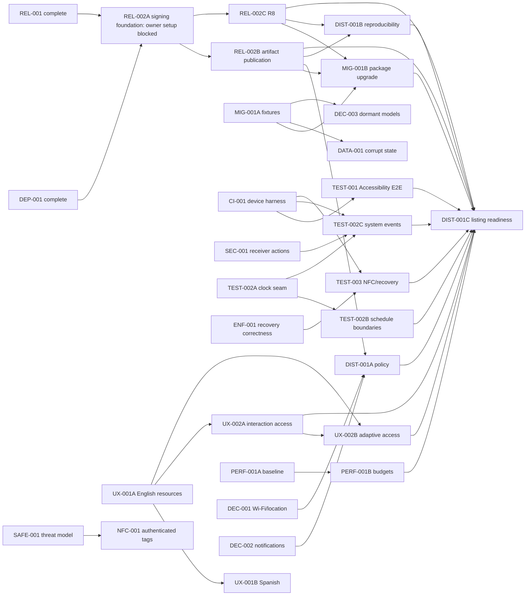

# WebSnag Roadmap

## Purpose

This document is the single source of truth for WebSnag's post-alpha backlog. It records
current behavior, product and safety constraints, canonical task ownership, dependencies,
and implementation-ready task cards.

The next milestone prioritizes **upgrade safety, release correctness, real Android
end-to-end coverage, and recovery reliability** before stronger enforcement or broader
distribution.

## Current baseline

Current `main`, following `v1.0.0-alpha.4`, includes:

- centralized unlock authorization and persisted emergency recovery;
- enrolled-tag enforcement with Android-Keystore-keyed HMAC identifiers;
- blocklist and allowlist profiles with manual and NFC activation paths;
- durable schedule occurrences and alarm-based reconciliation;
- optional Wi-Fi and SSID schedule conditions;
- passphrase-encrypted local backup and restore;
- installation-bound signed activity exports;
- local privacy, retention, export, delete, and diagnostics controls;
- a non-exported blocker and internal alarm receiver; system schedule broadcasts use a
  separate exported receiver;
- tag-derived Android version metadata with manifest verification;
- CI, lint, unit tests, Android test sources, CodeQL, and dependency review;
- no `INTERNET` permission, cloud account, telemetry, VPN, Device Admin, notification
  listener, usage-access permission, or Accessibility window-content retrieval.

The tagged release workflow still publishes a runner-generated debug-signed APK.
A separate protected-main, manually dispatched release APK/AAB build foundation exists,
but approved durable identity/custody, protected-environment setup and real approved-key
validation remain blocked. AAB publication, in-place upgrades and store readiness remain
roadmap work. See [the release guide](releasing.md).

## Product and safety invariants

Every roadmap task must preserve these rules:

1. **Local-first by default.** Do not add cloud accounts, telemetry, remote policy
   control, or server-side app/domain lists.
2. **No hidden inspection.** Keep Accessibility
   `canRetrieveWindowContent="false"`. Do not inspect typed text, page content,
   notifications, or network traffic.
3. **Recovery is mandatory.** No feature may create an unrecoverable lock. Emergency
   calling and the active default dialer must remain reachable.
4. **Authorization is centralized.** UI, schedules, NFC, backup restore, and data
   deletion must not bypass the enforcement engine's active-session policy.
5. **NFC assurance is stated honestly.** Ordinary UID and static NDEF tags are
   low-assurance identifiers that can be copied or replayed. At-rest HMAC protection is
   not tag authentication.
6. **No zero-bypass claim.** A consumer Accessibility-based blocker can be disabled,
   force-stopped, uninstalled, or bypassed through Android recovery mechanisms.
7. **Untrusted data is validated twice.** Validate imported files, intents, package
   metadata, tag data, and schedule inputs at the boundary; encode, bind, or allowlist
   again at their sink.
8. **Secrets never enter source or artifacts.** Signing passwords, private keys,
   passphrases, and Keystore material must not be committed, logged, exported, or placed
   in test fixtures.
9. **One canonical leaf, one reviewable PR.** Parent aliases and completed tasks cannot
   own implementation work.
10. **Evidence before claims.** A task is complete only when its acceptance criteria,
    tests, final diff, and required security checks have been reviewed.

## Android versioning

Release builds derive `versionName` and `versionCode` from
`-PwebsnagReleaseTag=vMAJOR.MINOR.PATCH[-CHANNEL.N]`. Untagged local builds use
`versionName="0.0.0-dev"` and `versionCode=1`.

Accepted tags are stable, `alpha`, `beta`, or `rc` releases. The tested build logic maps
them deterministically:

```text
major * 100_000_000
+ minor * 1_000_000
+ patch * 10_000
+ channel * 1_000
+ sequence

channel: alpha=1, beta=2, rc=3, stable=9
```

The tag workflow verifies generated manifest values before publication. Release tags are
immutable inputs; a corrected artifact requires a new patch or prerelease sequence.

## Priority model

| Priority | Meaning |
| --- | --- |
| P0 | Blocks an upgradeable or broadly testable prerelease, or fixes a recovery/safety defect |
| P1 | Required before beta or broad distribution |
| P2 | Valuable quality, diagnostics, or differentiation work |
| Decision | Resolves product policy before implementation |
| Research | Produces evidence and an architecture decision before implementation |

## Milestone overview

| Milestone | Goal | Canonical leaves |
| --- | --- | --- |
| Release safety | Secure, upgradeable, verified artifacts and migration evidence | REL-002A, REL-002B, REL-002C, MIG-001A, MIG-001B |
| Core reliability | Recovery correctness, bounded device CI, safe persistence and receiver boundaries | CI-001, ENF-001, SEC-001, DATA-001 |
| Android validation | Real enforcement, scheduling, alarm, NFC, and recovery validation | TEST-001, TEST-002A, TEST-002B, TEST-002C, TEST-003 |
| Product quality | Localized, accessible, measurable behavior | UX-001A, UX-001B, UX-002A, UX-002B, PERF-001A, PERF-001B |
| Product decisions | Resolve permission and dormant-model policy | DEC-001, DEC-002, DEC-003 |
| Distribution | Accurate policy, reproducible builds, and listing readiness | DIST-001A, DIST-001B, DIST-001C |
| Research | Evaluate stronger features without weakening safety or privacy | SAFE-001, NFC-001 |

## Completed foundation

These tasks are complete provenance, not claimable work:

| Task | Result |
| --- | --- |
| DEP-001 | Critical/high build dependency alerts closed and the Kotlin build-cache advisory remediated |
| REL-001 | Tag-derived Android metadata and manifest verification implemented |
| DOC-001 | README and roadmap consolidated around current behavior |
| DIAG-001 | Typed, redacted, bounded local diagnostics and SAF export implemented |

## Parent aliases

The former broad IDs remain navigation aliases only. Issues and pull requests must claim
a canonical leaf ID.

| Alias | Canonical leaves |
| --- | --- |
| `REL-002` | `REL-002A`, `REL-002B`, `REL-002C` |
| `MIG-001` | `MIG-001A`, `MIG-001B` |
| `TEST-002` | `TEST-002A`, `TEST-002B`, `TEST-002C` |
| `UX-001` | `UX-001A`, `UX-001B` |
| `UX-002` | `UX-002A`, `UX-002B` |
| `PERF-001` | `PERF-001A`, `PERF-001B` |
| `DIST-001` | `DIST-001A`, `DIST-001B`, `DIST-001C` |

## Task status and ownership

| Task | Status | Start condition |
| --- | --- | --- |
| REL-002A | Blocked (owner setup) | Build foundation implemented; approved identity, protected environment/custody and two approved-key runs required |
| REL-002B | Blocked | REL-002A acceptance recorded and code merged |
| REL-002C | Blocked | REL-002A acceptance recorded and code merged |
| MIG-001A | Blocked; partial implementation | Runtime migration-failure/recovery acceptance gate remains failing |
| MIG-001B | Blocked | REL-002B, REL-002C, and MIG-001A merged |
| CI-001 | Ready | May start now |
| ENF-001 | Ready | May start now |
| SEC-001 | Ready | May start now |
| DATA-001 | Blocked | MIG-001A merged |
| TEST-001 | Blocked | CI-001 merged |
| TEST-002A | Ready | May start now |
| TEST-002B | Blocked | TEST-002A merged |
| TEST-002C | Blocked | CI-001, SEC-001, and TEST-002A merged |
| TEST-003 | Blocked | CI-001 and ENF-001 merged |
| UX-001A | Ready | May start now |
| UX-001B | Blocked | UX-001A merged and fluent human review available |
| UX-002A | Blocked | UX-001A merged |
| UX-002B | Blocked | UX-001A and UX-002A merged |
| PERF-001A | Ready | May start now |
| PERF-001B | Blocked | PERF-001A baseline accepted |
| DEC-001 | Ready | May start now |
| DEC-002 | Ready | May start now |
| DEC-003 | Blocked | MIG-001A merged |
| DIST-001A | Blocked | DEC-001, DEC-002, and REL-002B merged |
| DIST-001B | Blocked | REL-002B and REL-002C merged |
| DIST-001C | Blocked | Every dependency in its card merged |
| SAFE-001 | Ready | May start now |
| NFC-001 | Blocked | SAFE-001 merged |

Before starting, search open issues and pull requests for the canonical leaf ID. The first
open issue or pull request with that ID owns the task until it closes or explicitly hands
off ownership.

## Execution sequence

1. **Immediate release lane:** owner setup and approved-key validation for `REL-002A`;
   `MIG-001A` has partial fixture evidence but its runtime failure/recovery acceptance gate
   remains blocked.
2. **Immediate reliability lane:** `CI-001`, `ENF-001`, `SEC-001`, and `TEST-002A`.
3. **Immediate quality and research lane:** `UX-001A`, `PERF-001A`, `DEC-001`,
   `DEC-002`, and `SAFE-001`.
4. **Release critical path as soon as prerequisites merge:** `REL-002B`, `REL-002C`,
   then `MIG-001B`; this lane does not wait for validation or quality work.
5. **Dependency-unlocked reliability and validation:** `DATA-001`, `TEST-001`,
   `TEST-002B`, `TEST-002C`, and `TEST-003`.
6. **Dependency-unlocked quality:** `UX-001B`, `UX-002A`, `UX-002B`, `PERF-001B`,
   `DEC-003`, `DIST-001A`, and `DIST-001B`.
7. **Final integration:** `DIST-001C`.

Tasks in a lane may proceed in parallel only when their file boundaries do not overlap.

## Dependency graph



---

## Release and upgrade safety

### REL-002A — Build release APK/AAB with a durable signing identity

**Status:** Blocked on owner setup and approved-identity validation
**Priority:** P0
**Depends on:** DEP-001, REL-001
**Can run in parallel with:** MIG-001A, CI-001, ENF-001, SEC-001
**PR boundary:** Gradle release configuration, protected release-build workflow, and key
custody documentation. Artifact publication and R8 tuning are out of scope.

**Evidence:** The build foundation supplies explicit signing/tag/cache gates, private
temporary key handling, APK/AAB identity checks and disposable-key validation.
`.github/workflows/release-build.yml` is manual and main-only; the tag-shaped input is
version metadata, not a source ref. This avoids treating `v*` as a trust boundary.
`.github/workflows/release.yml` still publishes only the debug APK, unchanged.

**Implementation:**
1. **Owner blocker:** approve/select the durable identity, establish encrypted backup and
   recovery custody, enforce main/code-owner and environment protections, and provision
   environment-only inputs using [docs/releasing.md](releasing.md).
2. **Implemented:** materialize the keystore only in the protected build job and temporary
   storage; keep user/project caches private and remove them on success/failure.
3. **Implemented:** build `assembleRelease` and `bundleRelease`; keep PR workflows free of
   durable credentials. Verify signatures, versions, package, non-debuggability and no
   INTERNET permission without adding publication or R8 changes.
4. **Owner blocker:** populate the deliberately empty public digest in
   `config/prerelease-signing.properties` through review and record two protected,
   consecutive version-input runs using that approved identity. Local disposable runs
   alone do not satisfy durable-identity acceptance.

**Files:** `app/build.gradle.kts`, `buildSrc/`, `.github/workflows/release-build.yml`,
`scripts/release/`, `config/prerelease-signing.properties`, `docs/releasing.md`.

**Acceptance and rollback:** Two consecutive protected build executions use the
owner-approved identity and recorded public certificate digest; each APK/AAB pair shares
version identity. Retain both run URLs, commit/version/certificate evidence and custody/
protection confirmation. Local disposable validation does not complete this acceptance.
Private signing material must not reach logs, public artifacts or forks. Missing/invalid
inputs fail closed; key compromise stops signing and follows the documented recovery path.

**Dependent eligibility:** REL-002B/C remain blocked until this acceptance is recorded
and the code is merged. Merging the build-only foundation alone does not clear the
owner/setup gate. MIG-001B and distribution tasks retain their existing dependencies.

### REL-002B — Verify and publish release artifacts

**Status:** Blocked
**Priority:** P0
**Depends on:** REL-002A
**Can run in parallel with:** REL-002C after interfaces and output paths are agreed
**PR boundary:** Artifact verification script, checksums, release manifest, and
verify-before-publish workflow. Signing setup and keep-rule tuning are out of scope.

**Evidence:** The tagged publisher still checks only debug APK version metadata. The
unpublished release-build path now has APK/AAB signature, certificate, package/version,
non-debuggability and permission checks plus limited JAR integrity checks. Reuse these
helpers; complete artifact-structure/SDK-bound validation, checksums, a release manifest
and verify-before-publication orchestration are still missing. REL-002A's approved-key/
environment acceptance must be recorded before this task becomes eligible.

**Implementation:** Verify APK signature/certificate, APK and AAB version identity,
application ID, SDK bounds, `android:debuggable=false`, expected files, and SHA-256
checksums. Generate a manifest containing tag, commit, versions, application ID, SDKs,
and certificate digest. Publish only after every verification passes.

**Likely files:** `.github/workflows/release.yml`,
`scripts/verify-release-artifacts.sh`, `docs/releasing.md`.

**Acceptance and rollback:** Tampered, mismatched, debug, unsigned, or incomplete
artifacts fail before release creation. Deleting a release is not treated as recall;
verification is the primary control.

### REL-002C — Enable R8 and resource shrinking safely

**Status:** Blocked
**Priority:** P0
**Depends on:** REL-002A
**Can run in parallel with:** REL-002B after release output paths stabilize
**PR boundary:** Release minification/resource shrinking, narrow keep rules, and release
smoke tests. Signing secrets and publication logic are out of scope.

**Evidence:** `isMinifyEnabled=false`, while `app/proguard-rules.pro` keeps the complete
`core.model` namespace.

**Implementation:** Enable code and resource shrinking, observe failures in serialization,
Keystore, component, backup, diagnostics, and Compose flows, and add only rules justified
by those failures. Keep mapping and symbol artifacts in a protected destination rather
than public release assets.

**Likely files:** `app/build.gradle.kts`, `app/proguard-rules.pro`, focused JVM and device
smoke tests.

**Acceptance and rollback:** A minified release passes serialization, backup, migration,
Keystore, diagnostics, navigation, and manifest smoke tests. Reverting minification is an
explicit release rollback, not a silent workflow fallback.

### MIG-001A — Create synthetic schema and migration fixtures

**Status:** Blocked; partial implementation, not completion evidence
**Priority:** P0
**Depends on:** Nothing; runtime recovery scope/sequencing decision now required
**Can run in parallel with:** REL-002A, CI-001, TEST-002A
**PR boundary:** Synthetic fixtures, production persistence tests, and fixture-proven migration,
identity, and backup consistency fixes. Package installation and speculative schema-engine work
are out of scope.

**Evidence:** The [v1 fixture suite and migration guide](testing/migrations.md) cover verified
alpha.1/alpha.2 field shapes, synthetic mixed/dormant/corrupt cases, complete tag/profile metadata,
active state, recovery, dismissal, retention, encrypted backup validation, and isolated Android
DataStore/Keystore reload. Native startup migration now validates and atomically converts related
identities; ambiguous matches and invalid backup schedules are rejected. Profile deletion removes
its dependent schedules atomically, and schedule saves reject missing profile references.

**Unmet acceptance:** `MigrationEnforcementAcceptanceTest` remains enabled and failing for
`duration-unbound`: native migration retains original bytes, but the runtime engine remains
inactive and the Accessibility package decision becomes permissive. The harness-only repair does
not establish production recovery. Completion requires a production failure/recovery state and
reachable retry path across the DATA-001/DEC-003 design boundary, preserving emergency access.
No broad recovery UI or dormant product policy is implemented here; resolve this scope/sequencing
blocker before claiming MIG-001A complete. MIG-001B, DATA-001, and DEC-003 retain their existing
merge prerequisites and remain blocked.

**Acceptance and rollback:** Raw identity fields disappear only after successful migration;
failures preserve original state. This disk guarantee does not satisfy the unmet runtime gate.
Successful conversion is one-way; rollback builds must read protected fingerprints/stable IDs,
never reconstruct raw UID storage. See the guide's test commands, failure diagram, and limitations.

### MIG-001B — Prove signed in-place package upgrades

**Status:** Blocked
**Priority:** P0
**Depends on:** REL-002B, REL-002C, MIG-001A
**Can run in parallel with:** UX and research work
**PR boundary:** Signed APK upgrade automation and device assertions. New product
features are out of scope.

**Evidence:** Debug signing forces uninstall-first releases, so current alpha installs do
not prove Android package upgrades or persisted-state migration.

**Implementation:** Install a durable signed baseline, seed synthetic state, record
package/version/certificate identity, install the candidate with `adb install -r`, launch,
and inspect migrated state. Cover success, incompatible signing, failed migration, and
Keystore-loss recovery.

**Likely files:** `scripts/test-apk-upgrade.sh`, migration device tests, bounded CI
integration after reliability is demonstrated.

**Acceptance and rollback:** The candidate upgrades without data deletion, preserves
authorized state, rejects malformed/future data, and reports recovery instead of becoming
permissive. Remove the uninstall-first warning only after this task passes.

---

## Core reliability and Android validation

### CI-001 — Run a bounded Android device-test harness

**Status:** Ready
**Priority:** P0
**Depends on:** Nothing
**Can run in parallel with:** Release, reliability, UX, performance, and research work
**PR boundary:** Emulator setup, test selection, timeouts, artifacts, and non-zero count
checks. New product behavior is out of scope.

**Evidence:** Android test sources exist, but `.github/workflows/ci.yml` runs build logic,
JVM tests, lint, and debug assembly without an instrumented test task.

**Implementation:** Add a deterministic PR smoke lane for existing and safety-critical
device tests. Separate any slower full matrix into a bounded scheduled/manual lane.
Capture logs and reports on failure without user data, and fail when zero tests execute.

**Likely files:** `.github/workflows/ci.yml`, optional dedicated device-test workflow,
test runner configuration.

**Acceptance and rollback:** CI reports a non-zero device-test count, has explicit
timeouts/cancellation, and remains reproducible across two consecutive runs. Quarantine a
flaky scenario explicitly; never convert the whole lane into allowed failure.

### ENF-001 — Make emergency recovery timing and intention consistent

**Status:** Ready
**Priority:** P0 safety fix
**Depends on:** Nothing
**Can run in parallel with:** CI-001, SEC-001, DATA-001, TEST-002A
**PR boundary:** Emergency recovery model, policy, overlay presentation, and focused
tests. Schedule clocks and stronger enforcement are out of scope.

**Evidence:** Recovery completion uses `System.currentTimeMillis`; the overlay hardcodes a
five-minute phrase path and always passes `intentionConfirmed=true`; policy always
requires that value even when `requireIntentionPhrase=false`.

**Implementation:** Use monotonic elapsed time during one boot and a conservative
documented restoration rule after reboot. Drive duration and phrase requirements from the
active profile. Align `UnlockPolicy`, persisted recovery, and overlay state so every
allowed configuration can complete and every disallowed request remains rejected.

**Likely files:** `EmergencyRecovery.kt`, `EnforcementEngine.kt`, `UnlockPolicy.kt`,
`BlockOverlayActivity.kt`, `BlockOverlayScreen.kt`, focused unit/device tests.

**Acceptance and rollback:** Moving wall time cannot shorten a cooldown; process
recreation preserves remaining friction; reboot never produces a shorter recovery;
phrase-disabled profiles complete without fabricating confirmation. Revert restores the
old model only with a migration for persisted recovery.

### SEC-001 — Validate schedule receiver actions

**Status:** Ready
**Priority:** P1
**Depends on:** Nothing
**Can run in parallel with:** ENF-001, DATA-001, TEST-002A
**PR boundary:** Alarm/system receiver action dispatch and component tests. Exported-state
policy and schedule calculation are out of scope.

**Evidence:** `SystemScheduleReceiver` inherits `ScheduleAlarmReceiver.onReceive`, which
reconciles without checking `intent.action`.

**Implementation:** Give the internal alarm receiver and system receiver explicit accepted
action sets. Reconcile only a known action for the receiving component; finish unexpected
async work without touching schedule state. Test null, spoofed, cross-component, and
expected actions.

**Likely files:** `ScheduleAlarmReceiver.kt`, `SystemScheduleReceiver.kt`,
`ScheduleAlarmCoordinator.kt`, component/device tests.

**Acceptance and rollback:** Unknown explicit intents cause no reconciliation or alarm
reschedule; each declared system action and the internal reconcile action execute once.
Do not change `android:exported` without separate platform evidence.

### DATA-001 — Surface and recover malformed persisted state

**Status:** Blocked
**Priority:** P1
**Depends on:** MIG-001A
**Can run in parallel with:** ENF-001, SEC-001 after fixture formats stabilize
**PR boundary:** DataStore decode outcomes, corruption quarantine/recovery, diagnostics,
and focused UI. Broad storage replacement is out of scope.

**Evidence:** Several existing JSON decode paths turn malformed stored data into empty or
default collections. A later write can then overwrite the only corrupt source without
surfacing recovery.

**Implementation:** Start from a failing MIG-001A corruption fixture. Distinguish missing,
valid, and corrupt values with typed outcomes. Prevent writes derived from corrupt state,
retain bounded raw recovery material locally, record a payload-free error category, and
offer explicit reset/export recovery. Add no schema version or migration step unless a
fixture requires it.

**Likely files:** `LocalDataStore.kt`, typed storage models, diagnostics metadata,
privacy/recovery UI, focused unit tests.

**Acceptance and rollback:** Corrupt profiles, tags, schedules, history, and recovery do
not become successful empty state; normal missing state still initializes defaults;
recovery exposes no sensitive payload and never bypasses an active lock.

### TEST-001 — Exercise Accessibility enforcement end to end

**Status:** Blocked
**Priority:** P1
**Depends on:** CI-001
**Can run in parallel with:** TEST-002B, TEST-002C, TEST-003
**PR boundary:** Test-only target app, UI Automator/instrumentation tests, and only
production fixes exposed by them.

**Evidence:** Unit tests cover package decisions, but no device test launches a real
foreground target and observes the Accessibility window event, Home action, and blocker.

**Implementation:** Add blocked and allowed fixture activities. Exercise blocklist and
allowlist, repeated events, service disable/re-enable, process death, chooser/system
surfaces, WebSnag, launcher, System UI, emergency surfaces, and the current default
dialer.

**Likely files:** test-target module or fixture APK, Accessibility device tests, production
service only when a failing test proves a fix.

**Acceptance and rollback:** Tests observe real Android events and both positive/negative
policy paths. Failures capture bounded device state without accounts, network, personal
package lists, or NFC identifiers.

### TEST-002A — Inject schedule wall-clock and time-zone inputs

**Status:** Ready
**Priority:** P1
**Depends on:** Nothing
**Can run in parallel with:** CI-001, ENF-001, SEC-001
**PR boundary:** Schedule time abstraction and behavior-preserving tests. New schedule
features and device lifecycle tests are out of scope.

**Evidence:** Schedule calculation uses `Calendar.getInstance()` and direct wall time,
preventing deterministic time-zone and daylight-saving tests.

**Implementation:** Introduce explicit clock and zone inputs for schedule calculation,
occurrence creation, manager reconciliation, and alarm selection. Preserve persisted epoch
contracts and current default behavior while making tests independent of host time/zone.

**Likely files:** `core/schedule/*`, `ScheduleRecord.kt`, focused JVM tests.

**Acceptance and rollback:** Existing schedule behavior remains green; callers can test an
instant in a named zone; no production path silently falls back to a test clock.

### TEST-002B — Cover schedule boundaries, overlap, and dismissal

**Status:** Blocked
**Priority:** P1
**Depends on:** TEST-002A
**Can run in parallel with:** TEST-001, TEST-002C, TEST-003
**PR boundary:** Pure schedule calculations and JVM tests. Android receiver/alarm
execution is out of scope.

**Evidence:** Current tests cover basic same-day/overnight transitions but not the complete
roadmap matrix.

**Implementation:** Cover every day boundary, spring-forward gaps, fall-back repeats,
same-day/overnight windows, delayed transitions, manual/NFC/emergency dismissal,
next-occurrence reactivation, Wi-Fi enter/exit, profile deletion, and deterministic
overlap ordering.

**Likely files:** schedule calculators/reconciler and their JVM tests.

**Acceptance and rollback:** Each boundary has explicit expected instants and decisions;
a dismissed occurrence cannot relock before its next start; overlap behavior is documented
and independent of incidental list order.

### TEST-002C — Exercise alarms and system events on Android

**Status:** Blocked
**Priority:** P1
**Depends on:** CI-001, SEC-001, TEST-002A
**Can run in parallel with:** TEST-001, TEST-002B, TEST-003
**PR boundary:** Emulator alarm, receiver, reboot/time/package-event tests and exposed
fixes only.

**Evidence:** Receivers and exact/inexact alarm paths exist without end-to-end lifecycle
coverage.

**Implementation:** Exercise start/end alarms, delayed delivery, denied exact-alarm
capability, process death, reboot, `TIME_SET`, `TIMEZONE_CHANGED`, and
`MY_PACKAGE_REPLACED`. Assert one immutable explicit pending intent and no fixed polling.

**Likely files:** schedule Android tests, receiver/coordinator only when tests expose a
defect, bounded device CI.

**Acceptance and rollback:** A missed end reconciles to unlocked on the next event; stale
or duplicate delivery does not reactivate; expected actions run exactly once.

### TEST-003 — Exercise NFC authorization and recovery on Android

**Status:** Blocked
**Priority:** P1
**Depends on:** CI-001, ENF-001
**Can run in parallel with:** TEST-001, TEST-002B, TEST-002C
**PR boundary:** NFC/recovery device tests and fixes they expose. Authenticated-tag
production support is out of scope.

**Evidence:** JVM tests cover policy branches, but no device suite covers Keystore,
Activity/process recreation, and complete lock/recovery behavior together.

**Implementation:** Cover specific/other/any/unknown/deleted tags, manual-only policy,
malformed input, Keystore loss, emergency disabled/enabled, phrase paths, cancellation,
process recreation, restore/delete conflicts, and forged external intents.

**Likely files:** NFC/recovery Android tests; NFC, Keystore, enforcement, and overlay code
only after a failing test.

**Acceptance and rollback:** No raw UID appears in storage/logs/screenshots/reports;
authorization uses typed outcomes; no UI callback directly deactivates a protected
session; manual hardware results are not clone-resistance evidence.

---

## Product quality and beta readiness

### UX-001A — Extract English resources, plurals, and formatting

**Status:** Ready
**Priority:** P1
**Depends on:** Nothing
**Can run in parallel with:** Release, reliability, performance, and research work
**PR boundary:** English resources and resource-backed presentation across current
features. Translation and accessibility layout changes are out of scope.

**Evidence:** `res/values/strings.xml` has two strings while Compose screens and model
presentation helpers contain hardcoded English.

**Implementation:** Inventory visible copy, content descriptions, errors, dialogs,
snackbars, notifications, and date/duration labels. Use semantic resource names, plurals,
and formatted strings; do not concatenate translated sentence fragments.

**Likely files:** `res/values/strings.xml`, `res/values/plurals.xml`, UI and presentation
files, resource-audit tests.

**Acceptance and rollback:** No unexplained user-visible literal remains in Compose or
presentation models; dates/numbers use active locale; resource changes do not alter IDs,
policy values, or cooldown durations.

### UX-001B — Add a human-reviewed Spanish translation

**Status:** Blocked
**Priority:** P1
**Depends on:** UX-001A and fluent human review
**Can run in parallel with:** UX-002A after English keys stabilize
**PR boundary:** Spanish resources, translator notes, and locale completeness tests.
Behavior and English-key churn are out of scope.

**Evidence:** No translated resource directory exists.

**Implementation:** Translate every translatable English key with context notes for NFC,
emergency recovery, low-assurance claims, and Accessibility. Keep product identifiers and
technical values unmodified.

**Likely files:** `res/values-es/strings.xml`, `res/values-es/plurals.xml`, translation
completeness tests.

**Acceptance and rollback:** A fluent human reviews every safety-sensitive string; no key
is missing; Spanish copy preserves recovery and NFC assurance meaning.

### UX-002A — Add interaction accessibility and semantics

**Status:** Blocked
**Priority:** P1
**Depends on:** UX-001A
**Can run in parallel with:** UX-001B
**PR boundary:** Semantics, roles, state descriptions, touch targets, focus, and an
accessible hold-to-lock alternative. Large-layout and motion work are out of scope.

**Evidence:** Hold-to-lock is pointer-gesture driven and several custom clickable
surfaces do not expose complete roles/states.

**Implementation:** Add a labeled tap-and-confirm alternative to hold-to-lock; define
headings, roles, state descriptions, actions, traversal, keyboard/switch activation, and
48dp targets across primary screens.

**Likely files:** Compose screens/components and accessibility tests.

**Acceptance and rollback:** Primary flows are operable without a timed pointer gesture;
tests assert labels, roles, states, and actions; destructive and lock actions retain
equivalent confirmation.

### UX-002B — Validate large content, RTL, and reduced motion

**Status:** Blocked
**Priority:** P1
**Depends on:** UX-001A, UX-002A
**Can run in parallel with:** Performance work after shared UI files stabilize
**PR boundary:** Adaptive layouts, bidirectional presentation, motion preferences, and
countdown announcements.

**Evidence:** Fixed-size custom controls and infinite pulse/radar animations lack a
documented large-font, RTL, and reduced-motion matrix.

**Implementation:** Test supported accessibility font/display scales, RTL and
bidirectional text, light/dark contrast, color-independent states, reduced-motion
alternatives, and screen-reader-safe countdown announcements.

**Likely files:** Compose UI/theme files, pseudo-locale configuration, UI tests, manual
TalkBack checklist.

**Acceptance and rollback:** Primary controls remain visible and operable at the largest
supported test scale; layout mirrors correctly; motion can be reduced; countdowns do not
announce each animation frame.

### PERF-001A — Establish a performance and battery baseline

**Status:** Ready
**Priority:** P2
**Depends on:** Nothing
**Can run in parallel with:** Release, reliability, UX, and research work
**PR boundary:** Benchmark infrastructure, synthetic fixtures, and measured results.
Optimization and pass/fail thresholds are out of scope.

**Evidence:** No reproducible baseline exists for startup, blocking latency, large rule
sets, schedule reconciliation, backup, attestation, memory, wakeups, or idle battery.

**Implementation:** Record p50/p95, fixture size, API, build type, thermal state, and
device identity on a reference emulator and at least one documented physical device.
Measure only synthetic data and redact benchmark output.

**Likely files:** benchmark module/tests and `docs/benchmarks/`.

**Acceptance and rollback:** Results reproduce within a documented variance across
repeated runs. No threshold is invented from desktop JVM timing alone.

### PERF-001B — Enforce evidence-based regression budgets

**Status:** Blocked
**Priority:** P2
**Depends on:** PERF-001A baseline accepted
**Can run in parallel with:** Distribution documentation
**PR boundary:** Regression budgets and one focused optimization at a time.

**Evidence:** Budgets are meaningful only after stable measurements identify variance and
user-visible risk.

**Implementation:** Select thresholds from the accepted baseline, document rationale and
noise margin, add bounded gates, and split unrelated optimizations into separate task IDs.

**Likely files:** benchmark configuration, CI gates, benchmark docs, narrowly affected
production code.

**Acceptance and rollback:** Gates fail a demonstrated regression without flaking on
normal variance; optimizations preserve correctness and privacy; rollback removes only the
specific gate or optimization.

---

## Product decisions

### DEC-001 — Decide Wi-Fi SSID and location-permission posture

**Status:** Ready
**Priority:** Decision / P1
**Depends on:** Nothing
**Can run in parallel with:** DEC-002, release, validation, UX, performance, research
**PR boundary:** Evidence, ADR, privacy copy implications, and bounded prototype/tests.
Silent removal of shipped SSID behavior is out of scope.

**Evidence:** SSID-specific schedules use location permissions through
`AndroidNetworkMonitor`; generic Wi-Fi connectivity does not preserve SSID matching.

**Decision options:** Retain SSID matching with accurate disclosure; degrade to any-Wi-Fi
conditions and remove location permissions; or approve a bounded, platform-verified
alternative. Verify current Android behavior from primary sources during the task.

**Likely files:** new architecture decision, manifest/network/schedule references only for
a bounded prototype, privacy documentation.

**Exit criteria:** Record one choice, API/version evidence, migration effect on existing
schedules, and follow-up implementation IDs. No option may imply geofencing or remote
location collection that WebSnag does not perform.

### DEC-002 — Decide notification permission and feature posture

**Status:** Ready
**Priority:** Decision / P1
**Depends on:** Nothing
**Can run in parallel with:** DEC-001 and most roadmap work
**PR boundary:** Permission/feature evidence and ADR. A full notification feature is out
of scope unless separately tasked.

**Evidence:** `POST_NOTIFICATIONS` is declared and shown in diagnostics, but no current
notification channel or posting path exists.

**Decision options:** Remove the permission and diagnostic requirement; or define a
specific local active-session/schedule notification with minimization and user control.

**Likely files:** architecture decision, manifest/diagnostics references, focused
prototype tests only when needed to decide.

**Exit criteria:** Record one choice and create any behavior task. The decision must not
introduce notification-content access, telemetry, or a broad background-service claim.

### DEC-003 — Resolve dormant trigger and duration models

**Status:** Blocked
**Priority:** Decision / P2
**Depends on:** MIG-001A
**Can run in parallel with:** Distribution and research after fixture evidence exists
**PR boundary:** Reachability/serialized-data audit, ADR, and bounded cleanup. Shipping a
new trigger is out of scope.

**Evidence:** `Profile.triggers`, `Trigger.TimeSchedule`, `Trigger.Location`,
`Trigger.WifiSsid`, and `UnlockCondition.DurationExpiry` are not wired into the current
profile editor and schedule engine; real schedules use `ScheduleRecord`.

**Decision options:** Remove/migrate dormant types; implement a separately scoped
duration-expiry feature; or retain a documented compatibility subset with an owner and
review trigger.

**Likely files:** model/serialization references, migration fixtures, README architecture
diagram, architecture decision.

**Exit criteria:** Prove whether historical serialized state can contain each type, record
one choice per type, update misleading documentation, and create separate implementation
IDs for retained behavior.

---

## Distribution

### DIST-001A — Create the distribution policy source of truth

**Status:** Blocked
**Priority:** P1
**Depends on:** DEC-001, DEC-002, REL-002B
**Can run in parallel with:** DIST-001B
**PR boundary:** Privacy, Accessibility, alarm, data-handling, support, and vulnerability
documentation. Store submission is out of scope.

**Evidence:** Distribution declarations cannot be accurate until permission decisions and
the release artifact shape are stable.

**Implementation:** Verify current platform/store requirements from primary sources, then
document manifest permissions, local data handling, Accessibility use/disclosure,
exact-alarm behavior/fallback, backup/export behavior, target audience, support, and
security reporting.

**Likely files:** `docs/distribution/`, privacy/security docs, README links.

**Acceptance and rollback:** Every declaration traces to manifest/runtime evidence and a
dated primary source where external policy is involved. No document claims publication or
approval that has not occurred.

### DIST-001B — Prove reproducible distribution builds and F-Droid feasibility

**Status:** Blocked
**Priority:** P1
**Depends on:** REL-002B, REL-002C
**Can run in parallel with:** DIST-001A
**PR boundary:** Tagged-source build instructions, dependency/license notices,
reproducibility evidence, and F-Droid feasibility metadata. Publication is out of scope.

**Evidence:** The repository builds debug artifacts in CI but does not document a
reviewer-reproducible signed release/AAB path or complete distribution metadata.

**Implementation:** Document clean tagged-source builds, compare reproducible unsigned
outputs where signing prevents byte identity, review dependency licenses, generate
open-source notices, and test metadata without proprietary runtime services.

**Likely files:** build/release docs, license notices, distribution metadata and
verification scripts.

**Acceptance and rollback:** A reviewer can build from a tag with documented tools; the
app remains functional without Play Services; no distribution dependency adds telemetry
or `INTERNET`.

### DIST-001C — Prepare listing and internal-track artifacts

**Status:** Blocked
**Priority:** P1 final integration
**Depends on:** REL-002B, REL-002C, MIG-001B, TEST-001, TEST-002B, TEST-002C, TEST-003,
UX-002A, UX-002B, PERF-001B, DIST-001A, DIST-001B
**Can run in parallel with:** Nothing at final integration
**PR boundary:** Final listing copy/assets, changelog process, form-factor screenshots,
and an internal-track package prepared for human review. Publishing is out of scope.

**Evidence:** Listing claims and screenshots are only trustworthy after release,
validation, localization, accessibility, and performance gates finish.

**Implementation:** Assemble reviewed titles/descriptions, changelog, supported-form-factor
screenshots across themes/font scales/locales, content/target-audience decisions, release
notes, and the verified AAB/APK package.

**Likely files:** distribution metadata, screenshots, changelog/release templates.

**Acceptance and rollback:** Listing copy matches runtime behavior and policy documents;
assets contain no personal data; upgrade evidence is linked. Real store publication
requires separate explicit approval of listing, countries, track, and user impact.

---

## Research track

### SAFE-001 — Threat-model stronger enforcement and coercive-control risk

**Status:** Ready
**Priority:** Research / safety gate
**Depends on:** Nothing
**Can run in parallel with:** Most implementation tasks
**PR boundary:** Threat model and architecture decision only. Production privilege changes
are out of scope.

**Question:** Should WebSnag ever add optional Device Admin, uninstall resistance, or
Settings blocking?

**Required evidence:** Evaluate impulsive-owner bypass, partner/parent/employer/abuser
misuse, revoked consent, lost tags, malware, transfer/resale, safe mode/recovery/ADB,
work profiles, MDM, and OEM behavior. Verify current platform/store constraints from
primary sources.

**Exit criteria:** Publish an ADR choosing permanent exclusion, a narrowly safeguarded
prototype, or named missing evidence with an owner/review trigger. Emergency recovery,
dialer/System UI access, visible revocation, and no stealth/remote control remain
non-negotiable.

### NFC-001 — Evaluate authenticated NFC hardware

**Status:** Blocked
**Priority:** Research
**Depends on:** SAFE-001
**Can run in parallel with:** Other work after SAFE-001 abuse cases are available
**PR boundary:** Research report, protocol abstraction/test vectors, and optional
hardware-gated prototype. Production marketing claims are out of scope.

**Question:** Can WebSnag support optional freshness-capable authenticated tags while
preserving ordinary low-assurance tags and the local-only architecture?

**Required evidence:** Official protocol documentation, provisioning/ownership, per-tap
freshness, replay/cloning/desynchronization/key-loss analysis, Android compatibility,
official test vectors, at least two physical tags, recovery, local key storage, and
dated cost/availability sources.

**Exit criteria:** Recommend one named protocol for a separate implementation task, one
bounded second prototype, or rejection with reasons. Static HMAC/NDEF, UID obscurity, and
emulator-only clone-resistance claims are prohibited.

---

## Explicit non-goals

These are not unclaimed roadmap tasks:

- cloud accounts, analytics, telemetry, or remote policy control;
- family, parental, employer, or partner enforcement dashboards;
- hidden or stealth operation;
- server-side package, website, or activity storage;
- Accessibility window-content retrieval;
- notification-content access;
- a local VPN or traffic inspection for domain blocking;
- mandatory proprietary NFC hardware;
- static-NDEF authentication;
- unrecoverable locks;
- zero-bypass, uncopyable, or non-repudiation claims;
- iOS parity inside this Android repository.

Domain blocking remains deferred by
[`docs/architecture/domain-blocking-decision.md`](architecture/domain-blocking-decision.md).
Changing that decision requires a new privacy architecture review.

## Canonical task protocol

1. Select one Ready canonical leaf ID.
2. Read this roadmap, linked decisions/security docs, relevant source/tests, and recent
   history.
3. Confirm no open issue or pull request owns the same leaf or file boundary.
4. State the leaf ID in the branch, pull request title, and pull request body.
5. Observe a focused test or check fail before changing behavior.
6. Keep the change inside the card's PR boundary; record newly discovered work as another
   task rather than expanding scope.
7. Run focused validation during development and full applicable validation before review.
8. Run a non-zero device-test count for Android framework, Keystore, Accessibility, alarm,
   NFC, or lifecycle behavior.
9. Request correctness/architecture and security/privacy/coverage review.
10. Update directly affected documentation and this roadmap only when status or
    dependencies materially change.
11. Include exact validation, limitations, migrations, and rollback notes in the pull
    request.

## Definition of done

A canonical leaf is complete only when:

- acceptance criteria are demonstrably met;
- behavior changes have observed red-green evidence;
- targeted and full applicable unit, lint, build, and device validation pass;
- applicable device tests execute a non-zero count;
- the final diff has no unresolved correctness, security, privacy, or coverage findings;
- documentation distinguishes current behavior from planned behavior;
- no secret or personal data appears in source, logs, fixtures, or artifacts;
- CI, CodeQL, and dependency review pass where applicable;
- the pull request remains focused on one canonical leaf ID;
- follow-up limitations become separate bounded tasks instead of hidden prose.
