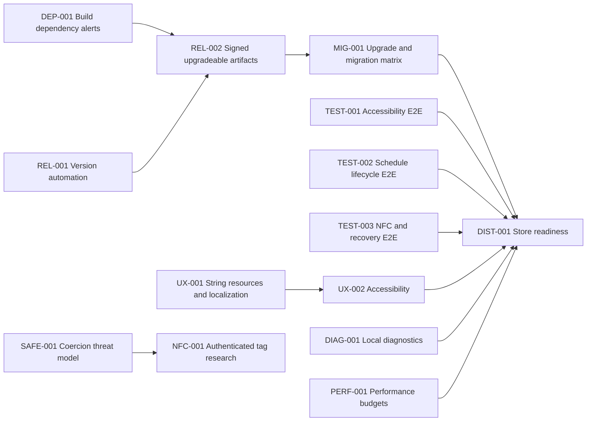

# WebSnag Roadmap

> **For agentic workers:** Treat each task card as one pull request unless the card
> explicitly says otherwise. Use test-driven development for behavior changes, preserve
> the security and privacy invariants in this document, and do not start a task whose
> dependencies are incomplete.

## Purpose

This document is the durable backlog after the Brick competitive review, the Android
security/privacy audit, the P1/P2 hardening work, and the release/diagnostics work merged
after [`v1.0.0-alpha.4`](https://github.com/mcasillas17/WebSnag/releases/tag/v1.0.0-alpha.4).
It is intentionally detailed so a contributor can take one task without reconstructing
the audit or making incompatible product decisions.

The next milestone should prioritize **upgrade safety, release correctness, and real
Android end-to-end coverage** before adding stronger enforcement.

## Current baseline

Current `main`, following `v1.0.0-alpha.4`, has:

- centralized unlock authorization and persisted emergency recovery;
- enrolled-tag enforcement with Android-Keystore-keyed HMAC identifiers;
- durable schedule occurrences and alarm-based reconciliation;
- backup and data-transfer exclusion;
- passphrase-encrypted local backup and restore;
- installation-bound signed activity exports;
- local privacy, retention, export, and delete controls;
- non-exported blocker and alarm components;
- CI, lint, unit tests, Android instrumentation, CodeQL, and dependency review;
- tag-derived Android version metadata with manifest verification;
- privacy-preserving local diagnostics and bounded local JSON export;
- no `INTERNET` permission, cloud account, telemetry, VPN, Device Admin, notification
  listener, usage-access permission, or Accessibility window-content retrieval.

The completed foundation came from:

- [PR #18: harden local enforcement controls](https://github.com/mcasillas17/WebSnag/pull/18)
- [PR #19: add local trust controls](https://github.com/mcasillas17/WebSnag/pull/19)

## Product and safety invariants

Every roadmap task must preserve these rules:

1. **Local-first by default.** Do not add cloud accounts, telemetry, remote policy
   control, or server-side app/domain lists.
2. **No hidden inspection.** Keep Accessibility
   `canRetrieveWindowContent="false"`. Do not inspect typed text, page content,
   notifications, or network traffic.
3. **Recovery is mandatory.** No feature may create an unrecoverable lock. Emergency
   calling and the active default dialer must remain reachable.
4. **Authorization is centralized.** UI, schedules, NFC, backup restore, and data
   deletion must not bypass the enforcement engine's active-session policy.
5. **NFC assurance is stated honestly.** Ordinary UID and static NDEF tags are
   low-assurance identifiers that can be copied or replayed. At-rest HMAC protection is
   not tag authentication.
6. **No "zero-bypass" claim.** A consumer Accessibility-based blocker can be disabled,
   force-stopped, uninstalled, or bypassed through Android recovery mechanisms.
7. **Untrusted data is validated twice.** Validate imported files, intents, package
   metadata, tag data, and schedule inputs at the boundary; encode, bind, or allowlist
   again at their sink.
8. **Secrets never enter source or artifacts.** Signing passwords, private keys,
   passphrases, and Keystore material must not be committed, logged, exported, or placed
   in test fixtures.
9. **One task, one reviewable PR.** Avoid mixing release infrastructure, UX,
   enforcement, and research in the same change.
10. **Evidence before claims.** A task is complete only when its acceptance criteria,
    tests, final diff, and required security checks have been reviewed.

## Android versioning: `versionCode` and `versionName`

Android packages carry two separate version values:

- **`versionCode`** is a positive integer used by Android and app stores to order
  builds. A larger value is newer. Every published upgrade must use a greater value,
  and Google Play does not accept reuse of a previously uploaded code.
- **`versionName`** is the user-visible string, such as `1.0.0-alpha.3`.

The Android documentation describes these contracts at
[Version your app](https://developer.android.com/studio/publish/versioning).

WebSnag release builds derive these values from an explicit
`-PwebsnagReleaseTag=vMAJOR.MINOR.PATCH[-CHANNEL.N]` property. Untagged local builds use:

```kotlin
versionCode = 1
versionName = "0.0.0-dev"
```

The tag workflow passes the immutable Git tag to Gradle, reads the parser's
machine-readable values, and verifies the generated APK manifest before publication. It
still publishes a runner-generated debug-signed APK, so users must uninstall the previous
build and lose local data until REL-002 supplies a durable signing identity.

### Implemented automation

Use the Git tag as the release source of truth and calculate both Android values with
tested build logic.

Accepted tag grammar:

```text
vMAJOR.MINOR.PATCH
vMAJOR.MINOR.PATCH-alpha.N
vMAJOR.MINOR.PATCH-beta.N
vMAJOR.MINOR.PATCH-rc.N
```

Recommended deterministic `versionCode` mapping:

```text
major * 100_000_000
+ minor * 1_000_000
+ patch * 10_000
+ channel * 1_000
+ sequence

channel: alpha=1, beta=2, rc=3, stable=9
```

Examples:

| Tag | `versionName` | `versionCode` |
| --- | --- | ---: |
| `v1.0.0-alpha.2` | `1.0.0-alpha.2` | `100001002` |
| `v1.0.0-alpha.3` | `1.0.0-alpha.3` | `100001003` |
| `v1.0.0-beta.1` | `1.0.0-beta.1` | `100002001` |
| `v1.0.0-rc.1` | `1.0.0-rc.1` | `100003001` |
| `v1.0.0` | `1.0.0` | `100009000` |
| `v1.0.1-alpha.1` | `1.0.1-alpha.1` | `100011001` |

The parser must reject major versions above 20, minor/patch values above 99,
prerelease sequences outside 1-999, unknown channels, leading signs, whitespace, and
codes above Android's supported limit. Development builds may use
`versionName="0.0.0-dev"` and `versionCode=1`; release builds must fail closed when no
valid release tag is provided.

Release tags are immutable inputs. Rebuilding the same stable tag must reproduce the
same version code; it must not invent a higher code for different contents. If a stable
artifact needs a corrected upload, publish a new patch version. If a prerelease needs a
corrected upload, increment its prerelease sequence. This trades same-name re-upload
headroom for deterministic, auditable tag-to-manifest identity.

Implement the parser as independently tested JVM build logic rather than duplicating
regular expressions in Gradle and GitHub Actions. WebSnag uses dependency-free Java 17
inside `buildSrc` because adding a Kotlin compiler plugin creates a newly reviewed path
to the repository's bounded Kotlin advisory, while no stable patched Kotlin release is
available. The tag workflow passes the exact tag to Gradle and uses `apkanalyzer` to
confirm the generated manifest values before publication.

## Priority model

| Priority | Meaning |
| --- | --- |
| P0 | Blocks an upgradeable or broadly testable prerelease |
| P1 | Required before beta / public store distribution |
| P2 | Valuable quality, diagnostics, or differentiation work |
| Research | Must produce evidence and a decision before production implementation |

## Milestone overview

| Milestone | Goal | Tasks |
| --- | --- | --- |
| Alpha 3 | Secure, upgradeable, correctly versioned builds with migration evidence | DEP-001, REL-001, REL-002, MIG-001, DOC-001 |
| Alpha 4 | Real enforcement and scheduling validation | TEST-001, TEST-002, TEST-003 |
| Beta 1 | Accessible, localized, diagnosable, distribution-ready app | UX-001, UX-002, DIAG-001, PERF-001, DIST-001 |
| Research track | Evaluate stronger features without weakening safety/privacy | NFC-001, SAFE-001 |

## Task status and ownership

The roadmap records dependency state; active ownership belongs in GitHub issues and pull
requests so two agents do not edit this document merely to claim work.

| Task | Status | Start condition |
| --- | --- | --- |
| DEP-001 | Complete | Critical/high alerts closed; Kotlin medium alert has a bounded disposition |
| REL-001 | Complete | Tag-derived Android metadata and manifest verification implemented |
| REL-002 | Ready | DEP-001 and REL-001 complete |
| MIG-001 | Blocked | REL-002 merged and a stable signed baseline exists |
| DOC-001 | Complete | Roadmap and README describe current behavior without duplicated task state |
| TEST-001 | Ready | May start now |
| TEST-002 | Ready | May start now |
| TEST-003 | Ready | May start now |
| UX-001 | Ready | May start now |
| UX-002 | Blocked | UX-001 merged |
| DIAG-001 | Complete | Local diagnostics screen and bounded SAF export implemented |
| PERF-001 | Ready | May start now |
| DIST-001 | Blocked | All listed distribution dependencies merged |
| SAFE-001 | Ready | May start now |
| NFC-001 | Blocked | SAFE-001 merged |

Before starting, search open issues and pull requests for the task ID. If no issue exists,
create one from the task card or put the complete card and ID in the PR body. The first
open issue/PR owns the task until it is closed or explicitly handed off.

## Execution sequence

1. **Release critical path:** complete `REL-002` to establish durable signing, then
   `MIG-001` to prove in-place upgrades and data migrations.
2. **Parallel validation and quality work:** `TEST-001`, `TEST-002`, `TEST-003`,
   `UX-001`, `PERF-001`, and `SAFE-001` may proceed while release work advances.
3. **Dependency-unlocked work:** start `UX-002` after `UX-001`, and `NFC-001` after
   `SAFE-001`.
4. **Final integration:** start `DIST-001` only after every dependency in its task card
   is complete.

## Dependency graph



Tasks without a dependency edge may proceed in parallel when they do not modify the
same files.

---

## Alpha 3: release and upgrade safety

### DEP-001 — Triage and remediate build/tooling dependency alerts

**Priority:** P0 supply-chain fix
**PR boundary:** Dependency provenance, safe upgrades/constraints, dependency snapshots,
and directly affected build configuration.
**Can run in parallel with:** REL-001, DOC-001, TEST-001, TEST-002, TEST-003
**Depends on:** Nothing

#### Problem and verified scope

GitHub's Dependabot API reported 49 open alerts on `main` after PR #25 merged on
2026-08-31:

- 1 critical;
- 19 high;
- 26 medium;
- 3 low.

The critical advisory names `org.bouncycastle:bcprov-jdk18on`; many high/medium alerts
name Netty modules. GitHub attributes these records to `settings.gradle.kts`.
Dependency extraction traced the remaining vulnerable versions to the root plugin
classpath and AGP internal `:app` configurations including `androidLintTool` and the
unified test platform. Bouncy Castle, Netty, jose4j, and JDOM remain absent from debug and
release application compile/runtime classpaths and packaged artifacts.

The completion gate is a new default-branch dependency snapshot that closes every
critical/high alert. The Kotlin Gradle plugin's medium alert may remain open only under
the bounded disposition in `docs/security/dependency-triage.md`.

#### Scope

1. Export the current Dependabot alert inventory with advisory ID, severity, package,
   vulnerable range, patched version, manifest, and dependency scope.
2. Resolve each package to its introducing top-level component using:
   - Gradle build-environment reports;
   - plugin classpaths;
   - app compile/runtime/test classpaths;
   - the submitted GitHub dependency snapshot.
3. Classify every alert as:
   - packaged runtime;
   - test-only;
   - build/plugin/tooling;
   - stale or incorrectly scoped snapshot;
   - unreachable but present.
4. Prefer upgrading the introducing top-level dependency or plugin.
5. Use a transitive constraint only when the introducing component documents
   compatibility with the patched version and the full build/test matrix proves it.
6. Do not add build-only libraries to the app runtime merely to override a tooling
   dependency.
7. Regenerate and inspect dependency snapshots after remediation.
8. Dismiss an alert only with advisory-specific evidence, affected scope, rationale,
   review date, and a trigger for reconsideration.
9. Add CODEOWNERS coverage for any new version catalog, build-logic, or dependency-policy
   files.

#### Likely files

- Modify: `gradle/libs.versions.toml`
- Modify: `settings.gradle.kts`
- Modify: root/app Gradle files only when provenance requires it
- Modify: `gradle/wrapper/gradle-wrapper.properties` only for a justified wrapper upgrade
- Modify: `.github/dependabot.yml`
- Modify: dependency-graph/review workflows only if snapshot scope is incorrect
- Modify: `.github/CODEOWNERS`
- Create: `docs/security/dependency-triage.md`

#### Required validation

- `./gradlew buildEnvironment`
- app debug/release compile and runtime dependency reports;
- focused `dependencyInsight` for every critical/high package;
- clean unit, lint, debug, release, and Android instrumentation runs;
- dependency snapshot generation;
- GitHub Dependency Review;
- CodeQL;
- APK/AAB content inspection proving build-only packages are not bundled.

#### Acceptance criteria

- No open critical/high alert remains without a reviewed, advisory-specific disposition.
- Packaged runtime exposure is distinguished from build-host exposure in the PR body.
- Upgrades do not weaken pinned GitHub Actions, wrapper verification, signing, or release
  fail-closed behavior.
- The final APK/AAB does not unexpectedly gain Netty, Bouncy Castle, HTTP clients, or
  network permissions.
- Dependency Review and the regenerated dependency graph pass.
- Medium/low alerts are fixed or entered as bounded follow-up work with an owner,
  rationale, and review trigger.
- No vulnerability is dismissed solely because WebSnag declares no `INTERNET`
  permission; build-host and local-file attack paths must still be considered.

#### Security notes

Build dependencies execute on contributor and CI machines and can be security relevant
even when absent from the APK. Conversely, a build-only alert must not be described as a
runtime Android vulnerability without evidence. Preserve both facts in documentation and
release notes.

---

### REL-001 — Automate Android version metadata

**Status:** Complete
**Priority:** P0
**PR boundary:** Build logic, its tests, and release-workflow version verification only.
**Can run in parallel with:** TEST-001, TEST-002, TEST-003. Coordinate with DOC-001
before either task modifies `README.md`.
**Depends on:** Nothing

#### Problem and evidence

Before this task, `app/build.gradle.kts` hardcoded `versionCode=1` and
`versionName="1.0.0"` while GitHub published alpha tags independently. Installed packages
therefore could not accurately report which alpha they contained, and store uploads
could not safely reuse the same code.

#### Scope

1. Add focused JVM build logic for:
   - parsing the accepted tag grammar;
   - deriving `versionName`;
   - deriving and range-checking `versionCode`;
   - distinguishing local development builds from release builds.
2. Read the release tag from one explicit Gradle property such as
   `-PwebsnagReleaseTag=v1.0.0-alpha.3`.
3. Make tag/release builds fail if the property is absent or invalid.
4. Add a Gradle verification task that prints machine-readable version values.
5. Pass the GitHub tag to Gradle from `.github/workflows/release.yml`.
6. Verify the built APK/AAB manifest with Android SDK tooling before publishing.
7. Include the calculated values in the release summary.

#### Likely files

- Create: `buildSrc/src/main/java/websnag/buildlogic/WebSnagVersion.java`
- Create: `buildSrc/src/test/java/websnag/buildlogic/WebSnagVersionTest.java`
- Create: `buildSrc/build.gradle.kts`
- Modify: `app/build.gradle.kts`
- Modify: `.github/workflows/release.yml`
- Modify: `.github/CODEOWNERS` to protect executable `buildSrc/` build logic
- Modify: `README.md`

If build logic is placed elsewhere, keep the parser independently testable and do not
copy its rules into the workflow.

#### Required test cases

- each accepted stable/alpha/beta/rc tag;
- monotonic ordering within and across channels;
- patch/minor/major transitions;
- malformed tags and unsupported channels;
- zero, negative, and too-large sequences;
- overflow and Android maximum enforcement;
- release build without a tag;
- local development fallback;
- manifest values in the built artifact equal the source tag.

CI and release jobs run `./gradlew -p buildSrc test` directly in addition to the
application suite; app-module test tasks do not execute buildSrc tests.

#### Acceptance criteria

- `v1.0.0-alpha.3` builds with `versionName=1.0.0-alpha.3` and a code greater than 1.
- Every later accepted tag maps to a greater code in semantic release order.
- Invalid or missing tag metadata cannot publish a release.
- The release workflow contains no second version parser.
- `./gradlew test`, `lintDebug`, and debug assembly pass.
- A workflow test or dry run demonstrates the exact tag-to-manifest values.

#### Security/privacy notes

Version calculation needs no secret. Do not derive it from an untrusted PR title,
branch name, release-note text, or mutable network response.

---

### REL-002 — Publish consistently signed, upgradeable prerelease artifacts

**Priority:** P0
**PR boundary:** Signing/release workflow, artifact verification, and release docs.
**Can run in parallel with:** TEST-001, TEST-002, TEST-003
**Depends on:** DEP-001, REL-001

#### Problem and evidence

The current tag workflow publishes `app-debug.apk`. Runner-generated debug signing is
not a durable release identity, and the release warning requires uninstalling old
builds, deleting local data. This prevents realistic migration testing and makes each
alpha a fresh install rather than an upgrade.

#### Scope

1. Choose one durable prerelease signing identity.
2. Store the keystore and credentials only in protected GitHub release secrets.
3. Build `assembleRelease` and `bundleRelease` for protected tag events.
4. Keep pull-request CI secret-free and debug-signed.
5. Verify APK signatures with `apksigner verify --verbose --print-certs`.
6. Verify AAB structure using supported Android bundle tooling.
7. Publish:
   - a signed release APK for direct testers;
   - a signed AAB for store/internal-track use;
   - SHA-256 checksum files;
   - a release manifest containing tag, commit, version name/code, application ID,
     minimum SDK, target SDK, and certificate digest.
8. Enable release code/resource shrinking with reviewed R8 rules, or document with
   measured evidence why a specific release must defer it.
9. Assert that every published release artifact is non-debuggable.
10. Preserve serialization, Keystore, backup, schedule, and Compose behavior under R8;
    treat obfuscation as artifact hardening, not a security boundary.
11. Publish the R8 mapping/native symbol artifacts only to the protected crash/store
    destination selected by the project; never attach them to a public release by
    default.
12. Document key custody, rotation, loss, and Play App Signing boundaries.
13. Remove the uninstall-first warning only after an actual upgrade test passes.

#### Likely files

- Modify: `.github/workflows/release.yml`
- Modify: `app/build.gradle.kts`
- Create: `docs/releasing.md`
- Create: `scripts/verify-release-artifacts.sh`
- Modify: `README.md`

#### Acceptance criteria

- No signing secret is available to pull-request workflows or forked code.
- Two consecutive tagged APKs have the same expected certificate digest.
- `adb install -r` upgrades the older prerelease without deleting app data.
- The AAB and APK carry the same version name/code.
- Checksums match downloaded assets.
- A release fails before publication if signing or artifact verification fails.
- The published manifest reports `android:debuggable="false"`.
- Release smoke tests pass with minification and resource shrinking enabled.
- R8 keep rules are narrow and justified by a failing test or documented runtime
  requirement; do not keep the entire application namespace.
- Key material and passwords are absent from source, logs, artifacts, and fixtures.

#### Rollback

Deleting a bad GitHub release does not recall downloaded APKs. The workflow must verify
artifacts before publication. If the signing key is compromised, stop releases, rotate
the upload key through the distribution provider, revoke affected credentials, and
publish a security notice.

---

### MIG-001 — Build an upgrade and data-migration test matrix

**Priority:** P0
**PR boundary:** Migration fixtures, migration code required by the fixtures, and
upgrade-test automation.
**Can run in parallel with:** DOC-001 after fixture format is agreed
**Depends on:** REL-002

#### Problem and evidence

Alpha 2 changed NFC identifiers from raw UIDs to Keystore HMAC fingerprints, added
persisted schedule occurrence and emergency-recovery state, bounded history, and added
encrypted backup data. Existing unit tests cover components, but the release process
does not prove that an installed older build upgrades without losing or weakening
state.

#### Scope

Create versioned, synthetic fixtures that contain no real user data:

- alpha-1-style profiles, raw test UID, tags, schedules, theme, and history;
- alpha-2 current state with HMAC tag fingerprints;
- active and inactive profile scenarios;
- an in-progress emergency recovery;
- a dismissed schedule occurrence;
- maximum retained history;
- valid and invalid encrypted backup envelopes.

Automate two kinds of tests:

1. **Schema migration tests:** load fixture bytes/preferences into the new code and
   assert the resulting domain state.
2. **Package upgrade tests:** install a durably signed baseline APK, seed synthetic
   state, install the new APK with `adb install -r`, launch, and inspect state.

#### Required migration assertions

- raw synthetic UID is removed after successful HMAC migration;
- the corresponding profile still references the correct enrolled tag;
- unknown or malformed identifiers fail closed rather than authorizing unlock;
- active sessions are never silently ended by migration;
- emergency cooldown cannot become shorter due to restart/migration;
- dismissed schedule occurrence does not immediately reactivate;
- history is capped without corrupting retained records;
- Keystore key loss leads to explicit re-enrollment, not a crash or permissive unlock;
- backup restore never imports an active profile;
- unsupported future backup versions are rejected without partial writes.

#### Likely files

- Create: `app/src/androidTest/assets/migrations/`
- Create: `app/src/androidTest/java/.../UpgradeMigrationTest.kt`
- Create: `scripts/test-apk-upgrade.sh`
- Modify: `LocalDataStore.kt` only when a failing fixture proves migration work is
  required
- Modify: `.github/workflows/ci.yml` if the emulator job is reliable and bounded

#### Acceptance criteria

- All fixture data is visibly synthetic and documented.
- Migration tests demonstrate red-green behavior for every migration path.
- A failed migration leaves original state available for a retry or explicit recovery.
- The previous signed test build upgrades in place on an emulator.
- The test records package version before/after and proves user state survived.

---

### DOC-001 — Correct current documentation drift

**Status:** Complete
**Priority:** P0 documentation fix
**PR boundary:** Documentation and badges only.
**Can run in parallel with:** Every task except another task editing `README.md`
**Depends on:** Nothing

#### Corrected drift

- README called `TimeScheduleTrigger` a roadmap item although durable schedules shipped.
- Emergency Unlock appeared twice in the feature list.
- The Kotlin badge said 2.3.20 while `gradle/libs.versions.toml` used 2.4.10.
- The project tree omitted backup, activity-attestation, privacy, scheduling, and
  identity-protection files.
- Release instructions did not explain the debug-signature/uninstall limitation
  alongside encrypted backup guidance.
- The P2 implementation plan contained unchecked execution boxes even though the
  implementation had merged.

#### Acceptance criteria

- README describes only behavior present on `main`.
- No duplicated feature bullets remain.
- Version badges are generated or checked against the version catalog where feasible.
- Architecture and project-tree examples include current boundaries without listing
  every incidental file.
- Release/install instructions distinguish current reality from planned REL-002 work.
- Historical plans are clearly labeled and are not mistaken for open tasks.

---

## Alpha 4: Android behavior validation

### TEST-001 — End-to-end Accessibility enforcement tests

**Priority:** P1
**PR boundary:** Test fixture app/module, device tests, and only production fixes exposed
by those tests.
**Can run in parallel with:** TEST-002, TEST-003
**Depends on:** Nothing

#### Goal

Prove on an emulator that the Accessibility service reacts to a real foreground package,
blocks only what policy requires, and never traps emergency/system surfaces.

#### Design

Create a tiny test-only target application with two activities so tests can produce real
window-state transitions. Use UI Automator or Android instrumentation to:

1. enable or verify the WebSnag Accessibility service in the controlled emulator;
2. activate a blocklist profile and launch the blocked fixture;
3. assert WebSnag returns Home and shows the calm blocker;
4. launch an unblocked fixture and assert it remains foreground;
5. activate allowlist mode and test inverse behavior;
6. prove WebSnag, System UI, launcher, emergency activity, and current default dialer are
   exempt;
7. disable Accessibility and verify the UI reports enforcement unavailable rather than
   pretending the lock is active;
8. re-enable the service and verify state recovery.

#### Important edge cases

- package names that are blank, missing, rapidly alternating, or uninstalled mid-session;
- split-screen, picture-in-picture, chooser, permission dialogs, and Settings surfaces;
- OEM/default dialer package discovery;
- blocker Activity already visible;
- repeated events do not create an Activity launch storm;
- process death while a profile remains persisted active.

#### Acceptance criteria

- Tests exercise actual Android window events, not only `isPackageBlocked()`.
- Blocklist and allowlist each have positive and negative cases.
- Emergency calling and default dialer safety assertions are device-level.
- No test requires a real user account, network, personal app list, or real NFC UID.
- Failures include enough device state to diagnose without logging user data.

---

### TEST-002 — Schedule lifecycle, clock, reboot, and alarm tests

**Priority:** P1
**PR boundary:** Clock/alarm abstractions, deterministic tests, emulator lifecycle
scripts, and fixes they expose.
**Can run in parallel with:** TEST-001, TEST-003
**Depends on:** Nothing

#### Goal

Prove that schedules activate and end exactly once across process death, reboot,
timezone changes, daylight-saving transitions, denied exact-alarm access, and manual
dismissal.

#### Required scenarios

- same-day and overnight windows;
- every day-of-week boundary;
- spring-forward missing local time;
- fall-back repeated local time;
- manual, NFC, and emergency end suppress only the current occurrence;
- next occurrence remains enabled;
- two overlapping schedules have a deterministic winner;
- profile deletion/disabling invalidates future alarms;
- process death before start, while active, and before end;
- reboot while inside and outside a window;
- `TIME_SET`, `TIMEZONE_CHANGED`, and `MY_PACKAGE_REPLACED`;
- exact alarms available and unavailable;
- delayed/inexact alarm delivery after the intended boundary;
- Wi-Fi condition enters/exits during a schedule window;
- no busy polling or duplicate `PendingIntent`.

#### Implementation guidance

Introduce a `Clock`/time-zone boundary before adding more tests if production code still
reads wall-clock time directly. Keep calendar calculations pure. Device tests should
inspect the scheduled explicit receiver and use unique synthetic schedule IDs.

#### Acceptance criteria

- Pure calculations have exhaustive JVM boundary tests.
- Emulator tests cover alarm delivery and system broadcasts.
- A missed end alarm reconciles to unlocked state on the next process/system event.
- A dismissed occurrence never relocks before its next start.
- Battery behavior is event/alarm-driven, with no fixed-interval loop.

---

### TEST-003 — NFC authorization and emergency recovery device tests

**Priority:** P1
**PR boundary:** NFC/recovery tests and fixes exposed by them.
**Can run in parallel with:** TEST-001, TEST-002
**Depends on:** Nothing

#### Goal

Validate the complete lock/unlock state machine, including HMAC migration and recovery
timers, without claiming that an emulator proves physical tag authenticity.

#### Required scenarios

- specific enrolled tag authorizes its profile;
- another enrolled tag is rejected by specific-tag policy;
- explicit any-enrolled policy accepts only enrolled tags;
- unknown and deleted tags are rejected;
- `ManualOnly` ignores NFC;
- null/malformed tag data fails closed;
- Keystore key invalidation requests re-enrollment;
- emergency unlock disabled;
- emergency unlock with and without required intention phrase;
- cooldown cancellation, process death, restoration, and completion;
- elapsed realtime/wall-clock manipulation cannot shorten cooldown;
- profile/tag mutation is blocked while active;
- restore/delete operations are blocked while active;
- external intents cannot forge a successful scan.

#### Hardware boundary

Use deterministic software inputs for authorization logic, but maintain a small manual
hardware matrix for at least:

- one writable NFC sticker;
- one read-only card or fob;
- one Android phone model with NFC antenna placement documented.

Manual results must never be promoted to a clone-resistance claim.

#### Acceptance criteria

- Device tests cover the recovery timer across Activity/process recreation.
- No raw UID appears in DataStore, logs, screenshots, exports, or test reports.
- Authorization outcomes are explicit typed results, not silent Boolean fallbacks.
- Tests prove no UI callback directly deactivates a protected session.

---

## Beta 1: product quality and distribution

### UX-001 — Extract strings and add localization infrastructure

**Priority:** P1
**PR boundary:** String resources, formatting/plural resources, locale configuration,
and localization tests.
**Can run in parallel with:** DIAG-001, PERF-001
**Depends on:** Nothing

#### Problem and evidence

The app has only `app/src/main/res/values/strings.xml`, while major Compose screens
contain hardcoded English UI text. This blocks reliable translation, plural handling,
and pseudo-localization testing.

#### Scope

1. Inventory user-visible strings in every screen, dialog, snackbar, accessibility
   description, notification, and error.
2. Move them to named resources grouped by feature.
3. Use formatted resources for durations and counts.
4. Use plurals for days, sessions, interceptions, and minutes.
5. Enable pseudo-locales in debug builds.
6. Add locale configuration only after at least one complete translation exists.
7. Add a Spanish translation as the first non-English locale after English resource
   coverage is complete and reviewed by a fluent human.

#### Naming rules

Resource names must describe meaning, not English wording:

- good: `emergency_unlock_cooldown_remaining`
- bad: `five_minutes_left`

Do not concatenate translated sentence fragments.

#### Acceptance criteria

- A search finds no unexplained user-visible string literals in Compose code.
- Pseudo-locales reveal no truncation in primary flows.
- Date/time and numeric formatting use the active locale.
- Accessibility labels are localized with the same semantic meaning.
- Translation changes do not alter policy values or identifiers.

---

### UX-002 — Accessibility and large-content validation

**Priority:** P1
**PR boundary:** Semantics, layout fixes, accessible interaction alternatives, and
Compose UI tests.
**Can run in parallel with:** DIAG-001 after UX-001 stabilizes shared strings
**Depends on:** UX-001

#### Scope

- TalkBack reading order and meaningful headings;
- content descriptions for meaningful icons and null descriptions for decorative art;
- state descriptions for toggles, schedules, profiles, and active locks;
- accessible alternatives to press-and-hold gestures;
- keyboard/switch-access focus and activation;
- 48dp minimum touch targets;
- large font and display scaling through Android accessibility sizes;
- light/dark contrast;
- reduced-motion behavior for breathing/radar animations;
- color-independent status communication;
- RTL mirroring and bidirectional text;
- screen-reader-safe countdown announcements that do not speak every animation frame.

#### Required screen matrix

- setup and permissions;
- dashboard idle/active/recovery;
- profiles and profile editor;
- schedules and schedule editor;
- activity/calendar;
- tags and enrollment;
- blocker overlay;
- privacy/export/delete controls.

#### Acceptance criteria

- Compose accessibility tests assert labels, roles, states, and actions.
- Primary flows remain usable at the largest supported font scale without clipped
  controls.
- Hold-to-lock has a clearly labeled accessible alternative with equivalent confirmation.
- Automated accessibility checks run in CI where stable.
- A manual TalkBack checklist is documented with device/API version.

---

### DIAG-001 — Add privacy-preserving local diagnostics

**Priority:** P1
**PR boundary:** Diagnostics model/screen/export and tests.
**Can run in parallel with:** UX-001, PERF-001
**Depends on:** Nothing

**Implementation status:** Complete. The "Local diagnostics" screen, `DiagnosticsReport`
model, and Storage-Access-Framework JSON export ship with unit test coverage. The report
is schema v1 (`DIAGNOSTICS_SCHEMA_VERSION`), the exported payload is hard-bounded to
`DIAGNOSTICS_MAX_EXPORT_BYTES` (16,384 bytes), and every field is typed (enum/value
object) rather than free-form, so no payload value can leak through it. Each unhealthy
signal links to a local remediation action (NFC toggle, NFC Hub, Accessibility,
notification, exact-alarm, or battery-optimization settings).

#### Goal

Answer "why did WebSnag not block?" without telemetry, cloud access, or exposing user
behavior.

#### Diagnostic state

Display and optionally export:

- app version name/code and build type;
- Android API/device manufacturer/model;
- NFC hardware present/enabled;
- Accessibility service enabled/running;
- notification permission state if still used;
- exact-alarm capability;
- battery-optimization state;
- next scheduled transition time and whether it is exact/best-effort;
- last schedule reconciliation time and typed outcome;
- active profile ID represented by a redacted local alias, never its name;
- whether a required enrolled tag exists, never its fingerprint;
- Keystore key availability as a Boolean state;
- backup schema version;
- last local error category and timestamp, without payload values.

#### Data minimization

Never export:

- raw or HMAC NFC identifiers;
- profile/tag names;
- package block/allow lists;
- Wi-Fi SSIDs/BSSIDs;
- backup passphrases or derived keys;
- activity history;
- notification or Accessibility event content;
- filesystem paths containing usernames.

#### Acceptance criteria

- Diagnostic export is valid, bounded JSON with an explicit schema version.
- Redaction tests use hostile names/identifiers and prove they do not appear.
- Export is opt-in and local through the Storage Access Framework.
- The feature declares no network permission and performs no network request.
- Every reported state links to a local remediation action where Android permits one.

---

### PERF-001 — Establish performance and battery budgets

**Priority:** P2
**PR boundary:** Benchmarks, representative fixtures, budgets, and targeted fixes.
**Can run in parallel with:** UX-001, DIAG-001
**Depends on:** Nothing

#### Measure

- cold/warm startup;
- profile activation to in-memory rule availability;
- Accessibility event to blocker presentation;
- package lookup with 10, 100, 1,000, and 10,000 rules;
- DataStore initialization and migration;
- schedule reconciliation with 1, 10, 100, and 1,000 schedules;
- backup encode/decode with maximum supported records;
- activity attestation generation/verification;
- memory after repeated profile/tag edits;
- wakeups and idle battery impact over a representative scheduled day.

#### Initial budgets

Budgets must be measured on a documented reference emulator and at least one physical
midrange device before being enforced. Do not invent thresholds solely from desktop JVM
tests. Record p50 and p95, fixture size, API level, build type, and thermal state.

#### Acceptance criteria

- Benchmarks are reproducible and use synthetic data.
- No benchmark logs sensitive values.
- A regression threshold is added only after a stable baseline exists.
- Release notes call out material battery/performance changes.
- Optimizations preserve correctness and are reviewed separately from benchmark setup
  when the diff would otherwise become too large.

---

### DIST-001 — Prepare Play/internal-track and F-Droid-compatible distribution

**Priority:** P1
**PR boundary:** Distribution metadata, policy documentation, and build automation.
Store-account publication should remain a separately approved action.
**Can run in parallel with:** None at final integration
**Depends on:** DEP-001, REL-002, MIG-001, TEST-001, TEST-002, TEST-003, UX-002,
DIAG-001, PERF-001

#### Scope

- production application/version identity;
- signed AAB and release APK;
- reproducible open-source build instructions;
- privacy policy matching actual permissions/data handling;
- Accessibility API declaration and user disclosure;
- exact-alarm justification or a documented inexact fallback;
- data safety form source-of-truth document;
- content rating and target audience decision;
- screenshots for supported form factors/themes/font scales;
- changelog and release-note process;
- support/contact and vulnerability-reporting paths;
- open-source notices and dependency license review;
- F-Droid metadata feasibility without proprietary services.

#### Acceptance criteria

- Store declarations match the manifest and runtime behavior.
- Reviewers can build from the tagged source using documented tools.
- The app remains functional without Google Play Services.
- No store-specific SDK adds telemetry or network permission.
- Upgrade from the previous signed release preserves data.
- Publishing to a real store is separately approved after reviewing the final listing,
  countries, track, and user impact.

---

## Research track

### NFC-001 — Evaluate authenticated NFC hardware

**Priority:** Research
**PR boundary:** Research report, protocol abstraction/test vectors, and optional
hardware-gated prototype. No production marketing claim.
**Can run in parallel with:** SAFE-001 after its abuse cases are available
**Depends on:** SAFE-001

#### Question

Can WebSnag support optional freshness-capable authenticated tags while preserving
ordinary read-only UID tags and the local-only architecture?

#### Required evidence

- official silicon/protocol documentation;
- tag-specific secret provisioning and ownership model;
- per-tap nonce/counter/freshness validation;
- replay, cloning, desynchronization, and key-loss analysis;
- Android NFC compatibility and latency across representative phones;
- deterministic official test vectors;
- at least two physical authenticated tags;
- recovery when the authenticated tag is lost or damaged;
- local key storage and export/non-export decisions;
- cost and availability clearly labeled with date/source.

#### Prohibited shortcuts

- static HMAC or secret in writable NDEF;
- UID plus obscurity;
- calling encrypted local storage "tag authentication";
- a protocol without freshness;
- mandatory proprietary hardware;
- claims based only on emulator tests.

#### Exit criteria

The research PR must recommend one of:

1. implement a named authenticated-tag protocol behind `TagCredentialVerifier`;
2. run a bounded second prototype to answer named missing evidence;
3. reject authenticated-tag support and document why.

Production implementation requires a separate reviewed PR and explicit assurance-level
copy in the UI.

---

### SAFE-001 — Threat-model stronger enforcement and coercive-control risk

**Priority:** Research / safety gate
**PR boundary:** Threat model and architecture decision only.
**Can run in parallel with:** Most implementation tasks
**Depends on:** Nothing

#### Question

Should WebSnag ever add optional Device Admin/uninstall resistance or Settings blocking?

#### Threat actors and misuse cases

- an impulsive owner trying to bypass their own commitment;
- a partner, parent, employer, or abuser configuring another person's phone;
- a person who consents initially but later needs immediate escape;
- a lost/broken tag with no network or support channel;
- malware attempting to hide behind WebSnag's privileges;
- device resale, ownership transfer, or inherited configuration;
- Android safe mode, recovery, ADB, work profile, MDM, and OEM-specific behavior.

#### Required decision criteria

- explicit device-owner consent cannot be remotely or silently supplied;
- enabling stronger enforcement has a waiting period and clear privilege explanation;
- emergency recovery remains local and cannot be disabled;
- dialer/emergency/System UI access remains available;
- revocation and uninstall steps are visible before enabling;
- no stealth mode, hidden icon, remote control, or third-party lock command;
- store-policy compatibility is verified from current primary sources;
- recovery is tested after process death, reboot, tag loss, and Keystore loss;
- marketing remains honest about Android-level bypasses.

#### Exit criteria

Publish an ADR choosing:

1. keep Device Admin permanently out of scope;
2. permit a narrowly defined opt-in prototype behind explicit safeguards;
3. identify missing evidence with an owner and review trigger.

No production privilege may be added in this task.

---

## Explicit non-goals

These are not unclaimed roadmap tasks:

- cloud accounts, analytics, telemetry, or remote policy control;
- family/parental/employer enforcement dashboards;
- hidden or stealth operation;
- server-side package, website, or activity storage;
- Accessibility window-content retrieval;
- notification-content access;
- a local VPN or traffic inspection for domain blocking;
- mandatory proprietary NFC hardware;
- static-NDEF "authentication";
- unrecoverable locks;
- "zero-bypass," "uncopyable," or non-repudiation claims;
- iOS parity inside the Android repository.

Domain blocking remains intentionally deferred by
[`docs/architecture/domain-blocking-decision.md`](architecture/domain-blocking-decision.md).
Changing that decision requires a new privacy architecture review, not a normal feature
PR.

## Agent task protocol

Future agents should use this sequence:

1. Select one task ID whose dependencies are merged.
2. Read this roadmap, linked ADRs/security docs, relevant source, tests, and recent
   history.
3. State the task ID in the branch name, PR title, and PR body.
4. Confirm no other open PR owns the same files or task.
5. Write a failing test before each behavior change.
6. Keep the PR within the card's boundary; propose newly discovered work as a separate
   task rather than expanding scope.
7. Run the smallest focused tests during development, then the complete unit/lint/build
   suite before review.
8. Run device tests for Android framework, Keystore, Accessibility, alarm, NFC, or
   lifecycle behavior.
9. Request one correctness/architecture review and one security/privacy/coverage review.
10. Fix valid findings and repeat review until no actionable findings remain.
11. Update directly affected documentation and this roadmap only if task status or
    dependencies materially change.
12. Include exact commands, test counts, limitations, migrations, and rollback notes in
    the PR.

## Definition of done for roadmap tasks

A task is complete only when:

- acceptance criteria are demonstrably met;
- tests were observed failing before implementation and passing afterward;
- full repository unit tests, lint, and applicable builds pass;
- applicable emulator/device tests execute a non-zero test count;
- the final diff has no unresolved security/privacy findings;
- documentation describes current behavior without future-tense ambiguity;
- no secrets or personal data appear in the diff or artifacts;
- CI, CodeQL, and dependency review pass;
- the PR remains focused on one task ID;
- follow-up limitations are recorded as separate, bounded work rather than hidden in
  prose.
