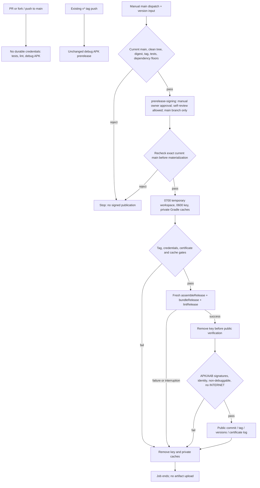

# Release builds and signing

## Readiness and scope

REL-002A supplies a **build-only signing foundation**, merged in #35, not a public
signed release. The approved solo-maintainer repository and environment protections
were configured and read back on **2026-09-13 at 04:59 UTC**; see the public control
record below. They do not establish signing readiness.

At that checkpoint, the existence of an approved identity and its custody/restore
arrangement was **unknown, not absent**. The approved certificate entry in
[`config/prerelease-signing.properties`](../config/prerelease-signing.properties)
is deliberately empty, `prerelease-signing` has **zero secrets**, no protected
`release-build.yml` runs have been dispatched, and no approved-key acceptance evidence
exists. This documentation/setup change was pending merge at the **2026-09-13 04:59 UTC
pre-merge checkpoint**. REL-002A remains blocked on identity approval, custody and tested
restore, separately approved provisioning, and
two successful protected runs with that identity. Disposable-key success cannot satisfy
those blockers; the existing foundation must not be reimplemented.

[`release-build.yml`](../.github/workflows/release-build.yml) is a separate manual
workflow. It builds the exact dispatched **current main commit**, using a tag-shaped
version input. It does not check out a supplied tag, accept a historical commit, create
tags, upload artifacts, or publish releases. This avoids running arbitrary tag-selected
workflow code with the durable key.

[`release.yml`](../.github/workflows/release.yml) is unchanged: pushed `v*` tags still
produce a debug-signed GitHub prerelease. **Uninstall previous CI-distributed debug
builds before installing newer ones; uninstalling removes their local app data.**
Do not remove this warning on the strength of certificate continuity alone.

| Output | Location | Current distribution |
| --- | --- | --- |
| Debug APK | `app/build/outputs/apk/debug/app-debug.apk` | Existing tagged debug prerelease workflow |
| Release APK | `app/build/outputs/apk/release/app-release.apk` | Local output or temporary hosted-job output only |
| Release AAB | `app/build/outputs/bundle/release/app-release.aab` | Local output or temporary hosted-job output only |

REL-002B owns complete artifact verification/publication, checksums and a release
manifest. REL-002C owns R8/resource shrinking and keep-rule tuning. MIG-001B owns the
in-place upgrade matrix and removal of the uninstall warning. None is completed here.
The application ID remains `websnag.elopenmike.com`; no application permissions, data
flows, telemetry, accounts, or enforcement privileges change.

## Release-build flow



## Maintainer setup: approval before provisioning

**Owner: `@mcasillas17`. Do not generate, replace, rotate, upload, or delete a durable
identity without explicit owner approval.** First inventory existing approved identities
and environment/secret **names and protection metadata**, not secret values. Reuse an
approved identity rather than creating another because configuration is missing.

### 1. Confirm configured repository and environment controls

WebSnag has one maintainer, `@mcasillas17`. All changes to `main`, including public
signing configuration, require a PR, passing required checks, an up-to-date branch,
and resolved review conversations. **Zero approving reviews are required**; mandatory
code-owner and last-push approval are disabled. CODEOWNERS records path responsibility,
not independent approval. The owner still inspects the final diff, checks and review
findings and separately authorizes the exact PR/head for a normal merge. Do not use
`--admin`, direct main pushes or an emergency bypass as the normal merge path.

The `prerelease-signing` environment requires **manual owner deployment approval**,
allows self-review and forbids administrator bypass. Only its selected `main` branch
may deploy. Configuration or dispatch authorization does not grant deployment approval:
never automate approval or use an owner token to approve on the owner's behalf.

Owner self-approval is authorization, **not independent human review**. AI review and
extra accounts controlled by the owner do not provide two-person separation. A second
maintainer is not a prerequisite of this policy. Account compromise concentrates source,
settings and signing-approval risk. Use strong phishing-resistant authentication
(passkeys or hardware security keys), tightly scoped/short-lived credentials where
supported, protected account recovery and minimal credential exposure. These reduce
risk but cannot replace separation of duties. The owner can still edit settings;
disabled bypass is not immutable governance.

#### Public control record

The following server-side settings were applied and read back on **2026-09-13 at
04:59 UTC** (2026-09-12 at 21:59 Pacific). This is a dated configuration record, not
approved-key execution evidence. Reconfirm the controls before provisioning or signing;
if a required control is unavailable or has drifted, stop rather than weaken it.

| Control | Recorded setting |
| --- | --- |
| Main PR/check rules | Active [ruleset 23134410](https://github.com/mcasillas17/WebSnag/rules/23134410), exactly `refs/heads/main`, no exclusions or bypass actors |
| PR approvals | PR required; `required_approving_review_count=0`, `require_code_owner_review=false`, `require_last_push_approval=false`; review conversations must be resolved |
| Required checks | Exactly the seven contexts below, each from GitHub Actions app `15368`; strict up-to-date checks enabled |
| Existing restrictions | [Ruleset 21267137](https://github.com/mcasillas17/WebSnag/rules/21267137) unchanged: default-branch force-push and deletion bans, no bypass actors |
| Signing environment | `prerelease-signing`, ID `21821186617` |
| Deployment reviewer | Only user `mcasillas17`, ID `9424687`; `prevent_self_review=false` |
| Administrator bypass | `can_admins_bypass=false` |
| Selected branches and tags | `protected_branches=false`, `custom_branch_policies=true`; exactly one policy, ID `59839327`, name `main`, type `branch`; no tag or PR-ref policies |
| Provisioning/execution | Zero signing environment secrets; no protected workflow dispatches or acceptance runs |

`require_extra_approval_for_unattributed_changes=true` remains GitHub's default.
[GitHub documents that this setting has no effect when required approvals are zero](https://docs.github.com/en/repositories/configuring-branches-and-merges-in-your-repository/managing-rulesets/available-rules-for-rulesets#additional-approval-for-unattributed-copilot-pull-requests);
it does not add an approval requirement under this policy.

All seven required PR contexts are pinned to the same GitHub Actions app:

| Exact required PR context | Purpose |
| --- | --- |
| `Validate` | Primary CI validation |
| `Device safety / Device (smoke, API 36)` | Required device safety smoke gate |
| `Analyze (java-kotlin)` | Java/Kotlin CodeQL analysis |
| `Analyze (actions)` | Actions CodeQL analysis |
| `Analyze (python)` | Python CodeQL analysis |
| `Generate pull request snapshot` | PR dependency-graph generation |
| `Review dependency changes` | PR dependency review |

Do not add `Submit pull request snapshot` as a required PR-head context: the observed
`workflow_run` check attaches to main. Inspect the actual trusted submission for the
merged PR instead. `Submit main snapshot` is the main-push submission, not the PR
generation check. Standalone full-device coverage is supplemental, not a replacement
for the required smoke context.

YAML and CODEOWNERS do not configure these server-side protections. The
`github.ref_protected` check is an additional gate, not proof that reviews or required
checks were configured. Do not substitute implicit environment creation, unrestricted
deployments, `v*`, PR refs or "protected branches only" for the selected-main policy.
Keep the four signing values below at **environment scope only**, never duplicated at
repository/organization scope or forwarded into PR workflows.

Before each manual deployment approval, the owner must inspect the **exact current main
SHA and version input** and confirm successful `Validate`, the device smoke context,
all three `Analyze (...)` contexts and `Submit main snapshot` on that SHA. Also inspect
the actual dependency generation, trusted submission and review for the merged PR,
including the setup/configuration PR. PR-only checks are not expected to rerun as
main-push jobs. The release workflow repeats release-control tests and dependency floors,
but does not query every main check.

Some dependency workflows can return green while skipping disabled or unsupported
services. Confirm that all applicable work **actually executed successfully**, including
dependency submission and review; a skipped step/job or green badge alone is insufficient.
Stop signing approval if those controls are unavailable. Do not change the workflows or
weaken checks to turn skipped work into acceptance.

### 2. Approve and safeguard one durable identity

First obtain identity-specific authorization and confirm whether an approved identity
already exists; its current existence and custody are unconfirmed. Missing configuration
is not permission to create a replacement.

Use a private JKS or PKCS12 keystore containing the approved private key and X.509
certificate, kept outside version-controlled directories. Use an approved modern,
non-debug identity. For a newly created identity, repository policy requires **RSA
at least 3072 bits** and **at least 25 years initial certificate validity**; this is
not a claim that Android mandates RSA-3072. The build checks validity now, not a minimum
remaining lifetime; initial validity and expiry planning are custody controls, not an
automated floor.

For a new identity, use an owner-approved offline provisioning procedure or Android
Studio's key-creation flow. Record the approval, custodian, certificate, algorithm,
creation/expiry dates, and recovery procedure before enabling the workflow. Existing
approved keys must not be regenerated to match an example.

Choose a **non-sensitive alias**, such as `websnag-prerelease`. `KEY_ALIAS` is stored as
an environment secret for configuration/log hygiene, not confidentiality. AAB/JAR
signature filenames expose an alias-derived form (uppercased/truncated/sanitized).
APK v1 signing is explicitly disabled and verified off; the v2/v3 APK path does not use
those JAR alias filenames. Neither aliases nor
certificate subject fields should contain passwords, personal identifiers or recovery
information. The certificate itself and its digest are public.

Keep the original in an access-controlled encrypted vault/offline store. Maintain at
least two independently stored encrypted backups, with recovery credentials separate
from the backup media. Base64 is not encryption; GitHub Actions must not be the sole
backup. Test restoration on an authorized isolated machine and confirm the restored
certificate digest **and usable private key** before depending on a backup; comparing
public certificates alone is insufficient. Retain detailed custody locations, recovery
instructions and access information privately. The public acceptance record needs only
a dated, non-sensitive owner confirmation of approved custody, backups and successful
restore. Review expiry before each release approval and after any custody/backup change.

### 3. Record the public certificate digest

On the authorized custody machine, export the **certificate only** from the approved
keystore. With `KEYSTORE_PATH`, `KEY_ALIAS`, and `KEYSTORE_PASSWORD` securely supplied
to that shell, and `PUBLIC_CERTIFICATE_PATH` naming an external `.der` file:

```bash
keytool -exportcert \
  -keystore "$KEYSTORE_PATH" -alias "$KEY_ALIAS" \
  -storepass:env KEYSTORE_PASSWORD -file "$PUBLIC_CERTIFICATE_PATH"

python3 -c 'import hashlib,pathlib,sys; print(hashlib.sha256(pathlib.Path(sys.argv[1]).read_bytes()).hexdigest())' \
  "$PUBLIC_CERTIFICATE_PATH"
```

Do not add `-rfc`: this command hashes the exported **DER certificate bytes**, not PEM
text, the keystore file, or the public key alone. The Python output is exactly
64 lowercase hexadecimal characters.

Only after identity approval and certificate verification, prepare a reviewed PR replacing
the empty value after `certificateSha256=` in
`config/prerelease-signing.properties` with that output. Keep one unindented property,
without quotes, separators or trailing spaces. LF and CRLF line endings are supported.
Do not paste the uppercase, colon-separated display from `keytool -list -v`, and never
record a disposable test fingerprint as the approved identity.

The approved public digest and policy/configuration changes must reach `main` through
normal PR gates and separate owner merge authorization **before** protected executions.
Do not require a signing deployment to merge this setup: the current-main workflow needs
the digest on main first. Documentation-only setup can merge while identity is unknown,
but it does not clear the digest, provisioning or execution gates.

### 4. Provision only the protected environment

| Environment secret | Meaning |
| --- | --- |
| `KEYSTORE_BASE64` | Single-line base64 of the approved keystore, without whitespace |
| `KEYSTORE_PASSWORD` | Exact nonblank store password |
| `KEY_ALIAS` | Exact nonblank, public-safe private-key alias |
| `KEY_PASSWORD` | Exact nonblank private-key password |

For PKCS12, use the same password for store and key unless the approved tooling supports
and has verified a different arrangement. Both variables are still required; there is
no fallback. Password/alias values are never trimmed into different credentials.
The store must fit GitHub's secret-value limit after encoding; the build also rejects
empty stores and stores larger than 1 MiB.

Only after controls, approved custody and tested restore are confirmed, obtain **separate
provisioning approval** for these four environment-only secrets. Use secure local/vault
input, standard input or GitHub Settings; never send credentials through chat. This
produces newline-free base64 directly into the environment secret without printing it:

```bash
python3 -c 'import base64,pathlib,sys; sys.stdout.write(base64.b64encode(pathlib.Path(sys.argv[1]).read_bytes()).decode("ascii"))' \
  "$KEYSTORE_PATH" |
  gh secret set KEYSTORE_BASE64 --repo mcasillas17/WebSnag --env prerelease-signing
```

Set the other three values through the environment settings or from the approved vault
via standard input to `gh secret set NAME --repo mcasillas17/WebSnag --env prerelease-signing`.
Never use literal passwords in command arguments, command tracing, `printenv`, screenshots,
Gradle properties, repository files or public reports. Listing secret names with
`gh secret list --repo mcasillas17/WebSnag --env prerelease-signing` is sufficient to
check registration; do not retrieve values for discovery.

`KEYSTORE_PATH` and `WEBSNAG_SIGNING_CERT_SHA256` are **not** additional GitHub secrets.
The wrapper generates the temporary path and reads the public digest from the reviewed
configuration file. It never derives a new expected identity from an uploaded keystore.

## Local disposable validation

Use JDK 17, SDK platform 35, build-tools 35.0.0, and installed Android command-line tools.
Set `JAVA_HOME` and `ANDROID_HOME` for your installation. Put `keytool`, `git`,
`apkanalyzer`, and `ps` on PATH; `apkanalyzer` must resolve inside `ANDROID_HOME`.
The Python tooling requires Python 3.9+ with POSIX `waitid`/`WNOWAIT` support (Linux or
a supported macOS Python). For example, if command-line tools are installed as `latest`:

```bash
export PATH="$JAVA_HOME/bin:$ANDROID_HOME/cmdline-tools/latest/bin:$ANDROID_HOME/platform-tools:$PATH"
./gradlew -p buildSrc test --rerun-tasks --no-daemon --no-configuration-cache
python3 -B -m unittest discover -s scripts/release -p 'test_*.py' -v
./gradlew verifyBuildDependencySecurity --no-daemon --no-configuration-cache
./gradlew testDebugUnitTest lintDebug assembleDebug --continue --no-daemon
python3 -B scripts/release/validate_local.py --failure-cases
```

The validator ignores inherited signing inputs, creates a two-day disposable identity
outside the checkout, and uses one identity for `v1.0.0-alpha.5` and `v1.0.0-alpha.6`.
It exercises the production build wrapper, with fresh private Gradle user/project caches,
then deletes the key and caches. Catchable SIGINT/SIGTERM interruptions also unwind its
cleanup. It checks failure paths, including default configuration
cache reuse, abbreviated/aggregate tasks, and task-dependency exclusion. It records the
tested commit, both version identities, certificate digest and per-build elapsed time.
It neither creates Git tags nor publishes anything.

Run from a clean, committed worktree when retaining commit-bound evidence. Do not
distribute these disposable outputs: another validator invocation creates a different
key, and the original key is removed. These runs prove implementation mechanics, not
durable custody, environment protection, in-place upgrades or store readiness.

### Direct Gradle commands for test identities

Prefer the validator above, which owns cleanup. For manual disposable-key work, securely
provide `KEYSTORE_PATH`, `KEYSTORE_PASSWORD`, `KEY_ALIAS`, `KEY_PASSWORD`, and the test
certificate's `WEBSNAG_SIGNING_CERT_SHA256`. Keep the keystore and a private temporary
`GRADLE_USER_HOME` outside the checkout and arrange cleanup on both success and failure.
The build command is:

```bash
: "${GRADLE_USER_HOME:?Use a private temporary directory outside the checkout}"
./gradlew assembleRelease bundleRelease lintRelease \
  -PwebsnagReleaseSigning=true -PwebsnagReleaseTag=v1.0.0-alpha.5 \
  --project-cache-dir="$GRADLE_USER_HOME/project-cache" \
  --rerun-tasks --no-daemon --no-configuration-cache --no-build-cache
```

The opt-in, tag, credentials and external project cache are required. Debug logging and
build scans are forbidden while signing. Debug builds need none of these values; omit
the opt-in (or set it to `false`). All release-named task nodes, including release lint,
are gated; aggregates such as `assemble`, `build`, and `bundle` can reach those nodes.
Use explicit debug targets for secret-free work. Abbreviations and excluding
`requireReleaseSigning` do not disable the task-action guards.

After removing the signing inputs from the environment, the public digest and tag
can verify an **existing** AAB:

```bash
unset KEYSTORE_BASE64 KEYSTORE_PATH KEYSTORE_PASSWORD KEY_ALIAS KEY_PASSWORD
./gradlew :app:verifyBundleIdentity -PwebsnagReleaseTag=v1.0.0-alpha.5 \
  --no-daemon --no-configuration-cache --no-build-cache
```

That standalone task is not a provenance/freshness check or a publisher. The wrapper
deletes the two prior release output files, requires newly produced nonempty regular
files, and verifies both artifacts before reporting success.

## Authorized protected executions

Setup and execution have separate authorization gates:

1. Merge the approved public digest and policy/configuration PR changes to `main` first,
   after normal required checks and separate owner authorization for the exact PR/head.
   The foundation in #35 already exists; a setup merge is not signing acceptance.
2. Confirm custody/restore, separately approved provisioning and current server controls.
   Inspect the applicable actual main checks and the merged PR's dependency work described
   above. Obtain separate authorization for **two consecutive valid `release_tag` version
   inputs and their dispatches**. The examples below are not authorized version choices.
3. Dispatch the existing workflow on `main` only. The owner manually approves each
   deployment after reviewing its exact current main SHA, input and successful checks.
   Neither dispatch permission nor approval of the first run authorizes the second
   deployment.
4. If main changes, re-review the new SHA and its checks and obtain redispatch authorization.
   Do not reuse a stale approval or relax SHA equality. After both successful executions,
   retain the public evidence below and submit an acceptance-evidence PR; its merge needs
   separate authorization too.

Once those gates permit dispatch, an example command is:

```bash
gh workflow run release-build.yml --repo mcasillas17/WebSnag \
  --ref main -f release_tag=v1.0.0-alpha.5
```

This requests a build, not publication or a Git tag. After the first authorized execution
succeeds, repeat for the next approved input, for example `v1.0.0-alpha.6`, with a new
manual owner deployment approval. Never automate approval or approve with an owner token
on their behalf.

The input uses the existing `WebSnagVersion` mapping:
`vMAJOR.MINOR.PATCH` for stable, or `vMAJOR.MINOR.PATCH-(alpha|beta|rc).N`.
It is a version label, not a Git ref lookup. Untagged development defaults
(`0.0.0-dev`, code 1) cannot be used for signed builds. Publication uniqueness and
comparison with previously distributed versions are not implemented here.

Every execution checks repository/workflow identity, protected `main`, clean tracked and
untracked state, absence of tracked `.jks`/`.keystore`/`.p12`/`.pfx` files (case-insensitive), and
`HEAD == GITHUB_SHA == current origin/main`. A new push to main during approval or
execution can deliberately reject the run; re-dispatch the new main commit rather than
weakening the check. `local.properties` is rejected in the protected checkout; SDK
configuration comes from `ANDROID_HOME`.
Filename guards do not replace custody rules, code review or secret scanning; private
material must not be committed under any name.

### Required public acceptance evidence

**No approved-key acceptance executions are recorded yet.** This is the required evidence
schema, not a populated run record. For each of the two successful protected executions,
retain:

| Evidence | Required record |
| --- | --- |
| Execution identity | Run URL, run ID and attempt; exact main SHA; approved `release_tag` input |
| Authorization and controls | Manual owner deployment approval; inspected SHA/input and actual check/submission/review links; dated protection and non-sensitive custody/backup/restore confirmations |
| Versions | APK and AAB `versionName` and `versionCode`, matching each other and the requested mapping |
| Certificate identity | Approved expected public DER SHA-256 and verification-backed observed APK/AAB signer SHA-256, equal to the pin; immutable verifier commit SHA |
| Artifact verification | Successful APK v2/v3 with v1 disabled; AAB signed payload/metadata checks; package/version equality, non-debuggability and no `INTERNET` permission |
| Hosted durations | Preflight and protected signing job start/end timestamps and elapsed durations, including SDK setup and cold bootstraps |
| Completion and cleanup | Full `Build and check signed candidates` step success, final `Remove private runner state even after cancellation` step success and final job/run results |

Retain the exact public `Verified build-only identity` log line. It prints the **pinned
digest after APK/AAB equality checks pass**, not a separate raw certificate dump. It is
verification-backed evidence of the observed identity, but it **precedes final workspace
cleanup**. That line alone is not cleanup proof; the full build step and final cleanup
step must both succeed. Do not use local timings as hosted-job durations, invent separate
signing-tool timings, or count disposable runs, skipped jobs or partial success as
approved-key acceptance.

There is **no Actions artifact upload** in this workflow. Until REL-002B, protected-run
continuity evidence is in the logs, subject to repository retention settings. Preserve
the public lines, job/step results and measured timings in the acceptance record before
logs expire, without adding artifact upload or retaining/distributing signed files.
The signed files and normal build intermediates are discarded with the hosted VM.
Only full REL-002A acceptance recorded and the required changes merged can unblock
REL-002B/C; neither a documentation/setup merge nor foundation #35 alone does so.
MIG-001B retains its existing dependencies and no in-place upgrade claim is made.

## Cleanup, diagnostics and maintenance

The private workspace is `$RUNNER_TEMP/websnag-release`, mode 0700; the materialized
keystore is mode 0600. Both Gradle user cache and project execution history stay under
that workspace. No Gradle cache restore/save or report/artifact upload is used by the
signing job. The key is unlinked immediately after the signing command, before public
verification. `finally` cleanup removes private caches, and an `always()` workflow step
also removes the workspace after failure or cancellation.

Tool process groups are terminated before their reserved leader PID is reaped. The wrapper
distinguishes its command deadlines from catchable interruptions; inspect Actions run
details to distinguish a GitHub job deadline from manual cancellation. No software cleanup can guarantee
execution after power loss or an uncatchable kill; hosted-runner disposal is part of the
control. **Use standard GitHub-hosted ephemeral runners only.** Moving this workflow to
persistent/self-hosted runners requires a reviewed workspace-retention and lifecycle design.

Buffer clearing is best effort: Python decoding creates an intermediate immutable byte
string, passwords/aliases must exist as strings for Gradle, and removing environment
variables does not erase every memory copy or the OS initial-environment snapshot.
Unlinking files is not guaranteed physical overwrite. Do not claim secure memory/disk
erasure; rely on restricted access, short lifetimes, no sharing/upload, and ephemeral hosts.
The application's on-device Android Keystore is separate and is not changed here.

| Failure | Required response |
| --- | --- |
| Approved certificate not configured | Complete owner approval and the canonical DER digest step; do not insert a test digest |
| Digest formatting or duplicate-property error | Keep one unindented `certificateSha256=` property with 64 lowercase hex characters and no separators/trailing spaces; do not regenerate the identity |
| Missing/blank named runtime or credential input | Correct that environment name/scope; there is no default key/password/alias |
| `KEYSTORE_BASE64` malformed | Encode without wrapping, spaces or newline characters; base64 is not encryption |
| Signing-input validation failure | Check store type/integrity, passwords, alias, validity dates and public digest through the authorized custody procedure |
| Release task/cache gate | Use the explicit opt-in, valid version input, disabled caches and external temporary project cache |
| Rejected main/checkout | Re-dispatch current main; resolve tracked/untracked changes or tracked keystores; never bypass trust checks |
| Signed build failure | Reproduce compiler/lint issues without durable credentials, using debug targets or the disposable validator |
| Artifact identity failure | Do not distribute; inspect public metadata and tool versions, not private signing logs |
| Interrupted / timed out / cleanup unconfirmed | Stop and inspect lifecycle/runner state; do not reuse leftover private state |

Raw credentialed tool output is discarded, not redacted and uploaded. Errors identify
fields or stages without echoing submitted values. Do not enable tracing, debug logs,
scans, or upload whole workspaces to troubleshoot a signing failure.

Python-supervised commands have a 30-minute cap. The secret-free **preflight job is capped
at 15 minutes**, and the protected **sign job at 40 minutes**; a job deadline can stop a
step before its command deadline. For **each authorized acceptance run**, the owner
records both jobs' durations, including SDK setup and cold bootstraps, and revisits caps
through review if measured evidence requires it. Local validator timings are not
hosted-runner estimates.
Cold downloads are deliberate: the sign job's secret-free preflight and private signing
home do not share a credential-bearing cache.

`verifyBundleIdentity` reuses the selected AGP's bundled `DumpCommand` API. On an AGP
upgrade, revalidate this coupling, dependency floors, both artifacts and the failure
matrix. Build-tools 35.0.0 in the scripts must stay aligned with the workflow package
selection; CI pins command-line tools revision 14742923. Do not add a second bundletool
version or relax security floors merely to mask an incompatibility.

Workflow tests deliberately check a fixed reviewed structure and reserve the `secrets`
token for four exact identity bindings, even in comments/strings. New signing inputs,
job structure, or credential-reference styles require coordinated tests and owner
inspection through the normal PR/check policy, not mandatory independent code-owner
approval. This is a regression guard, not an Actions expression parser or a replacement
for server-side environment protection.

## Loss, compromise, rotation and Play boundaries

**Loss:** stop releases. Restore only an authorized encrypted backup and verify its
certificate identity and private-key usability. A certificate/digest or an existing
APK/AAB cannot reconstruct the private key. If no valid backup exists, escalate to the
owner for recovery/distribution policy; never generate a replacement as a success fallback.

**Compromise or accidental commit:** stop approvals and signing, restrict compromised
access, and involve the owner in incident response. Preserve appropriate evidence without
copying private material into reports. Treat a committed private key as exposed even if
removed from the current tree. Do not delete originals, rewrite shared history, rotate
keys, or resume distribution without explicit approval and a reviewed recovery plan.
Deleting a published asset is not recall of downloaded copies.

**Expiry:** review certificate dates before each approval and plan recovery well before
expiry. Stop signing if validity is insufficient; do not renew/regenerate a certificate
or change the pinned digest as a fallback. Any identity change needs explicit owner
approval, a custody/recovery plan and the verifier/distribution/upgrade work below.

**Rotation:** this pipeline supports one unrotated prerelease identity. Multisigner or
unexpected signing-tool output fails the current checks; lineage-aware verification and
device-upgrade compatibility are not implemented. v3 is enabled alongside v2, but this
does not create a proof-of-rotation, recover a lost key, or prove updates on Android
26/27 or newer devices. Changing the pinned digest is not a rotation procedure.
Any identity/certificate change needs an approved verifier/distribution plan and the
relevant device upgrade evidence before use.

**Play App Signing:** the current APK signing certificate identifies locally installed
APKs; the current AAB is signed with the same prerelease identity solely for this
build foundation. It is not a Play-managed app-signing configuration.
With Play App Signing, Google signs distributed APKs with the **app-signing key**;
the **upload key** authenticates uploaded bundles and can be separate. Resetting an
upload key does not replace a lost sideload app-signing key. Before Play enrollment,
the owner must decide how existing sideload identity is preserved and approve any
custody transfer. Do not substitute an upload key into the current APK signing inputs.
Separate upload/app identities require explicit configuration and verifier changes;
no store readiness or successful package-upgrade claim is made here.

## Primary references

- [Android app signing and Play App Signing](https://developer.android.com/studio/publish/app-signing)
- [APK Signature Scheme v3 and proof of rotation](https://source.android.com/docs/security/features/apksigning/v3)
- [GitHub environment protection and secret scope](https://docs.github.com/en/actions/reference/workflows-and-actions/deployments-and-environments)
- [Creating GitHub environment secrets](https://docs.github.com/en/actions/how-tos/write-workflows/choose-what-workflows-do/use-secrets)
- [GitHub-hosted runner lifecycle](https://docs.github.com/en/actions/concepts/runners/github-hosted-runners)
