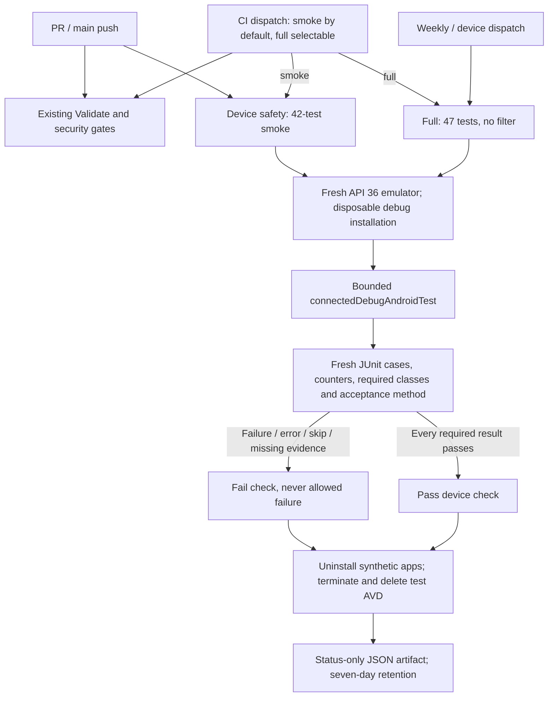

# Bounded Android device tests

CI-001 adds a synthetic device gate; it does not change application behavior, release signing,
or publishing. **Green validation is blocked on the MIG-001A production recovery fix.**
`MigrationEnforcementAcceptanceTest.failedMigrationMustNotSilentlyDisableRuntimeBlocking`
stays enabled in PR smoke. Its deterministic failure is not a flake or an allowed failure.
See [migration failure evidence](migrations.md#unmet-runtime-acceptance-criterion).

## Lanes and exact selection

`.github/workflows/ci.yml` calls the reusable `device-tests.yml` with `suite: smoke` on every
PR targeting main and main push. CI manual dispatch defaults to smoke and can select full.
Validate and Device safety run
independently for bounded feedback latency. Both must pass; retain the existing CodeQL,
dependency-review and dependency-graph requirements. The device workflow also runs full
coverage weekly (Monday 06:23 UTC) and accepts a manual `smoke` or `full` selection (default full).
Scheduled runs use the default branch; dispatching the device workflow requires it to exist there.
Before that new workflow is merged, dispatch the already-registered `ci.yml` at the candidate
branch with `suite: full`; its local reusable-workflow call uses that same candidate.

`scripts/ci/device_tests.py` owns selection and report validation. Smoke selects complete
classes, not individual passing methods. Full sends no class/package filter to AndroidJUnitRunner.
There is no retry, quarantine, shard or device matrix.

All classes below are under `websnag.elopenmike.com`. Counts describe the `e77bd64` baseline;
new tests run with their selected class, and new classes should be considered for smoke.

| Class | Tests | PR smoke | Full |
| --- | ---: | --- | --- |
| `AndroidKeystoreActivitySignerTest` | 2 | Yes | Yes |
| `ComponentHardeningTest` | 3 | Yes | Yes |
| `DiagnosticsRepositoryTest` | 4 | Yes | Yes |
| `PrivacyManifestTest` | 1 | Yes | Yes |
| `RemediationSettingsIntentFactoryTest` | 7 | Yes | Yes |
| `core.data.BackupRestoreFixtureTest` | 6 | Yes | Yes |
| `core.data.MigrationEnforcementAcceptanceTest` | 1 | Yes | Yes |
| `core.data.MigrationFailureTest` | 4 | Yes | Yes |
| `core.data.PersistedStateFixtureTest` | 5 | Yes | Yes |
| `core.data.ScheduleBackupConsistencyTest` | 6 | Yes | Yes |
| `core.data.UpgradeMigrationTest` | 3 | Yes | Yes |
| `DiagnosticsScreenTest` | 5 | No | Yes |
| **Total** | **47** | **42** | **47** |

Only Compose diagnostics presentation/callback coverage is scheduled/manual-only, keeping
UI synchronization outside the PR safety budget. Cryptography, backup, recovery and persistence
coverage is not sacrificed for speed. The full lane is one additional bounded run, not a
cross-version/device matrix. These tests do not establish Accessibility E2E, physical NFC, signed
package upgrades, emergency-dialer UI behavior, or the separate TEST/ENF roadmap acceptances.



## Configuration and bounds

The hosted lane uses an ephemeral **Ubuntu 24.04** runner, **JDK 17**, the repository wrapper,
compile SDK **35**, build-tools **35.0.0**, command-line tools **14742923**, and
`system-images;android-36;google_apis;x86_64`. Device API 36 is separate from compile/target SDK 35.
The action and all setup/upload actions are pinned to full commit SHAs; emulator binary build
**14472402** (36.3.10) is explicit. The SDK repository supplies the system-image revision within
that package; consult the setup log when comparing revisions, since this is not a hermetic image
archive or a claim that SDK package revisions are immutable.

AVD `websnag-ci-api36` uses Pixel 2, 2 cores, 2048 MiB RAM, 256 MiB heap, a 4096 MiB data partition,
software GPU, UTC, disabled animations/spellchecker/cameras/audio, no snapshots and wiped data.
KVM read/write access is required, not silently replaced with unaccelerated emulation.
The pinned emulator action sets `ANDROID_SERIAL=emulator-5554` for its script. The harness refuses
physical serials, other AVD names, and APIs other than 36. Hosted runners have no personal app
installation. Local runs require a separately created disposable AVD with the same name.

| Bound | Limit |
| --- | --- |
| Device job, including setup and cleanup | 35 minutes |
| Emulator action, including SDK setup/boot/test | 25 minutes |
| Emulator boot | 300 seconds |
| Gradle process including fresh compilation and instrumentation | 12 minutes smoke / 18 minutes full |
| AndroidJUnitRunner `timeout_msec` | 60,000 ms per test |
| Individual harness ADB command | 30 seconds |
| Owned Gradle process-group termination grace | 10 seconds, then SIGKILL |
| Workflow cleanup / artifact steps | 2 minutes each, within job budget |
| Report input | At most 100 XML files, 10 MiB per file, 1,000 unique cases |
| Uploaded artifact retention | 7 days |

Each invocation removes only generated connected-test reports and uninstalls the app/test
packages from the verified disposable emulator before and after running. This also resets
installation-bound test keys. Gradle uses `--rerun-tasks --no-build-cache --no-configuration-cache
--no-daemon`; the device job disables Gradle cache restore/save and never caches an AVD.
PR concurrency cancels superseded CI; device-workflow concurrency cancels older runs of the
same ref/PR and suite. SIGTERM/interrupt/timeout terminates the owned Gradle process group.
The action stops its emulator; an `always()` step additionally attempts bounded emulator
termination and deletion of that named AVD. Abrupt runner loss can prevent final steps; its
ephemeral VM is the isolation boundary, not a promise of cleanup after machine loss.

PRs/forks run with `contents: read`, no persisted checkout credentials, no environment approval
or inherited secrets, and only disposable debug signing. They never access the protected
release environment. Existing dependency security, CodeQL and wrapper verification remain intact.

## Reproduce locally

Prerequisites: JDK 17, Python 3.9+, the project's Android SDK/build-tools, platform-tools,
`emulator`, `sdkmanager`, and `avdmanager` on PATH. Discover installed JDK/SDK paths locally;
do not commit local paths or signing inputs. Install the API 36 Google APIs system image for
your host: `x86_64` on Linux/x86_64, `arm64-v8a` on Apple Silicon. An ARM run is useful local
evidence but does not replace hosted Linux/x86_64 validation.

Use private AVD storage in an emulator terminal, not an existing/personal AVD:

```bash
export ANDROID_AVD_HOME="$(mktemp -d)"
# On Apple Silicon, substitute arm64-v8a for x86_64.
sdkmanager 'system-images;android-36;google_apis;x86_64'
avdmanager create avd --name websnag-ci-api36 --device pixel_2 \
  --package 'system-images;android-36;google_apis;x86_64'
# Choose an unused emulator port; 5556 is only an example.
emulator -avd websnag-ci-api36 -port 5556 -cores 2 -memory 2048 \
  -no-window -gpu swiftshader -no-snapshot -wipe-data -noaudio -no-boot-anim \
  -camera-back none -camera-front none -timezone UTC
```

In a second terminal with the same JDK/SDK tools on PATH, confirm that `adb devices -l` lists
the dedicated serial and `adb -s emulator-5556 emu avd name` returns `websnag-ci-api36`.
Do not run these commands against a personal installation: test setup deliberately uninstalls
both WebSnag packages and some existing tests delete installation keys.

```bash
export ANDROID_SERIAL=emulator-5556
# Bounded boot wait (five minutes); do not proceed unless boot completed.
for attempt in $(seq 1 150); do
  [ "$(adb -s "$ANDROID_SERIAL" shell getprop sys.boot_completed 2>/dev/null | tr -d '\r')" = 1 ] && break
  sleep 2
done
test "$(adb -s "$ANDROID_SERIAL" shell getprop sys.boot_completed | tr -d '\r')" = 1
adb -s "$ANDROID_SERIAL" shell settings put global window_animation_scale 0
adb -s "$ANDROID_SERIAL" shell settings put global transition_animation_scale 0
adb -s "$ANDROID_SERIAL" shell settings put global animator_duration_scale 0
adb -s "$ANDROID_SERIAL" shell settings put secure spell_checker_enabled 0
python3 -B -m unittest discover -s scripts/ci -p 'test_*.py' -v
python3 -B scripts/ci/device_tests.py smoke
# Save the first JSON outside app/build before repeating: the next run replaces it.
python3 -B scripts/ci/device_tests.py smoke
python3 -B scripts/ci/device_tests.py full
adb -s "$ANDROID_SERIAL" emu kill
```

After the emulator command exits in the first terminal, delete only the AVD you created with
`avdmanager delete avd --name websnag-ci-api36`, then remove the now-empty temporary directory
with `rmdir "$ANDROID_AVD_HOME"`. For hosted reproducibility, run the same candidate twice with
the same smoke inputs and separately run full; retain commit SHA, system-image revision, run
IDs/attempts, durations and both status artifacts. Never combine counts across attempts.

## Hosted evidence after recovery integration

Hosted acceptance is not a prerequisite to creating the PR that triggers it. After the
MIG-001A production fix is integrated, complete local validation and review, then open the
authorized CI-001 PR. Keep the candidate branch up to date with main and freeze its head/base
while collecting evidence. The first PR CI run supplies smoke execution 1; rerun the **entire**
same CI run for execution 2, not just failed jobs. A manual CI dispatch supplies full coverage.
Acceptance remains blocked until all required runs and the existing security checks pass.

Set `CANDIDATE_BRANCH` to the integrated branch and `SMOKE_RUN_ID` to its completed PR CI run.
Record the original run metadata and artifact before rerunning:

```bash
gh run view "$SMOKE_RUN_ID" --repo mcasillas17/WebSnag \
  --json headSha,headBranch,event,attempt,status,conclusion,url
gh run rerun "$SMOKE_RUN_ID" --repo mcasillas17/WebSnag
# After the complete second attempt finishes, record its metadata and artifact too.
gh run view "$SMOKE_RUN_ID" --repo mcasillas17/WebSnag \
  --json headSha,headBranch,event,attempt,status,conclusion,url
gh workflow run ci.yml --repo mcasillas17/WebSnag --ref "$CANDIDATE_BRANCH" -f suite=full
```

Use the returned full-run URL to obtain `FULL_RUN_ID`, then inspect it with the same
`gh run view --json` fields. Verify each run's `headSha` matches the frozen candidate head;
retain the actual checkout commit from job logs as well, since PR jobs check out the PR merge
commit whereas dispatch checks out the branch commit. The up-to-date branch and its PR merge
must represent the same tree. A changed head/base invalidates the comparison and requires
new evidence. Confirm the full run actually selected full and reported all required classes;
successful dispatch submission is not execution evidence.

This entry point does not depend on `device-tests.yml` existing on main: `ci.yml` is already
registered there and `--ref` selects the candidate workflow version with the new input.
For fork PRs, keep the PR safety execution unprivileged; full dispatch must target a repository
and branch where CI is registered and the candidate is present. Do not add privileged PR
events or signing credentials to work around that constraint.

## Results and failure diagnosis

The runner preserves raw local JUnit under `app/build/outputs/androidTest-results/connected`
and AGP HTML under `app/build/reports/androidTests/connected`. Only
`app/build/device-tests/{smoke,full}.json` is uploaded. It contains fixed run status/error labels,
executed count, and bounded test class/method/outcome metadata. It excludes assertion payloads,
XML properties, stdout, logcat, screenshots, APKs, AVD images, preferences, backups, and Keystore
material. Inputs must remain synthetic; never import a real backup, account, or personal data
to debug this lane. Do not expand the artifact glob to raw build outputs.

The job fails on Gradle failure/timeout/cancellation even if reports look successful. The report
gate separately rejects missing/malformed/oversized files, inconsistent suite/aggregate counters,
duplicate cases, zero executed cases, a missing required class or exact migration acceptance
method, or **any** failed, errored or skipped case. It counts actual `testcase` elements, not just
claimed XML totals. There is no "expected failing" test mode.

- **Emulator/setup failure:** inspect the action's SDK/KVM/boot log and explicit image/architecture.
  Missing status artifacts also fail upload. Do not infer a test pass from successful assembly.
- **Harness/report failure:** inspect the JSON `error`; regenerate fresh reports through the
  harness rather than retaining old XML or loosening counter/selection checks.
- **Assertion failure:** JSON identifies the class/method. Inspect the failed assertion in Gradle
  job output or reproduce locally and open the raw report; do not publish personal diagnostics.
- **Known migration failure:** original `duration-unbound` assertion remains red until the
  production recovery fix lands. Do not skip it, narrow the class list, weaken the assertion,
  add retries, or use `continue-on-error`.
- **Timeout/cancellation:** distinguish resource/boot limits from a hanging test. The partial
  output is not completion evidence. Inspect cleanup output before reusing any local AVD.

## Recorded evidence and outstanding acceptance

On 2026-09-06, against application baseline `e77bd64`, the bounded runner used JDK 17.0.20.1,
Gradle 9.7.1 and an isolated API 36 Google APIs **arm64-v8a revision 7** emulator, binary
36.3.10/build 14472402. Two consecutive fresh-install smoke executions each produced
**42 executed, 41 passed, 1 failed, 0 skipped** (Gradle 59 s and 63 s). An unfiltered full run
produced **47 executed, 46 passed, 1 failed, 0 skipped** (93 s). All three failed only
`MigrationEnforcementAcceptanceTest.failedMigrationMustNotSilentlyDisableRuntimeBlocking`.

This demonstrates reproducible detection of the documented correctness defect, **not two green
executions, hosted Linux/x86_64 proof, or CI-001 completion**. Acceptance remains blocked until the
separately owned MIG-001A recovery fix is integrated and the same required selection passes twice
on the hosted configuration, with a passing full run. Those hosted checks follow PR creation;
they are not a circular pre-PR requirement. The harness does not implement that fix. The dispatch
route and inputs are configured, but no hosted dispatch or successful hosted execution is claimed
by this local evidence.
