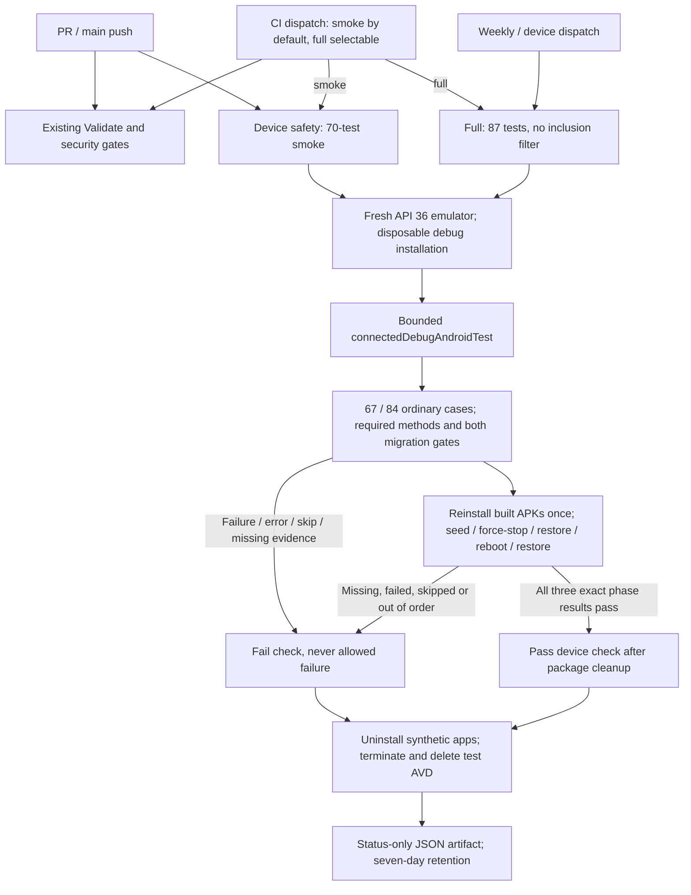

# Bounded Android device tests

CI-001's synthetic device gate is merged in #37. ENF-001 extends it with emergency-recovery
regressions and real process/reboot phases, without changing release signing or publishing.
MIG-001A's production recovery fix is integrated from #36. Both
`MigrationEnforcementAcceptanceTest.failedMigrationMustNotSilentlyDisableRuntimeBlocking`
(dormant and duration-unbound inputs) and
`approvedRecoveryRestartsTheIntendedSessionWithoutWeakeningIt` must run and pass in PR smoke,
alongside the recovery UI. Neither gate is quarantined or an allowed failure.
See [migration failure and recovery](migrations.md#runtime-migration-failure-and-recovery).

## Lanes and exact selection

`.github/workflows/ci.yml` calls the reusable `device-tests.yml` with `suite: smoke` on every
PR targeting main and main push. CI manual dispatch defaults to smoke and can select full.
Validate and Device safety run
independently for bounded feedback latency. Both must pass; retain the existing CodeQL,
dependency-review and dependency-graph requirements. The device workflow also runs full
coverage weekly (Monday 06:23 UTC) and accepts a manual `smoke` or `full` selection (default full).
Scheduled runs use the default branch. To validate a candidate before merge, dispatch `ci.yml`
at its branch with `suite: full`; its local reusable-workflow call uses that same candidate.

`scripts/ci/device_tests.py` owns selection and report validation. Smoke selects complete
classes, not individual passing methods. Full sends no class/package inclusion filter.
Both ordinary invocations exclude only `EmergencyRecoveryLifecycleTest` with `notClass`;
all three of its methods then run in mandatory host-controlled order below. This exclusion is
sequencing, not omitted coverage. There is no test retry, quarantine, shard or device matrix.

All classes below are under `websnag.elopenmike.com`. Counts include ACT-001, SEC-001 and ENF-001;
new safety cases must remain in smoke and required method checks.

| Class | Tests | PR smoke | Full |
| --- | ---: | --- | --- |
| `AndroidKeystoreActivitySignerTest` | 2 | Yes | Yes |
| `ComponentHardeningTest` | 3 | Yes | Yes |
| `DiagnosticsRepositoryTest` | 4 | Yes | Yes |
| `PrivacyManifestTest` | 1 | Yes | Yes |
| `RemediationSettingsIntentFactoryTest` | 7 | Yes | Yes |
| `StorageRecoveryScreenTest` | 7 | Yes | Yes |
| `EmergencyRecoveryScreenTest` | 4 | Yes | Yes |
| `EmergencyRecoveryActivityTest` | 4 | Yes | Yes |
| `core.data.EmergencyRecoveryDeviceTest` | 4 | Yes | Yes |
| `core.data.EmergencyRecoveryLifecycleTest` | 3 | Ordered phases | Ordered phases |
| `core.data.BackupRestoreFixtureTest` | 6 | Yes | Yes |
| `core.data.MigrationEnforcementAcceptanceTest` | 2 | Yes | Yes |
| `core.data.MigrationFailureTest` | 4 | Yes | Yes |
| `core.data.PersistedStateFixtureTest` | 5 | Yes | Yes |
| `core.data.ScheduleBackupConsistencyTest` | 6 | Yes | Yes |
| `core.data.UpgradeMigrationTest` | 3 | Yes | Yes |
| `core.schedule.ScheduleReceiverActionTest` | 5 | Yes | Yes |
| `ActivityScreenTest` | 10 | No | Yes |
| `ActivitySelectionStateTest` | 2 | No | Yes |
| `DiagnosticsScreenTest` | 5 | No | Yes |
| **Total** | **87** | **70** | **87** |

Only Compose Activity chart and diagnostics presentation/callback coverage is scheduled/manual-only,
keeping non-safety presentation checks outside the PR budget; all three classes are required in full.
Safety-critical recovery UI, cryptography, backup, runtime recovery, persistence and
schedule-receiver action coverage is not sacrificed for speed. The full lane is one additional
bounded run, not a cross-version/device matrix. These tests do not establish Accessibility E2E,
physical NFC, signed package upgrades, emergency-dialer UI behavior, or TEST-003's broader
combined NFC/Keystore suite. The focused ENF-001 coverage does not deliver TEST-003, which
becomes eligible only after ENF-001 merges.

`core.schedule.ScheduleReceiverActionTest` sends real explicit ordered broadcasts where an app may
send the action. The ordered result arrives only after the receiver finishes its `goAsync()` work.
Rejected actions must leave the app's preferences file byte-for-byte unchanged, and each accepted
delivery must write exactly one reconciliation record. The four declared system actions are
protected broadcasts that only the system can send, so the test passes them straight to `onReceive`.
Platform-delivered boot, clock, time-zone and package-replacement events remain TEST-002C scope.
## Mandatory process and reboot sequence

After all **67 ordinary smoke / 84 ordinary full** cases pass, `device_lifecycle.py`
re-verifies the disposable emulator and installs the just-built app/test APKs once:
AGP removes its instrumentation installation after `connectedDebugAndroidTest`. No reinstall
or data clearing occurs between these phases:

1. `seedRecovery` writes a synthetic, five-minute optional-phrase request through the real
   engine and DataStore, with the real Android clock. It records elapsed progress and a
   test-only process/boot witness outside the app's normal preferences.
2. The host force-stops the app. `verifyProcessRestoration` runs in fresh instrumentation,
   checks a new process, unchanged boot/session/request/anchor, and retained elapsed progress.
3. The host reboots the emulator and requires boot completion **and an increased native boot
   count**, revalidates AVD/API, and restores animation settings. `verifyRebootRestoration`
   checks the persisted new anchor/request, unchanged session/policy, full restarted wait and
   continued blocking, then removes only the synthetic fixture.

No fake clock or production test bypass supplies this lifecycle evidence. Every exact method
is required once in order. Missing installation, phase, identity, counter, final success,
or boot evidence fails the lane. Running one phase manually is not a passing lane.



## Configuration and bounds

The hosted lane uses an ephemeral **Ubuntu 24.04** runner, **JDK 17**, the repository wrapper,
compile SDK **35**, build-tools **35.0.0**, command-line tools **14742923**, and
`system-images;android-36;google_apis;x86_64`. Device API 36 is separate from compile/target SDK 35.
The action and all setup/upload actions are pinned to full commit SHAs; emulator binary build
**14472402** (36.3.10) is explicit. The SDK repository supplies the system-image revision within
that package; consult the setup log when comparing revisions, since this is not a hermetic image
archive or a claim that SDK package revisions are immutable.

AVD `websnag-ci-api36` uses Pixel 2, 2 cores, 2048 MiB RAM, 256 MiB heap, a 4096 MiB data partition,
software GPU, UTC, disabled animations/spellchecker/cameras/audio, no snapshots and wiped data.
KVM read/write access is required, not silently replaced with unaccelerated emulation.
The pinned emulator action sets `ANDROID_SERIAL=emulator-5554` for its script. The harness refuses
physical serials, other AVD names, and APIs other than 36. Hosted runners have no personal app
installation. Local runs require a separately created disposable AVD with the same name.

| Bound | Limit |
| --- | --- |
| Device job, including setup and cleanup | 42 minutes |
| Emulator action, including SDK setup/boot/test | 32 minutes |
| Emulator boot | 300 seconds |
| Gradle process including fresh compilation and instrumentation | 12 minutes smoke / 18 minutes full |
| AndroidJUnitRunner `timeout_msec` | 60,000 ms per test |
| Individual harness ADB command | 30 seconds |
| Each lifecycle APK install | 30 seconds, within shared lifecycle deadline |
| Each direct instrumentation phase | 60 seconds; test rule is 30 seconds |
| Lifecycle reboot readiness | 300 seconds |
| Entire lifecycle sequence, including installs/checks/settings | 540 seconds total; shared deadline can shorten individual maxima |
| Direct instrumentation output | 128 KiB per phase |
| Owned Gradle process-group termination grace | 10 seconds, then SIGKILL |
| Workflow cleanup / artifact steps | 2 minutes each, within job budget |
| Report input | At most 100 XML files, 10 MiB per file, 1,000 unique cases |
| Uploaded artifact retention | 7 days |

Each invocation removes only generated connected-test reports and uninstalls the app/test
packages from the verified disposable emulator before and after running. This also resets
installation-bound test keys. Gradle uses `--rerun-tasks --no-build-cache --no-configuration-cache
--no-daemon`; the device job disables Gradle cache restore/save and never caches an AVD.
PR concurrency cancels superseded CI; device-workflow concurrency cancels older runs of the
same ref/PR and suite. SIGTERM/interrupt/timeout terminates the owned Gradle process group;
direct phases reap their own ADB client without terminating the shared ADB server.
The action stops its emulator; an `always()` step additionally attempts bounded emulator
termination and deletion of that named AVD. Abrupt runner loss can prevent final steps; its
ephemeral VM is the isolation boundary, not a promise of cleanup after machine loss.

PRs/forks run with `contents: read`, no persisted checkout credentials, no environment approval
or inherited secrets, and only disposable debug signing. They never access the protected
release environment. Existing dependency security, CodeQL and wrapper verification remain intact.

## Reproduce locally

Prerequisites: JDK 17, Python 3.9+, the project's Android SDK/build-tools, platform-tools,
`emulator`, `sdkmanager`, and `avdmanager` on PATH. Discover installed JDK/SDK paths locally;
do not commit local paths or signing inputs. Install the API 36 Google APIs system image for
your host: `x86_64` on Linux/x86_64, `arm64-v8a` on Apple Silicon. An ARM run is useful local
evidence but does not replace hosted Linux/x86_64 validation.

Use private AVD storage in an emulator terminal, not an existing/personal AVD:

```bash
export ANDROID_AVD_HOME="$(mktemp -d)"
# On Apple Silicon, substitute arm64-v8a for x86_64.
sdkmanager 'system-images;android-36;google_apis;x86_64'
avdmanager create avd --name websnag-ci-api36 --device pixel_2 \
  --package 'system-images;android-36;google_apis;x86_64'
# Choose an unused emulator port; 5556 is only an example.
emulator -avd websnag-ci-api36 -port 5556 -cores 2 -memory 2048 \
  -no-window -gpu swiftshader -no-snapshot -wipe-data -noaudio -no-boot-anim \
  -camera-back none -camera-front none -timezone UTC
```

In a second terminal with the same JDK/SDK tools on PATH, confirm that `adb devices -l` lists
the dedicated serial and `adb -s emulator-5556 emu avd name` returns `websnag-ci-api36`.
Do not run these commands against a personal installation: test setup deliberately uninstalls
both WebSnag packages and some existing tests delete installation keys.

```bash
export ANDROID_SERIAL=emulator-5556
# Bounded boot wait (five minutes); do not proceed unless boot completed.
for attempt in $(seq 1 150); do
  [ "$(adb -s "$ANDROID_SERIAL" shell getprop sys.boot_completed 2>/dev/null | tr -d '\r')" = 1 ] && break
  sleep 2
done
test "$(adb -s "$ANDROID_SERIAL" shell getprop sys.boot_completed | tr -d '\r')" = 1
adb -s "$ANDROID_SERIAL" shell settings put global window_animation_scale 0
adb -s "$ANDROID_SERIAL" shell settings put global transition_animation_scale 0
adb -s "$ANDROID_SERIAL" shell settings put global animator_duration_scale 0
adb -s "$ANDROID_SERIAL" shell settings put secure spell_checker_enabled 0
python3 -B -m unittest discover -s scripts/ci -p 'test_*.py' -v
python3 -B scripts/ci/device_tests.py smoke
# Save the first JSON outside app/build before repeating: the next run replaces it.
python3 -B scripts/ci/device_tests.py smoke
python3 -B scripts/ci/device_tests.py full
adb -s "$ANDROID_SERIAL" emu kill
```

After the emulator command exits in the first terminal, delete only the AVD you created with
`avdmanager delete avd --name websnag-ci-api36`, then remove the now-empty temporary directory
with `rmdir "$ANDROID_AVD_HOME"`. For hosted reproducibility, run the same candidate twice with
the same smoke inputs and separately run full; retain commit SHA, system-image revision, run
IDs/attempts, durations and both status artifacts. Never combine counts across attempts.

## Hosted candidate evidence

Hosted acceptance follows creation of the PR that triggers it, not merely local success.
Keep the candidate branch up to date with main and freeze its head/base while collecting
evidence. The first PR CI run supplies smoke; a manual CI dispatch supplies full coverage.
For a reproducibility comparison, rerun the **entire** unchanged CI run, not only failed jobs.
CI-001's original two-smoke/full acceptance is recorded below; a new candidate needs its own
applicable device and existing security checks to pass.

Set `CANDIDATE_BRANCH` to the integrated branch and `SMOKE_RUN_ID` to its completed PR CI run.
Record the original run metadata and artifact before rerunning:

```bash
gh run view "$SMOKE_RUN_ID" --repo mcasillas17/WebSnag \
  --json headSha,headBranch,event,attempt,status,conclusion,url
gh run rerun "$SMOKE_RUN_ID" --repo mcasillas17/WebSnag
# After the complete second attempt finishes, record its metadata and artifact too.
gh run view "$SMOKE_RUN_ID" --repo mcasillas17/WebSnag \
  --json headSha,headBranch,event,attempt,status,conclusion,url
gh workflow run ci.yml --repo mcasillas17/WebSnag --ref "$CANDIDATE_BRANCH" -f suite=full
```

Use the returned full-run URL to obtain `FULL_RUN_ID`, then inspect it with the same
`gh run view --json` fields. Verify each run's `headSha` matches the frozen candidate head;
retain the actual checkout commit from job logs as well, since PR jobs check out the PR merge
commit whereas dispatch checks out the branch commit. The up-to-date branch and its PR merge
must represent the same tree. A changed head/base invalidates the comparison and requires
new evidence. Confirm the full run actually selected full and reported all required classes;
successful dispatch submission is not execution evidence.

Both workflows are registered on main; `--ref` selects the candidate workflow version.
For fork PRs, keep the PR safety execution unprivileged; full dispatch must target a repository
and branch where CI is registered and the candidate is present. Do not add privileged PR
events or signing credentials to work around that constraint.

## Results and failure diagnosis

The runner preserves raw local JUnit under `app/build/outputs/androidTest-results/connected`
and AGP HTML under `app/build/reports/androidTests/connected`. Only
`app/build/device-tests/{smoke,full}.json` is uploaded. It contains fixed run status/error labels,
executed count, and bounded test class/method/outcome metadata. It excludes assertion payloads,
XML properties, stdout, logcat, screenshots, APKs, AVD images, preferences, backups, and Keystore
material. Inputs must remain synthetic; never import a real backup, account, or personal data
to debug this lane. Do not expand the artifact glob to raw build outputs.

The JSON has a separate lifecycle manifest: `not_run` or `unverified` phases cannot authorize
success, and only verified passed phases enter the executed count. Ordinary JUnit success
leaves overall status failed/pending until all phases and final package cleanup succeed.
Raw lifecycle failure detail is capped and saved mode **0600 outside the repository** (system
temporary directory by default, or `WEBSNAG_DEVICE_DIAGNOSTICS_DIR`). Only its location is
printed, and it is never included in the uploaded artifact. Inspect it locally, not as public
PR content.

The job fails on Gradle failure/timeout/cancellation even if reports look successful. The report
gate separately rejects missing/malformed/oversized files, inconsistent suite/aggregate counters,
duplicate cases, zero executed cases, a missing required class or either migration acceptance
method, any required emergency method, or **any** failed, errored or skipped case. It counts
actual `testcase` elements, not just claimed XML totals. The direct-phase parser separately
requires exact runner/class/method identity, one start and success, a single-test summary and
successful terminal report. There is no "expected failing" test mode.

- **Emulator/setup failure:** inspect the action's SDK/KVM/boot log and explicit image/architecture.
  Missing status artifacts also fail upload. Do not infer a test pass from successful assembly.
- **Harness/report failure:** inspect the JSON `error`; regenerate fresh reports through the
  harness rather than retaining old XML or loosening counter/selection checks.
- **Assertion failure:** JSON identifies the class/method. Inspect the failed assertion in Gradle
  job output or reproduce locally and open the raw report; do not publish personal diagnostics.
- **Migration/recovery regression:** the original duration-unbound blocking assertion and the
  approved-retry/restart gate must pass. Do not skip either method, narrow the class list, weaken
  assertions, add retries, or use `continue-on-error`.
- **Timeout/cancellation:** distinguish resource/boot limits from a hanging test. The partial
  output is not completion evidence. Inspect cleanup output before reusing any local AVD.

## Recorded evidence and hosted acceptance

On 2026-09-06, against integrated application baseline `f1f3062` (#36), the runner used JDK 17.0.20.1,
Gradle 9.7.1 and an isolated API 36 Google APIs **arm64-v8a revision 7** emulator, binary
36.3.10/build 14472402. Two consecutive fresh-install smoke executions each produced
**50 executed, 50 passed, 0 failed, 0 skipped** (Gradle 107 s and 84 s). An unfiltered full run
produced **55 executed, 55 passed, 0 failed, 0 skipped** (89 s). Both runtime acceptance methods
and all seven `StorageRecoveryScreenTest` cases passed in both smoke runs. Recovery production
code and instrumentation assertions match main; CI-001 changes only selection/report enforcement.

The earlier `e77bd64` control correctly failed: two 42-test smoke executions and a 47-test full
execution each detected the original duration-unbound defect. That was failure-detection evidence,
not successful acceptance. #36 supplies the production fix; this harness does not repair recovery.

CI-001 merged in #37 with hosted Linux/x86_64 acceptance:
[smoke 34057328721, attempts 1 and 2](https://github.com/mcasillas17/WebSnag/actions/runs/34057328721)
each passed 50 tests, and [full 34057902147](https://github.com/mcasillas17/WebSnag/actions/runs/34057902147)
passed 55. #37 records immutable head/checkout identities and the actual dispatch outcome.
These are historical counts, not ENF-001 validation.

Local ARM evidence is **not hosted Linux/x86_64 proof**. New candidate PRs record their own
run URLs, head/checkout SHAs, selected suite, counts and all lifecycle outcomes. Hosted checks
follow PR creation without a circular pre-PR requirement; failed or missing checks still block
the final delivery claim.
