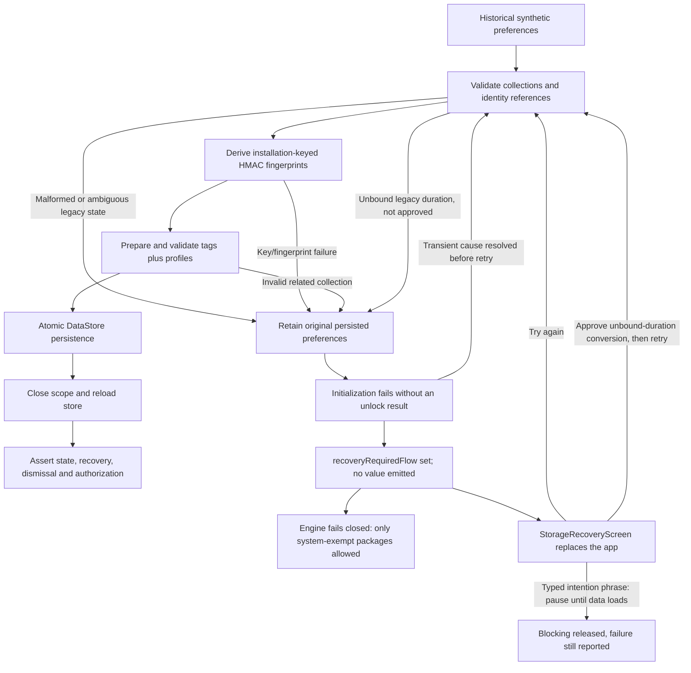

# Synthetic migration and persistence tests

MIG-001A exercises WebSnag's production identity conversion, Preferences DataStore transactions,
backup codec/repository, and NFC authorization with synthetic data. It does not prove a signed
Android package upgrade, physical NFC behavior, clone resistance, or cross-device credential
portability. Signed `adb install -r` testing belongs to MIG-001B.

## Runtime migration failure and recovery

`MigrationEnforcementAcceptanceTest.failedMigrationMustNotSilentlyDisableRuntimeBlocking` is an
enabled Android acceptance test and it passes through production behavior. Its bound-duration
control (`dormant`) starts blocking normally. The `duration-unbound` input still makes the native
migration abort with the original preferences retained, but that abort is now an explicit
production state rather than an inactive engine:

- `LocalDataStore` derives every flow from one guarded read. A failed read sets
  `recoveryRequiredFlow` and then emits nothing at all, so no consumer can mistake it for a
  successful empty or default value and no write derived from it can overwrite the retained bytes.
  Repository reads therefore wait for recovery instead of returning defaults or terminating their
  observer -- previously a failed initialization propagated out of every collector, including the
  application scope's unhandled ones. DataStore re-runs initialization for each new collection, so
  observing a success also releases every collector parked by an earlier failure; a later reader
  cannot report success while an earlier one stays parked. Reads are not cached, so a read after a
  write still sees that write. `retryReadingPersistedState()` re-runs initialization on demand. The
  explicit `migrateLegacyTagIdentifiers` method and direct `DataStore.data` reads still surface
  `LegacyTagMigrationException` unchanged.
- `EnforcementEngine` mirrors that posture into `EnforcementState.storageRecoveryRequired` and
  fails closed. `isPackageBlocked` -- the same decision `WebSnagAccessibilityService` uses --
  returns true for every package that is not system-exempt. Exemptions are evaluated first, so
  emergency calling, `com.android.phone`, `com.android.telecom`, the device dialer, the home
  launcher and WebSnag itself stay reachable. The failure is never reported as an active session,
  and no session record is written for it. The engine leaves the lockdown when its own profile
  observer emits, not when the store flag clears, so there is no window where nothing is blocked
  and the persisted profile has not been applied yet.
- `MainActivity` replaces the normal app with `StorageRecoveryScreen` while the flag is set. That
  screen is the reachable retry/recovery route: "Try again" re-runs initialization for a transient
  cause, and a separately confirmed action approves the one conversion below.
- Some failures cannot be repaired from the device at all -- a lost Keystore key, an ambiguous
  stored reference, a malformed related collection. Blocking every non-exempt package forever would
  make the phone unusable with no way out, so `StorageRecoveryScreen` also offers a deliberate
  release: typing the exact intention phrase calls `EnforcementEngine.pauseRecoveryLockdown()`.
  The lockdown only ever *widens* blocking, and the release is exactly that narrow: it withdraws the
  extra blocking, never a session that was already loaded before the failure. Ending such a session
  still requires that profile's own unlock policy, so the typed phrase can never stand in for an
  NFC tap or the emergency cooldown. The failure stays reported, the persisted bytes stay untouched,
  and enforcement re-arms by itself as soon as the state loads. The pause is process-scoped, so it
  is never a durable opt-out. `EnforcementState.recoveryLockdownInForce` is the single predicate the
  engine, the block overlay's dismissal and the overlay's copy all branch on, so they cannot
  disagree about whether the lockdown still applies.

  **Known limitation.** A session that was already active when the store became unreadable cannot be
  ended until the state loads: every unlock route -- NFC, manual and the emergency cooldown -- has to
  write, and writes still fail. The block overlay therefore hides the affordances it cannot honor
  rather than offering an unlock that would silently do nothing, and the typed pause withdraws only
  the lockdown's extra blocking, leaving that session's own configuration in force. This is the
  user's own lock rather than a lock invented by the failure, so it is bounded by what they
  configured; a store that never becomes readable again keeps it until then.
- `WebSnagApp`'s default-profile preload stays suspended while initialization keeps failing, so
  presets can never overwrite retained recovery input. A successful retry resumes it.
- Consumers that must finish regardless are bounded rather than open-ended, because a read waits
  instead of failing. `ScheduleManager.reconcileNow`/`reschedule` are bounded, and `reconcileNow`
  runs its completion callback even when the pass throws. So both schedule receivers always finish
  the `goAsync()` PendingResult for an action they accept -- BOOT_COMPLETED and MY_PACKAGE_REPLACED
  are exactly the deliveries that coincide with a failing startup migration.
  Diagnostics collection is skipped when recovery is already known, and bounded otherwise, since on
  a cold start the first read has not failed yet. `NfcActionResolver.resolve` drops a tap itself --
  guarded and bounded at that one boundary rather than at each call site, because both the main
  screen and the block overlay resolve scans and the overlay is the surface actually in front of the
  user during the lockdown. It returns `NfcTagAction.StorageUnavailable`, so taps cannot pile up and
  all apply at once against the state that later loads; the main screen says so on screen.
- Reads wait, but **writes still fail**: `DataStore.updateData` re-runs the failed initialization and
  raises `LegacyTagMigrationException`. Anything that reports a problem by persisting one must
  therefore tolerate that write failing -- `MainActivity.recordLocalError` is reached from every
  catch block in the activity and is deliberately best effort, because turning a reported failure
  into a fatal one would put the recovery screen out of reach.

### Narrow legacy-duration compatibility decision

A legacy `DurationExpiry` that named no tag has no equivalent current condition. Today's unbound
`DurationExpiry` is unlockable by a manual tap or by any enrolled tag, and no duration timer exists
to expire it, so converting it silently would weaken authorization. The migration therefore never
converts it on its own; it aborts and keeps the original bytes.

On explicit, separately confirmed user approval, and only for that shape, the profile keeps its
blocking configuration and takes the strictest current condition instead:
`RequireNfcTag(requiredTagId = null, allowAnyEnrolledTag = false, allowEmergencyUnlock = true,
emergencyCooldownMinutes = 5, requireIntentionPhrase = true)`. Neither a manual tap nor any tag can
end that session; only the existing deliberate-friction emergency route can, so the session never
becomes unrecoverable. The historical duration value is discarded rather than re-implemented -- no
duration timer or new trigger behavior is introduced, and DEC-003 still owns the general dormant
trigger/duration audit.

The approval is a payload-free boolean in `MigrationRecoveryConsent`. It is process-scoped and
deliberately not persisted: it is granted immediately before the retry it is meant for, and a
persisted approval would still be set after an unrelated abort and could then apply the
irreversible replacement at some later start with no confirmation in front of the user. It cannot
live in the migrating DataStore either, since that store is exactly what is unreadable. It is
one-shot by construction: `takeLegacyUnlockApproval()` reads and clears atomically, and the
migration takes it once for the whole pass. So one approval converts every profile carrying that
shape, which is what `StorageRecoveryScreen` states -- taking it per profile would abort the pass as
soon as a second profile carried it, with nothing left to re-approve with -- and a pass that took
the approval and then aborted for an unrelated reason cannot leave it set for a later, unrelated
retry to spend with no confirmation in front of the user. Approval never
bypasses identity protection -- a missing or failing protected fingerprint, an ambiguous reference,
or a malformed related collection still aborts with the original bytes retained.

This slice is scoped to migration failure and recovery. DATA-001 still owns typed corruption
outcomes, quarantine, export and the broader recovery UI for arbitrary malformed values; the
guarded read here only stops a read failure from being reported as success.

## Fixture format and provenance

Fixture suite **v1** is a test-input format. It is independent of the application version and of
`BackupCodec.VERSION` (the WSB1 envelope version). No DataStore schema-version key is added.
The canonical JVM inputs are under `app/src/test/resources/migrations/v1`; identical device
copies are under `app/src/androidTest/assets/migrations/v1`. `FixtureCatalogTest` checks parity.

Each JSON file declares `fixtureVersion`, `kind`, `source`, and `preferences`. The harness stores
collection/object values ending in `_json` as serialized JSON strings; other string values as
string preferences; `history_retention_days` as an integer. `rawOverrides` seeds exact malformed
strings without accidentally converting them into valid JSON strings.

All values are invented for testing. A historical-shape label means the declared fields and
serialization types were verified against source, not that an actual installation supplied data.

| Fixture | Provenance | Purpose and expected result |
| --- | --- | --- |
| `alpha1.json` | `v1.0.0-alpha.1`, `a4a05bb113ea4e2cf59dde273f96673698926785` | Raw tag records, specific profile links, active/inactive flags, activation time, escaped labels/descriptions, optional payload/timestamps, schedules, history, theme. Migrate identity fields and retain supported metadata/state. |
| `alpha2-current.json` | `v1.0.0-alpha.2`, `e18c614d2375bf452d48c1a11ea4af77393431e8`; relevant fields checked through alpha.4 | Fingerprint records, stable IDs, recovery, dismissed occurrence, retention. Migration is a byte-stable no-op and must not provision a key. |
| `mixed.json` | Explicit synthetic combination of alpha.1 and alpha.2 fields | Legacy and current tags/profiles plus separate recovery/state. Keep all valid records; convert only legacy identities. Not claimed as a historical writer's output. |
| `dormant.json` | Synthetic compatibility probes of types declared at alpha.1 | Separate probes for `Profile.triggers`, time/location/Wi-Fi triggers and duration expiry; also migrate legacy NFC trigger references. No feature activation or proof of historical editor reachability. |
| `duration-unbound.json` | Explicit synthetic probe of alpha.1 nullable duration binding | Null/omitted legacy binding must abort initialization with original bytes retained, surface the recovery state, and keep runtime blocking failing closed; an explicitly approved retry converts it to the strictest current condition. Does not establish historical UI reachability. |
| `malformed.json` | Explicit synthetic corruption | Characterize unchanged nonlegacy decode fallbacks separately from stored bytes; demonstrates DATA-001's remaining recovery problem. |

Historical source differences can be inspected without checking out an old version:

```bash
git show v1.0.0-alpha.1:app/src/main/java/websnag/elopenmike/com/core/model/NfcTagRecord.kt
git diff v1.0.0-alpha.1 v1.0.0-alpha.2 -- app/src/main/java/websnag/elopenmike/com/core/model
git show v1.0.0-alpha.2:app/src/main/java/websnag/elopenmike/com/core/data/LocalDataStore.kt
```

Alpha.1 declared `uidHex`, `linkedTagUid`, `requiredTagUid`, and NFC trigger `tagUid`. Alpha.2
replaced these with fingerprints and enrolled IDs, introduced explicit any-enrolled policy and
persisted recovery/occurrence/retention. Alpha.3 (`ddb4cb53aa3a4e9e779eadf9335ac28dd33d25da`) and
alpha.4 (`eb2d25d5869dad554e60ef1df1e05504898a98a6`) retain the relevant shapes. Dormant types
being serializable is not evidence that the historical UI persisted them; DEC-003 owns that audit.

## Production migration and failure behavior

DataStore's initialization migration runs before repository reads and writes, including default
profile initialization and schedule consumers. The explicit `migrateLegacyTagIdentifiers` method
uses the same conversion. Conversion validates related tag/profile collections before replacing
both atomically. Metadata stays in the JSON tree, preserving escaped strings and present optional
values/timestamps. Current-only inputs are not rewritten.



A missing, malformed, ambiguous, unknown, or conflicting non-null legacy reference aborts the
migration. It never falls back to a different tag. Case normalization matches the historical
case-insensitive UID lookup. Legacy implicit-any NFC policy does not enable current
`allowAnyEnrolledTag`; it remains closed unless a current policy explicitly opts in. A duration
profile's specific legacy reference must resolve before conversion. A null or omitted legacy
duration binding also aborts unless the user explicitly approved the conversion described above:
converting it to a current null binding would permit manual or any-enrolled-tag unlock. A current
explicitly serialized `requiredTagId: null` retains its current policy; migration does not
reinterpret it. No duration timer or new trigger behavior is introduced. This rejection retains
disk state, and the runtime fails closed behind it rather than becoming permissive.

Fingerprint failure or malformed related collections leave the original preferences available.
Failure raises a payload-free `LegacyTagMigrationException`; underlying parser/key messages are
not attached because they can contain raw identifiers. DataStore does not deliver partially
migrated state or allow defaults to overwrite the failed migration. The next initialization can
retry if the cause has resolved, either automatically on the next start or from
`StorageRecoveryScreen`. The test harness's raw-file repair remains test-only; production recovery
is the retry and approval route above. This does not repair Keystore loss or solve arbitrary
nonlegacy corruption; keep the failed file private for explicit recovery, rather than clearing app
data.

## What the tests establish

| Area | Tests and evidence |
| --- | --- |
| Historical and mixed data | `LegacyMigrationTest`, `UpgradeMigrationTest`: metadata, stable references, idempotence, mixed/current preservation, malformed/duplicate/unknown reference refusal. |
| Startup and rollback | `StartupMigrationTest`, `MigrationFailureTest`: first read/default writer wait for initialization; concurrent readers see no premigration value; null/throwing identity failures preserve on-disk state and allow retry. |
| Runtime failure acceptance | `MigrationEnforcementAcceptanceTest`: the enabled gate described above, plus the approved-recovery restart. `MigrationRecoveryTest`, `EnforcementRecoveryTest` and `StorageRecoveryScreenTest` cover the guarded read, release of parked collectors on an observed success, one-shot approval, approval scope, fail-closed exemptions, the deliberate lockdown release and its automatic re-arm, and the recovery UI's two friction gates. |
| Authorization and Keystore | `NfcIdentityFixtureTest`, `UpgradeMigrationTest`: unique IDs/fingerprints required for writes and matches; ambiguous current bytes remain stored but cannot authorize. Also production HMAC with isolated test alias, correct/other/unknown tag resolution, active profile retained, fresh key cannot authenticate old fingerprints. |
| Recovery and dismissal | `PersistedStateFixtureTest`: production save methods and reload, configured recovery friction retained; dismissed occurrence stays inactive with a positive schedule-window control. ENF-001's timing redesign is not covered. |
| History/preferences | Deterministic inclusive cutoff, just-outside expiry, 500 retained records, newest-first order, retention settings 1..3650, theme, repeated reload. |
| Backup | `BackupFixtureTest`, `BackupRestoreFixtureTest`, `ScheduleBackupConsistencyTest`: fresh production encryption, malformed/authentication/size/count/schedule failures, no partial restore, both active markers and a precheck/transaction race, imported profiles always inactive. |
| Dormant compatibility | `DormantCompatibilityFixtureTest`: individual serialized types and fields survive migration and encrypted roundtrip, without wiring them into product behavior. |

History fixtures at the count and time boundaries are generated in tests using synthetic IDs and
explicit timestamps. `saveFocusSession` keeps at most 500 records and includes records whose end
time equals the retention cutoff. Reading or restoring history does not itself apply that cap.
The backup codec allows a count up to 10,000, subject to its **786,432-byte plaintext** and
**1,048,576-byte envelope** limits; 10,000 ordinary records can exceed the byte limit. Tests show
501 accepted backup records, count rejection at 10,001, and independent byte rejection at 10,000.

Valid envelopes are generated with production `BackupCodec.encrypt`, its full 210,000-iteration
PBKDF2-HMAC-SHA256 cost, and fresh random salt/nonce. Mutated headers/ciphertext test parser and
authentication refusal. A test-only adversarial writer starts from a production-generated header
and KDF settings, uses a fresh random nonce, and supplies authenticated invalid plaintext so
restore's post-decryption validation is also exercised. No fixed nonce or weakened production KDF
is used; no real backup or passphrase is committed.

Restore clears imported active flags/timestamps and never imports an active profile ID. It replaces
history when included and clears it when omitted. Existing destination recovery and occurrence
keys remain unchanged; they are not fields in the backup snapshot. Tag custom payloads are not
exported. Backup validation rejects duplicate tag fingerprints, empty schedule day sets, missing
schedule profile IDs/names, and references to profiles absent from the snapshot, as well as invalid
time ranges. Previously accepted inconsistent snapshots may now fail validation; correct their
source records before exporting again. Rejected restores leave every destination preference
unchanged. Deleting an inactive profile also removes its dependent schedules in the same
DataStore transaction; either active marker or malformed related collections refuse deletion.
Schedule saves recheck profile existence in their transaction, so a stale editor cannot persist a
dangling reference. Schedule writes and profile deletion use profile-filtered defaults when materializing
fallback schedules. The read-only `schedulesFlow` still emits its existing two disabled defaults
without repairing missing/malformed bytes; write-time filtering does not change that DATA-001
characterization or the distinct-until-changed flow regression coverage. Preserved fingerprints remain bound to their original installation key.

## Existing malformed-state behavior (DATA-001 evidence)

For nonlegacy malformed values, reading a fallback is not a successful repair:

| Stored value | Flow or snapshot result | Stored bytes after read |
| --- | --- | --- |
| Malformed profiles/tags/history JSON | Empty collection | Unchanged |
| Malformed schedules JSON | Two disabled defaults from `schedulesFlow`; empty schedules in backup snapshot | Unchanged |
| Malformed recovery/occurrence JSON | Null | Unchanged |
| Unknown theme | SYSTEM | Unchanged |
| Persisted out-of-range retention integer | The same integer (validation applies to setter/backup codec) | Unchanged |
| Active ID with undecodable profiles | ID flow retains it, repository active profile is null | Unchanged |

Absent values use ordinary defaults without persisting them on read. A later normal save can
replace a malformed collection with valid new content, losing the original corrupt source. Tests
make that distinction explicit. DATA-001 owns typed corruption outcomes, quarantine/recovery and
UI; these characterization tests do not claim those problems are fixed.

## Running safely

Use the repository's JDK 17 toolchain and Android SDK 35. Device tests additionally need an isolated
Android emulator/device (API 26+) with platform-tools and a supported system image. Use a fresh
AVD dedicated to tests: connected tests install the app/test APK, and existing device tests exercise
installation keys. Never select a personal or production installation. Discover JDK/SDK paths
locally (`java -version`, Android Studio SDK settings, `sdkmanager --list_installed`); configure
`JAVA_HOME` and `ANDROID_HOME` locally, or ignored `local.properties`, without committing paths.

```bash
./gradlew testDebugUnitTest --tests '*LegacyMigrationTest' --tests '*StartupMigrationTest' \
  --tests '*MigrationRecoveryTest' --tests '*EnforcementRecoveryTest' \
  --tests '*NfcIdentityFixtureTest' --tests '*BackupFixtureTest' --tests '*DormantCompatibilityFixtureTest' --tests '*FixtureCatalogTest' \
  --rerun-tasks --no-build-cache --no-daemon

adb devices -l
# Replace with the serial of the dedicated test emulator shown above.
ANDROID_SERIAL=emulator-5556 ./gradlew connectedDebugAndroidTest \
  -Pandroid.testInstrumentationRunnerArguments.package=websnag.elopenmike.com.core.data \
  --rerun-tasks --no-build-cache --no-daemon

./gradlew testDebugUnitTest lintDebug assembleDebug --continue --rerun-tasks --no-build-cache --no-daemon
ANDROID_SERIAL=emulator-5556 ./gradlew connectedDebugAndroidTest --rerun-tasks --no-build-cache --no-daemon
```

Confirm nonzero test counts and no unexpected skips; inspect assertion output as well as
successful task execution. Inspect
`app/build/test-results/testDebugUnitTest`, `app/build/outputs/androidTest-results/connected`, and
`app/build/reports/lint-results-debug.html`. Cached or skipped tasks are not fresh execution.
The fixture tests run on an isolated API 36 arm64 emulator; that is not a complete
Android-version/device matrix. CI now invokes the bounded
[device safety harness](device-tests.md) alongside its existing JVM/lint/build gates. All migration,
persistence, backup and runtime-acceptance device classes, plus `StorageRecoveryScreenTest`,
are in PR smoke; none is relegated to scheduled-only coverage. Both the retained
`failedMigrationMustNotSilentlyDisableRuntimeBlocking` gate (dormant and duration-unbound inputs)
and `approvedRecoveryRestartsTheIntendedSessionWithoutWeakeningIt` must execute successfully.
See the guide for the precise split, hosted configuration, local reproduction, evidence and
bounded report policy.

Each new device test uses a unique directory below the target application's cache, never the
production preferences filename. It cancels and joins the old DataStore scope before reopening
the same file and deletes only its own temporary directory. Keystore tests use unique
`synthetic.websnag.migration.*` aliases and remove only those aliases. Defaults/schedule consumers
cannot race with fixture storage because they use a different DataStore file.

## Adding a case

1. Inspect the source tag/commit first; record exact provenance or label a new compatibility/
   corruption probe explicitly synthetic. Include every relevant state key, not only tags.
2. Add a named v1 JSON fixture or a deterministic boundary generator with a stated purpose.
   Keep fixture version separate from app/envelope versions. Mirror JSON into device assets and
   update `FixtureCatalogTest`'s catalog; it prevents divergent JVM/device inputs.
3. Exercise the actual migration/store/repository/policy. Test the failure before changing
   production behavior, then assert preservation/authorization and close/reopen on Android.
4. Specify success versus rejection and rollback. Test idempotence and retained separate state.
   Do not satisfy a case by weakening authorization, bypassing production randomness/KDF, or
   silently dropping records. If a case needs DATA-001/DEC-003/ENF-001 redesign, record its exact
   limitation instead of claiming completion.
5. Assert booleans for raw-state equality/absence; do not print raw fixture preferences in failed
   comparisons, diagnostics, screenshots, reports or exports. Raw synthetic UID strings belong
   only in migration inputs, never expected protected output. Keep all encrypted samples ephemeral.

Rollback means retaining the untouched source when conversion fails. A successful conversion is
one-way identity protection; do not reconstruct raw UIDs or revert to raw-UID storage. Any rollback
build must continue reading the current protected shape. Back up synthetic test evidence locally
when investigating failure; never use real device data to extend the fixture corpus.
